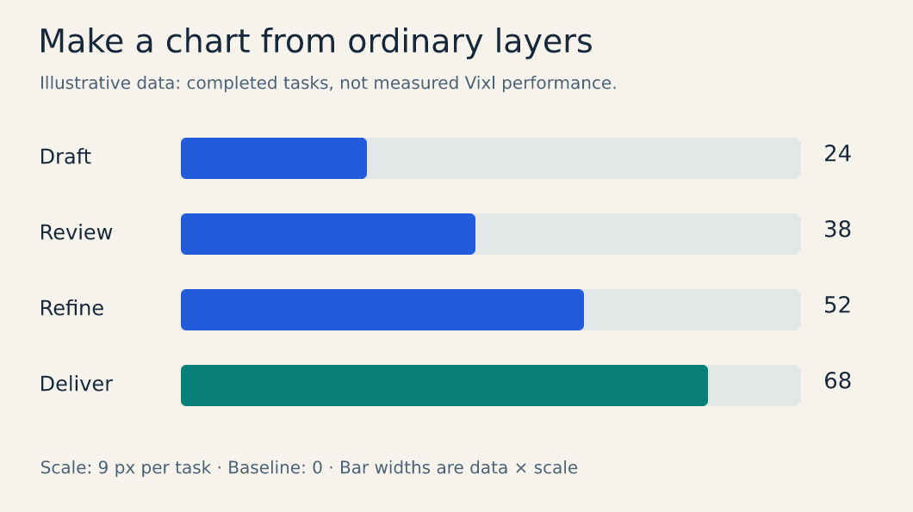

<picture>
  <source media="(prefers-color-scheme: dark)" srcset="assets/brand/digital-shift/SVG/horizontal-reverse.svg">
  
</picture>

# Vixl

**An editable image-document engine for AI agents and programmable creative work.**

Create, inspect, edit, measure and export layered designs through MCP, CLI, Python or REST.
No graphical display is required. Text, shapes, masks, effects, variables, constraints,
pages and history stay editable in a portable `.vixl` master.

Current tagged release: **0.23.0**. See the [changelog](CHANGELOG.md#0230) for release notes.
Run `vixl --version` to check your runtime;
record the Git commit when using a source checkout.

**[Documentation home](docs/README.md)** · [Getting started](docs/getting-started.md) ·
[Visual gallery](docs/gallery.md) · [Command reference](docs/commands.md) ·
[Downloads](https://github.com/jxburros/Vixl/releases/latest)


## What you can make

| Goal | Examples and guides |
| --- | --- |
| Posters, social graphics and branded variants | [Campaign tutorial](docs/tutorials/campaign.md), [sizes/layouts](docs/sizes-and-layouts.md), [brands](docs/brands.md), [design styles](docs/styles.md), [finishing looks](docs/looks.md), [CSV merge to print sheets](docs/imposition.md), [linked documents](docs/linked-documents.md) |
| Charts, diagrams and infographics | [Editable chart tutorial](docs/tutorials/charts.md), [data-bound charts](docs/charts.md), [flowcharts and diagrams](docs/diagrams.md), [design tools](docs/design-tools.md) |
| Photo edits, drawings and painted artwork | [Filters](docs/artistic-filters.md), [drawing cleanup](docs/drawing.md), [brushes](docs/brushes-and-animation.md), [organic shapes](docs/organic.md), [irregularity and torn edges](docs/irregular.md) |
| Presentations, carousels and booklets | [Forms and decks tutorial](docs/tutorials/forms-and-decks.md), [slides/pages](docs/slides.md), [HTML presenter](docs/presenter.md), [rich text](docs/rich-text.md), [text flow](docs/text-flow.md) |
| Registration forms and filled copies | [Forms](docs/forms.md), including fillable PDFs and CSV-driven output |
| Motion, sprites and lyric videos | [Character rigs, audio and cameras](docs/animation-authoring.md), [Motion tutorial](docs/tutorials/motion.md), [pixel animation](docs/pixel-animation-spacing.md), [lyric videos](docs/lyric-video.md) |
| Checked production and collaboration | [Production workflows](docs/production.md), [studio](docs/studio.md), [agent resources](docs/agent-resources.md) |
| Reusable containers, templates and comics | [Container and template library](docs/containers-and-templates.md) |
| Vector drawing and precise placement | [Vector paths and shape catalog](docs/vector-paths.md), [spatial queries and transforms](docs/spatial-transforms.md) |
| Texture, lighting and media review | [Creative media workflows](docs/media-craft.md) |
| Agent discovery and bounded diagnostics | [Agent workflow guide](docs/agent-discovery.md), [MCP toolset evaluation](docs/mcp-toolsets.md) |
| AI generation and vision | [Provider setup and capabilities](docs/providers.md); external services required |

## Install

On Windows, download the latest **Vixl-Setup-VERSION-windows-x64.exe** from
[GitHub Releases](https://github.com/jxburros/Vixl/releases/latest). It bundles Python,
REST and MCP, installs for your user account, and supports verified automatic updates.
If `vixl` is not found, reopen the terminal or see [PATH repair](docs/releases.md#using-the-current-terminal).

```text
vixl --version
vixl update --check
vixl update
```

For source development, use Python 3.11+:

```bash
git clone https://github.com/jxburros/Vixl.git
cd Vixl
python -m venv .venv
# macOS/Linux:
source .venv/bin/activate
# Windows PowerShell: .venv\Scripts\Activate.ps1
python -m pip install -e '.[server,pdf]'
vixl --version
```

The core install is `python -m pip install -e .`; MCP is included. Optional `server`
adds REST/live review, and `pdf` adds PDF page import. Pip installs use pip-managed
updates. [Installation and releases](docs/releases.md) covers pinned versions, Windows
rollback, agent bundles and packaging.

## Make your first design

```bash
vixl new 800x600 --background '#18283b' -o hello.vixl
vixl -p hello.vixl text add 'Hello, Vixl' --name title --size 64 --color '#ffffff'
vixl -p hello.vixl align title center
vixl -p hello.vixl check --checks bounds contrast
vixl -p hello.vixl render --out hello-preview.png
vixl -p hello.vixl export hello.png
```

Editing commands autosave; pass `-p` explicitly in scripts. Inspect the preview before
handoff. The [first-design walkthrough](docs/getting-started.md) explains undo,
checkpoints, JSON batches and Python. Use the bundled font for proofing; choose suitable
[typography](docs/typography.md) for finished work.

## Connect an agent

```bash
vixl mcp --workspace . --tools core --schema slim
```

For a pinned tagged runtime with uv:

```bash
uvx --from https://github.com/jxburros/Vixl/archive/refs/tags/v0.23.0.tar.gz vixl mcp --workspace . --tools core --schema slim
```

The workspace must exist. Use `--tools compact --schema slim` for consolidated workflow
tools, `--tools ai` for provider-backed tools, or `--http` for Streamable HTTP.
[Interface setup](docs/interfaces.md) includes client JSON, multi-document sessions,
REST authentication, imports and live human review (`vixl -p hello.vixl view`).

The [Vixl agent skill](skills/vixl/SKILL.md) teaches the inspect → apply → check → preview
→ export loop, recipes and operation details. Copy its folder to your agent's skills
directory. AI functions use explicitly configured providers; Vixl contains no model weights.

## Use Python

```python
from vixl import Project

project = Project(800, 600, background="#18283b")
project.apply([
    {"type": "text", "name": "title", "text": "Hello, Vixl", "size": 64, "color": "#ffffff"},
    {"type": "align", "target": "title", "alignment": "center"},
])
project.save("hello.vixl")
project.export("hello.png")
```

All interfaces share canonical operations and atomic batches. Direct Python requires
an explicit save. See [document concepts](docs/concepts.md), [operation semantics](docs/operations.md)
and [Python/REST/MCP](docs/interfaces.md) for deeper integration.

## Examples and development



[Editable chart](docs/assets/generated/chart.vixl) · [Recipe](docs/assets/generated/chart.json)
· [Visual capability gallery](docs/gallery.md)

```bash
python -m pip install -e '.[dev]'
python examples/build_documentation.py
python examples/build_poster.py --output examples/output
python examples/build_sprite.py --output examples/output/sprite
python examples/build_filter_gallery.py
python examples/build_organic_gallery.py
python examples/build_irregular_gallery.py
python examples/build_drawing_pipeline.py
python -m pytest -q
```

The documentation builder creates diagrams, charts, artwork, forms, slides and motion
without AI credentials or network access. Every new visual has an editable master and
operation recipe; see [documentation maintenance](docs/documentation-maintenance.md).
[Explorations](explorations/README.md) showcase longer creative projects, and
[agent evaluations](evals/README.md) measure design tasks.

Vixl edits in RGBA8 sRGB and exports supported vectors or documented raster fallbacks.
CMYK is an export setting. RAW development, spot-color editing, PSD/XCF import
(PSD export is layered pixels) and a desktop GUI are outside this implementation. Review
[coverage and limitations](docs/coverage.md), [export behavior](docs/exporting.md) and
[architecture](docs/architecture.md) before choosing it for a workflow.
The [original product specification](docs/product-spec.md) is retained as design context.
The [Digital Shift identity kit](assets/brand/digital-shift/START-HERE.md) includes logos,
icons, usage guidance and editable masters.

## Licence

Vixl is source-available under the [PolyForm Small Business License 1.0.0](LICENSE): free for
individuals and for companies with fewer than 100 people and under US$1M (2019) revenue; larger
companies need a commercial licence from the licensor. Copies of Vixl must carry the licence and
its `Required Notice:` lines. If Vixl helped make your work, please credit it ("Made with Vixl").

Bundled assets keep their own terms: DejaVu Sans ([font licence](src/vixl/data/FONT-LICENSE.txt))
and the xkcd colour names (CC0).
