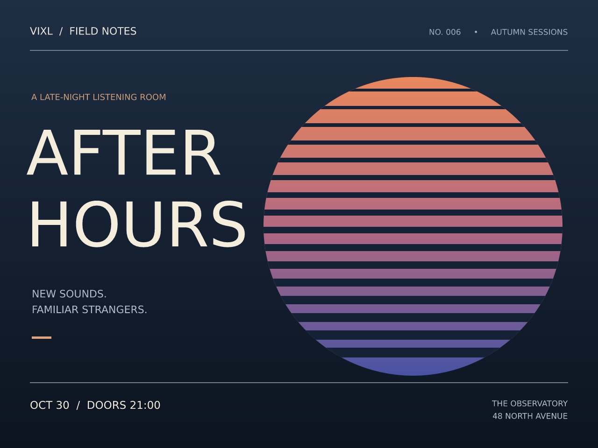

# Vixl

**A headless image-document engine designed for autonomous AI agents.**

Vixl is built for AI agents to create, inspect, edit, measure, and export designs autonomously through MCP, structured operations, Python, REST, or the CLI. Humans can use the same interfaces. It needs no graphical display.

Vixl keeps images editable: layers, text, masks, effects, constraints, variables, and creative history live in a portable `.vixl` document. CLI commands, Python, REST, MCP, and AI plans all use one structured operation engine.

This initial implementation covers the specification's core editor and automation, advanced document, provider-based AI, and agent milestones. See the [coverage and limitations](docs/coverage.md) for the precise scope. The supplied [product specification](docs/product-spec.md) is retained as design context.



[Download the editable example](examples/after-hours.vixl), or rebuild it with `python examples/build_poster.py`.

## Install on Windows

Download **Vixl-Setup-VERSION-windows-x64.exe** from [GitHub Releases](https://github.com/jxburros/Vixl/releases/latest) and run it. The installer bundles Python and the REST/MCP dependencies, installs for your Windows account without administrator access, and adds `vixl` to your user PATH. Completely close and reopen your terminal application after installation:

```text
vixl --version
vixl --help
```

If your current terminal cannot find `vixl`, see the [same-session PATH repair and version checks](docs/releases.md#using-the-current-terminal). Repository documentation describes the source version; use `vixl --version` to confirm which installed runtime is executing.

Automatic updates are on by default. When you launch Vixl, it checks GitHub at most once a day in the background. A verified update is staged alongside the current version and activated on a subsequent launch. Existing editing sessions continue using their original runtime. Project files and AI credentials are not part of the installation.

```text
vixl update --check
vixl update
vixl updates status
vixl updates off
vixl updates on
vixl update --rollback
```

`vixl update` downloads, verifies, and activates the new version before returning. It reports the active version; already-running sessions keep their original runtime. Rollback selects the previous installed version and turns off automatic updates. [Installation, updates, and release instructions](docs/releases.md) explain migration from a pip install, rollback, and reproducible automation.

## Install with Python / develop from source

Requires Python 3.11 or newer. No graphical display is needed. This method uses pip-managed updates rather than the Windows automatic updater.

```bash
git clone https://github.com/jxburros/Vixl.git
cd Vixl
python -m venv .venv
# macOS/Linux:
source .venv/bin/activate
# Windows PowerShell: .venv\Scripts\Activate.ps1
python -m pip install -e ".[server,mcp]"
vixl --help
```

The core install is `pip install -e .`; REST and MCP are optional extras. A default DejaVu Sans font is bundled, with its license, so basic text works without system fonts.

## Discover resources and start from a template

```bash
vixl commands --json
vixl shapes --json
vixl export --help
vixl palette list
vixl template new social-square -o campaign.vixl --set title='New launch'
vixl guidance apply minimal --style minimal
vixl palette apply ocean
vixl font import Brand-Regular.ttf --name brand
vixl text add 'Brand headline' --font brand --name headline --size 64
vixl export campaign.svg
```

Discovery and command help work before opening a document. CLI editing responses are compact by default; use `--detail full` for snapshots. For sustained autonomous work, use a persistent MCP/REST session or atomic `apply` batches. The [resource guide](docs/agent-resources.md) covers 32 palettes, built-in and custom templates, overall/style guidance, HTTPS font imports, shape shortcuts and editable Bézier paths.

## A first document

```bash
vixl new 1280x720 --background '#121926' -o poster.vixl
vixl gradient --name atmosphere --start '#243655' --end '#10131c'
vixl text add 'AFTER HOURS' --name title --size 100 --color '#f6ecd7'
vixl align title center
vixl constrain title --center-x canvas --center-y canvas
vixl checkpoint layout
vixl export poster.png
vixl canvas preset story
vixl render --out story.png
vixl undo
```

Every successful editing command autosaves. `vixl open poster.vixl` selects a project for the current directory; `vixl --project poster.vixl ...` makes the project explicit. `vixl` alone opens the interactive shell. Quote colors beginning with `#` in scripts and shells.

Add a photo with `vixl add photo.jpg --name portrait`; then try:

```bash
vixl resize portrait --width 800
vixl align portrait top-right --margin 40
vixl select rect 0 0 640 720
vixl saturation portrait -35
vixl select none
vixl effects portrait --json
vixl undo
```

Selections affect newly added effects and can become layer masks. Images, fonts imported from files, and grayscale masks are embedded; source imagery is not overwritten.

## Sizes, layouts, color, print, brushes and motion

Start from a named size instead of guessing pixels. Print sizes carry physical units, dpi, bleed and a safe area; 150 sizes cover paper, stationery, posters, social, web, ads, email, video, slides, app stores, icons and logos.

```bash
vixl sizes --category stationery
vixl new letter --bleed -o flyer.vixl          # 8.5 × 11 in at 300 dpi with ⅛ in bleed and trim/safe guides
vixl new favicon -o icon.vixl                  # 512 px icon master
```

Layouts give models structure without making every design look the same. Each of 33 layouts encodes a principle (single focal point, modular grid, rule of thirds, golden section, Z-pattern, asymmetric balance, logo lockups, app-icon keylines …), adapts to the canvas, and uses a seed to vary palette roles, type scale, margins, alignment and accents. Contrast is checked as roles are assigned.

```bash
vixl layout list
vixl layout apply event-poster --set title='Night Market' --set label='Sat · June 21' \
  --set body=$'6 pm – 11 pm\nRiverside Park' --palette sunset --seed 4
vixl check
```

Colors use a full color language: names (CSS plus 938 public-domain survey names), hex, `rgb()`, `hsl()`, `hwb()`, `lab()`, `lch()`, `oklab()`, `oklch()`, `color(display-p3 …)`, `cmyk()`, `kelvin()`, `color-mix()`, and modifiers such as `lighten(@brand, 10%)` or `mix(@a, @b, 30%)`. Print output separates to CMYK (with your printer's ICC profile, or device-naive GCR with an ink limit), and PDF, ICO and icon sets are supported.

```bash
vixl color '#2563eb'                           # every representation, names and contrast
vixl color harmony '#2563eb' --scheme split-complementary
vixl palette-generate brand '#2563eb'          # @brand-50 … @brand-950
vixl export flyer.pdf --cmyk --icc printer.icc
vixl export proof.png --proof --simulate deuteranopia
vixl check --checks print color_vision
vixl export-icons --out icons --set all
```

Paint with 17 editable brushes (ink, pencil, marker, calligraphy, chalk, charcoal, watercolor, dry-brush, spray …) and animate any layer with keyframe timelines, easing, presets and markers.

```bash
vixl paint --brush watercolor --path 'M80 900 C300 760 700 1040 1000 880' --size 70 --color '@accent'
vixl animate-preset headline slide-in-up --duration 0.8s
vixl animate logo rotation --to 360 --duration 3s --easing linear
vixl timeline-sheet --out motion.png
vixl export-timeline --out promo.webp         # GIF, APNG, WebP, sprite sheet, PNG ZIP, MP4/WebM (ffmpeg)
```

See [sizes and layouts](docs/sizes-and-layouts.md), [color and print](docs/color-and-print.md) and [brushes and animation](docs/brushes-and-animation.md).

## Design tools

Groups and clipping masks, editable shapes, layer styles, linked text styles and swatches,
artboards, frames, repeat/blend, and measurements now share Vixl's operation engine.

```bash
vixl shape ellipse --name sun --width 640 --height 640 --fill '#e8885c'
vixl shape rectangle --name stripe --width 700 --height 6 --fill '#152235'
vixl repeat stripe --count 16 --dy 37 --dh 1
vixl group stripes stripe
vixl clip stripes sun
vixl layer-style title drop-shadow --settings '{"blur":8,"dy":6,"opacity":0.65}'
vixl artboard story --preset story
vixl export-screens --out screens --scales 1 2
vixl render --data rows.csv --out campaign
vixl info --target title
```

[Design tool reference](docs/design-tools.md) covers every new operation, richer gradients,
adjustment layers, automatic corrections, LUTs, comps, text layout, guides, pathfinder,
symbols, provider-backed editing tools, and their precise limits.

## Spacing checks, pixel art and animation

```bash
vixl spacing --around body --before heading --after footer --tolerance 1 --check
vixl pixel-art --name sprite --width 16 --height 16
vixl pixel-draw sprite rect 4 4 --width 8 --height 8 --color '#'
vixl frame-save idle --duration 100
vixl pixel-draw sprite pixel 5 5 --color .
vixl frame-save blink --duration 100
vixl export-animation --out sprite.gif --scale 8
vixl export-animation --out sprite-sheet.png --format sheet
```

Spacing analysis checks only the intent and objects you specify. Pixel sprites use compact
character grids and palettes that agents can inspect directly; named frames preserve edits
and timing. [Spacing and pixel-animation reference](docs/pixel-animation-spacing.md)
documents CLI/Python/REST/MCP workflows, crisp scaling, GIF/APNG and game sprite sheets.

## Automation and creative history

```bash
vixl variable set title 'Night Shift'
vixl text add '${title}' --name heading --size 80
vixl render --set title='Late Edition' --out alternate.png
vixl apply operations.json --dry-run
vixl apply operations.json
vixl run examples/portrait-cleanup.vixlscript
vixl batch './photos/*.jpg' --run examples/portrait-cleanup.vixlscript --output ./processed
vixl checkpoint before-color
vixl contrast +20
vixl branch vivid
vixl checkout before-color
vixl saturation -30
vixl branch muted
vixl compare vivid muted --out comparison.png
vixl validate
```

`apply` and `run` are atomic. Multi-command transactions survive process restarts:

```bash
vixl transaction begin
vixl move heading 40 40
vixl opacity heading 0.9
vixl transaction commit  # or rollback
```

A structured batch looks like:

```json
{"operations": [
  {"type": "scale", "target": "portrait", "value": 0.8},
  {"type": "align", "target": "portrait", "alignment": "top-right", "margin": 40}
]}
```

Use names or immutable IDs. `vixl schema` emits JSON Schema, and `vixl inspect --json` returns the document and resolved bounds. Machine errors go to stderr with a nonzero exit code. Binary pipelines are supported:

```bash
cat photo.png | vixl convert --grayscale > gray.png
cat operations.json | vixl apply -
vixl export - --format PNG > preview.png
```

## AI and agent interfaces

AI features require a configured external provider; Vixl does not ship model weights or simulate AI results. Built-in adapters support OpenAI, Anthropic, Mistral, Meta Llama, Gemini, Black Forest Labs FLUX, ComfyUI API workflows, Automatic1111, and a documented HTTP gateway. Authenticated model discovery and capability routing select available models for the requested task. Midjourney requires a configured HTTP gateway; it has no supported public model API. See [provider discovery](docs/providers.md).

```bash
vixl ask 'Make the logo 20% smaller and align it top-right with a 40px margin'
vixl ask 'Make the logo 20% smaller' --apply
vixl select object 'the person' --provider vision
vixl generate --prompt 'foggy forest at night' --provider comfy --size 1024x1024 --as forest
vixl select rect 100 100 300 300
vixl generate --prompt 'a neon sign' --mode inpaint --provider local --as sign
vixl ai extend --right 500 --prompt 'continue the scene' --provider local --as extension
vixl ai regenerate forest --prompt 'sunlit forest'
```

AI plans are validated and previewed by default. Generation provenance, model, returned seed, source image, and selection are retained. Inpainting inserts a masked layer; background removal adds an editable mask. Provider support varies: [configuration and capabilities](docs/providers.md).

```bash
vixl --project poster.vixl serve  # local REST API, http://127.0.0.1:8765/docs
vixl mcp --workspace .          # MCP over stdio; create/open documents with tools
```

For agents, MCP offers:

- **A safe workspace**: create/open several documents, import images by path or base64, export files; no code execution and no access outside the workspace.
- **Forgiving input**: common spellings (`rect`, `font_size`, `opacity: 50`, `"50%"`, `"center"`, CSS `rgba()`) are normalized and reported.
- **Actionable errors**: JSON with the failing operation index, field, allowed values and suggestions.
- **Self-checks**: `vixl_check` finds cut-off content, overlapping text, low contrast, safe-area violations and text too small at thumbnail size, plus opt-in print (ink, resolution, bleed, live area) and color-vision checks; previews render fast at preview resolution, can zoom, show a timeline frame, soft-proof print or simulate color blindness; `vixl_render_compare` shows what changed between revisions.
- **Design starting points**: `vixl_sizes_list`, `vixl_layouts_list`, `vixl_color`, `vixl_brushes_list`, timeline preview/export and icon-set export tools.
- **Small responses**: minified JSON, compact diffs and an optional slim schema (`vixl mcp --schema slim`).
- **Long sessions**: delta history keeps every edit fast and old revisions are squashed instead of blocking edits.

The [agent eval suite](evals/README.md) measures how well a model completes real design briefs with these tools. REST stays scoped to one project. See [interface setup](docs/interfaces.md), including MCP client configuration and authenticated REST access.

### Agent skill

[`skills/vixl`](skills/vixl/SKILL.md) is an agent skill that teaches AI agents to drive Vixl through MCP, the CLI, REST, or Python: the inspect → apply → preview → measure → export loop, every operation and tool, recipes, and common pitfalls. Copy the folder into your agent's skills directory (for Claude Code: `~/.claude/skills/vixl` or `.claude/skills/vixl` in a project).

## Python API

```python
from vixl import Project

project = Project(800, 600, background="#101828")
project.apply([
    {"type": "text", "name": "title", "text": "Hello, Vixl", "size": 64},
    {"type": "align", "target": "title", "alignment": "center"},
])
project.save("hello.vixl")
project.export("hello.png")
preview = project.render()  # Pillow RGBA Image
```

## Examples, development, and documentation

```bash
python examples/build_poster.py --output examples/output
python -m pip install -e ".[dev]"
pytest -q
python -m pip wheel . --no-deps --wheel-dir dist
```

- [Agent skill for AI agents](skills/vixl/SKILL.md)
- [Named sizes and principled layouts](docs/sizes-and-layouts.md)
- [Color language, CMYK and print output](docs/color-and-print.md)
- [Brushes and animation timelines](docs/brushes-and-animation.md)
- [Spacing checks, pixel art and animation](docs/pixel-animation-spacing.md)
- [Design tools and template production](docs/design-tools.md)
- [Command reference](docs/commands.md)
- [Operation format and document semantics](docs/operations.md)
- [AI providers](docs/providers.md)
- [REST, MCP, and plugins](docs/interfaces.md)
- [Architecture, security, and limits](docs/architecture.md)
- [Specification coverage and known limitations](docs/coverage.md)
- [Agent evaluation suite](evals/README.md)

Vixl processes raster images in RGBA8 and retains procedural shapes and supported Bézier paths. SVG preserves supported geometry, groups, gradients, pixel grids, shaped Unicode text and common effects/styles. `--svg-policy strict` rejects embedded raster content with layer/effect details. [19 local artistic filters](docs/artistic-filters.md) include sepia, ink blot, sketch, halftone, paint-like treatments and distortions; no AI is required. Unsupported appearances use documented raster fallbacks; PNG preserves transparency and JPG flattens it against a chosen background. Documents edit in RGBA8 sRGB and export CMYK for print. CMYK editing, spot colors, RAW development, arbitrary SVG import, desktop GUI/TUI, and GIMP/Photoshop project compatibility are outside this implementation. The AI provider adapters have been used successfully with real services; the test suite checks their contracts offline, and live use requires your own service, model, workflow and credentials.
