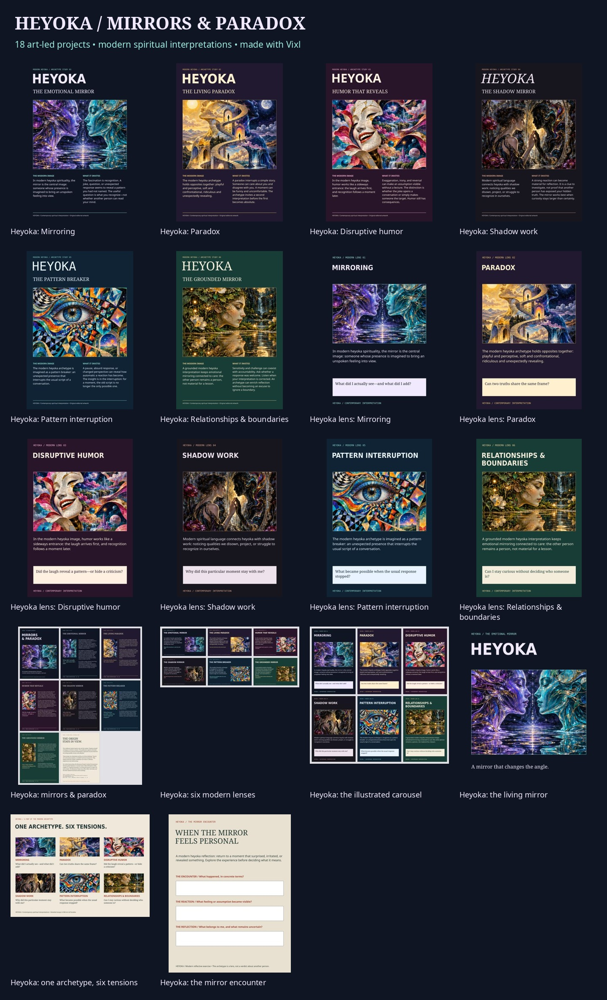

# Heyoka: Mirrors & Paradox

A psychedelic editorial collection exploring contemporary heyoka spirituality through emotional mirroring, paradox, disruptive humor, shadow work, pattern interruption, and grounded relationships. Created with Vixl 0.23.0 and preserved here as a visual and document reference.

## Browse and reuse

- Download this directory and open [gallery-offline.html](gallery-offline.html) for previews and links to the archived files.
- [gallery-preview.html](gallery-preview.html) is a compact, self-contained preview with embedded images. It needs no scripts or external resources.
- Open any `items/*.vixl` master in Vixl to edit the text, layouts, image crops, and other composition elements.
- [Mirrors & Paradox booklet](items/13-heyoka-mirrors-paradox-booklet.pdf) contains eight illustrated pages, including six essays and a cultural-origin/editorial-scope page.
- [manifest.json](manifest.json) indexes the 18 projects and their archived export formats.

## Collection

| Projects | Contents |
| --- | --- |
| 01–06 | Six illustrated posters: mirroring, paradox, disruptive humor, shadow work, pattern interruption, relationships and boundaries |
| 07–12 | Six illustrated study cards with reflection questions |
| 13 | Eight-page illustrated essay booklet |
| 14 | Six-slide art deck, including editable PowerPoint |
| 15 | Six-page illustrated carousel with individual page PNGs |
| 16 | Three-second living-mirror animation in WebP and GIF |
| 17 | Illustrated archetype map |
| 18 | Encounter journal, with a separate fillable PDF |

The archive includes all 18 editable masters, rendered PNGs, PDFs, operation recipes, thumbnails, and saved Vixl check reports. Individual pages are included for the booklet, deck, and carousel. SVG and per-document HTML exports are omitted because they duplicate embedded artwork already retained in the masters and other exports.

## Artwork and Vixl capabilities

The six surreal illustrations were generated as one raster sheet, retained in [assets/heyoka-surreal-sheet.png](assets/heyoka-surreal-sheet.png). Vixl performs native reversible crops, image placement, layered editable typography, multipage composition, PDF and PowerPoint export, form-field authoring, and keyframe animation. The illustrations remain embedded raster assets; they are not editable vector drawings. Fonts are embedded in the masters and PDFs. PowerPoint references font families and needs those fonts installed for matching appearance.

The artwork uses modern editorial metaphors, without traditional ceremonial objects or regalia. The modern “heyoka empath” interpretation is distinct from the traditional Lakota heyoka role. The essays explore contemporary spiritual language rather than making clinical claims or establishing spiritual recognition. Cultural context and resources are identified on the final booklet page: the WoLakota Project glossary and homepage, and *Black Elk Speaks*, chapter 16.

## Verification at archival time

- All 35 compositions passed Vixl design and readability checks; saved reports are in `items/`.
- All 18 gallery images loaded in desktop, mobile, and script-disabled iframe browser checks.
- Offline gallery links resolved to archived files.
- All six essay endings were present in the PDF text.
- The PowerPoint contained six slides; both animations played for three seconds; the fillable journal exported AcroForm fields.

Browser checks used Chromium and do not establish behavior in every embedded application preview.
