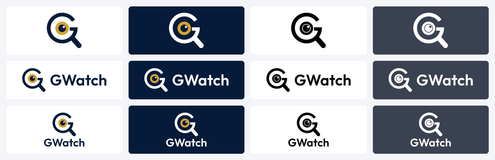
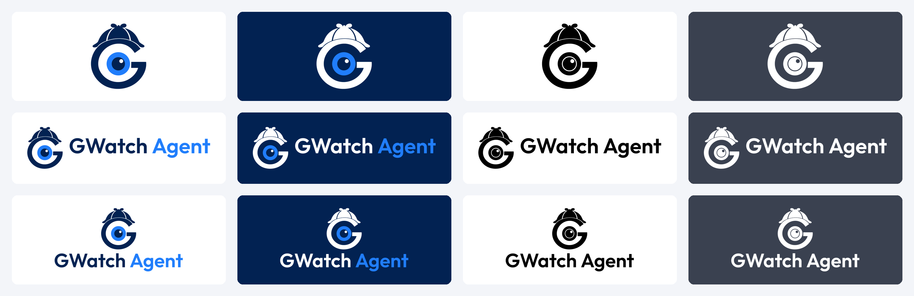

# GWatch and GWatch Agent logo kits

Vector rebuilds of the supplied GWatch (magnifier, gold eye) and GWatch Agent (detective hat, blue
eye) logos, made with Vixl. Each kit has the same files:

| Folder | Kit | |
| --- | --- | --- |
| [`gwatch/`](gwatch/) | GWatch |  |
| [`gwatch-agent/`](gwatch-agent/) | GWatch Agent |  |

## Choose a layout

| File name starts with | Best use |
| --- | --- |
| `mark-` | The symbol on its own: avatars, watermarks, compact spaces |
| `horizontal-` | Website headers, slides, documents, email signatures |
| `stacked-` | Posters, cover pages, vertical spaces |
| `app-icon-light` / `app-icon-dark` | App and store icons; square, opaque, no pre-rounded corners |
| `avatar-light` / `avatar-dark` | Social profile pictures; extra padding survives a circular crop |
| `favicon` / `favicon-dark` | Browser tabs on light or dark browser themes; transparent |

## Choose a colour version

- `color`: the original colours. Use on white or light backgrounds.
- `reverse`: white G and hat, coloured iris, the eye open to the background. Use on dark backgrounds
  (designed against the logo's own navy).
- `black`: one colour, for single-ink printing, stamps and engraving.
- `white`: one colour for dark surfaces. It looks blank in a white preview; that is expected.

The one-colour versions separate the iris from the pupil with a thin knockout ring so the eye still
reads.

## Choose a format

- **SVG** (`SVG/`): scalable, for websites and design tools. Pure vector paths; the wordmark is
  outlined, so no font is needed to display it.
- **PDF** (`PDF/`): vector core logos for print and for sending to printers (RGB artwork).
- **PNG** (`PNG/`): transparent. Marks at 128, 256, 512, 1000 (no suffix) and 2000 px tall;
  lockups at 1x and @2x.
- **Icons** (`Icons/`): app icons and avatars as 1024 px PNG and JPG plus 48, 96, 180, 192, 256 and
  512 px PNGs; favicons as a multi-size ICO (16–256 px) and separate PNGs.
- **Icon sets** (`Icon-Sets/app-icon-light`, `Icon-Sets/app-icon-dark`): drop-in platform sets: web
  (`favicon.ico`, `apple-touch-icon.png`, `android-chrome-*`, `site.webmanifest`), Apple (20–1024),
  Android mipmaps and Play Store 512, and Windows tiles.
- **Vixl** (`Editable-Vixl/`): editable masters, each part on its own named layer (`g` and `handle`, or
  `hat-and-g`, `eye-white`, `iris`, `pupil`, `highlight`, `wordmark`).

## Brand details

| | GWatch | GWatch Agent |
| --- | --- | --- |
| Navy | `#061A3A` | `#022252` |
| Accent | Gold `#D3A32E` | Blue `#207DFB` |
| White | `#FFFFFF` | `#FFFFFF` |

Colours were sampled from the supplied artwork. The wordmark is **Outfit SemiBold (600)**; it was not
part of the supplied logos, so swap it in `build.py` (`WORDMARK_FONT`) if GWatch has a set typeface.

## Use consistently

Keep the proportions; don't recolour parts individually or stretch the mark. Leave clear space of
at least the iris's width around it. Use SVG where you can, otherwise a PNG at least as large as it
is displayed. The GWatch Agent hat gets busy below about 32 px; at 16 px the GWatch mark reads better,
so consider the GWatch favicon if one icon must serve both.

## How it was made

- `source/` holds the supplied originals. `source/trace.py` turned them into `source/geometry.json`:
  the GWatch Agent hat, brim and G are traced at 4x with potrace (they are hand-drawn curves); the eyes and
  the whole GWatch mark are true circles, lines and rectangles least-squares fitted to the originals.
- `build.py` draws every file with Vixl from that geometry and exports it. Rebuild from the repository
  root with `python assets/brand/gwatch/build.py` (or `... build.py gwatch` / `agent`). The wordmark
  font downloads from Google Fonts on the first run.
