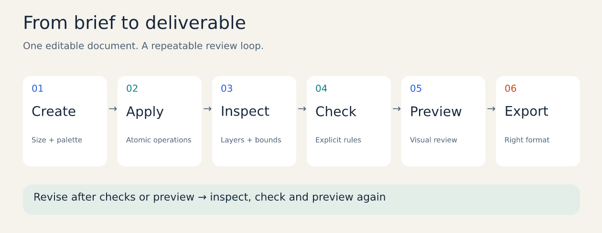

# Vixl documentation

Vixl creates and edits layered designs through commands, Python, MCP or REST. There is no
desktop canvas to learn: create a document, apply operations, inspect it, check it, preview
the result and export. Text, geometry, masks, effects and history stay in the `.vixl` master.

## Start here

1. [Install and make your first design](getting-started.md): a complete CLI and Python walkthrough.
2. [Understand the document](concepts.md): layers, coordinates, constraints, assets and history.
3. [Explore the visual gallery](gallery.md): actual Vixl output with editable masters and recipes.
4. [Choose an export format](exporting.md): images, vectors, print, decks, forms and motion.
5. [Resolve common problems](troubleshooting.md): installation, text, checks, imports and providers.

Current tagged release: **0.21.0**. See the [release notes](../CHANGELOG.md#0210)
for the features and behavior changes in this version.
See [installation and updating](releases.md) for Windows, source and agent bundles.

## Learn by making

Run tutorials from the repository root after installing Vixl. Their input JSON, images
and editable documents are committed under `docs/assets/generated/`; all visuals rebuild
offline with `python examples/build_documentation.py`.

| Goal | Tutorial | What you learn |
| --- | --- | --- |
| Make reusable social or event artwork | [Campaign and variants](tutorials/campaign.md) | Variables, text edits, checkpoints, CSV output |
| Explain data visually | [Editable charts](tutorials/charts.md) | Data-to-geometry mapping, labels, SVG, slide reuse |
| Produce registration materials and presentations | [Forms and decks](tutorials/forms-and-decks.md) | Field validation, fillable PDF, pages, notes, PowerPoint |
| Add movement | [Motion and pixel art](tutorials/motion.md) | Keyframes, frame previews, animated WebP, sprite frames |

## Find a feature

| Area | Guides and references |
| --- | --- |
| Documents and authoring | [Concepts](concepts.md), [authoring](authoring.md), [commands](commands.md), [operation semantics](operations.md) |
| Starting points | [Safe design variety](safe-variety.md), [Containers and templates](containers-and-templates.md), [Sizes and layouts](sizes-and-layouts.md), [palettes, templates and resources](agent-resources.md), [brands](brands.md), [design styles](styles.md) |
| Text | [Typography](typography.md), [rich text](rich-text.md), [text flow](text-flow.md) |
| Shapes and layout | [Vector paths and strokes](vector-paths.md), [Spatial queries and transforms](spatial-transforms.md), [Design tools](design-tools.md), [organic shapes](organic.md), [diagrams and flowcharts](diagrams.md), [guides and grids](guides.md), [spacing](pixel-animation-spacing.md) |
| Finishing and imperfection | [Looks](looks.md), [irregularity and torn edges](irregular.md) |
| Images and drawing | [Materials and media review](media-craft.md), [Drawing cleanup](drawing.md), [artistic filters](artistic-filters.md), [brushes](brushes-and-animation.md) |
| Output | [Export guide](exporting.md), [color and print](color-and-print.md), [slides](slides.md), [HTML presenter](presenter.md), [forms](forms.md) |
| Data and reuse | [Charts](charts.md), [linked documents](linked-documents.md), [data merge and print imposition](imposition.md) |
| Motion | [Characters, rigs and scene authoring](animation-authoring.md), [Brushes and timelines](brushes-and-animation.md), [pixel animation](pixel-animation-spacing.md), [lyric video](lyric-video.md) |
| Automation and collaboration | [Production workflows](production.md) (proof pages, logo packages), [studio and custom tests](studio.md), [checking designs in CI](ci.md) |
| AI | [Provider setup and capability matrix](providers.md) |
| Integration | [Capability discovery](agent-discovery.md), [MCP toolset evaluation](mcp-toolsets.md), [Python, REST and MCP](interfaces.md), [agent skill](../skills/vixl/SKILL.md) |
| Installation | [Releases, updates and rollback](releases.md) |

## Work with an agent

Use `vixl mcp --workspace . --tools core --schema slim` for a small editing toolset, or
`--tools compact --schema slim` for consolidated workflow tools. Give the agent a brief with
dimensions, audience, copy, assets, brand rules and required outputs. Ask it to inspect and
preview before handing off the editable master and exports. [Interface setup](interfaces.md)
includes client JSON, authentication and HTTP transport; [studio](studio.md) covers review,
tests and independent branch documents.

AI generation, semantic selection and natural-language planning use configured external
providers. Layouts, charts, paint, effects, forms and the gallery work without AI credentials.
See the [provider matrix](providers.md#capability-matrix) before choosing a service.

## Development and deeper examples

- [Architecture and resource limits](architecture.md) and [implementation coverage](coverage.md).
- [Examples](../examples/) and [explorations](../explorations/README.md): longer creative projects.
- [Agent evaluations](../evals/README.md): briefs and grading contracts.
- [Documentation maintenance](documentation-maintenance.md): rebuilding visuals and verifying examples.
- [Changelog](../CHANGELOG.md): shipped changes and source-only additions.
- [Original product specification](product-spec.md): design context; use coverage for implemented behavior.

[Back to the project](../README.md)
