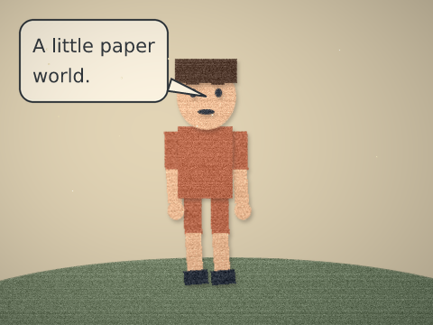

# Motion, reusable characters, compositing and sound

All operation times are milliseconds. Motion coordinates are pixels; velocities and gravity use seconds. These operations work through the same `vixl_operations_apply`, CLI batch and Python `Project.apply` boundary. Read the `looping-motion`, `natural-motion`, `character-rigging`, `cut-paper` and `audio-composition` guidance before planning a sequence: `vixl_guide(brief="natural-motion")` (or `vixl_resource_get(kind="guidance", name=…)`, CLI `vixl guide natural-motion`) returns the text, and `vixl_guide("animation")` gives the checklist and a worked example. Run `vixl_check` with `motion`, `character`, `anatomy` and `captions` checks and inspect important frames, then play the export.

## Bouncing ball → walk → reaction

```json
[
  {"type":"shape","name":"ball","shape":"ellipse","width":40,"height":40,"x":40,"y":300,"fill":"#efb557"},
  {"type":"motion","target":"ball","recipe":"bounce","amount":150,"gravity":980,"restitution":0.65,"duration":2400},
  {"type":"character","name":"hero","x":180,"y":40,"height":320},
  {"type":"character-cycle","target":"hero","cycle":"walk","duration":2000,"period":1000},
  {"type":"character-cycle","target":"hero","cycle":"react","start":2000,"duration":800,"amount":35}
]
```

A free fall accelerates as `y = y0 + v0*t + ½*g*t²`; a bounce reverses velocity and multiplies it by restitution. Keep a consistent ground plane and inspect the contact frame. Springs use a damped oscillatory response with zero initial velocity. Increase damping to settle sooner; choose a duration that includes settling instead of forcing an instantaneous final snap.

Natural movement has a cause: prepare a large action with a small opposite action, shift weight before stepping, move limbs along arcs, and delay loose parts after the torso. A walk alternates contact, down, passing and up poses. A reaction anticipates before extension and recovery. `motion` provides follow-path (arc-length traversal), orbit, bounce, shake, wiggle, spring, look-at, overlap, breathing, blink, hover, spin and line-boil. `targets`, `children` and millisecond `stagger` apply coordinated motion without hand-writing every key. `wiggle` oscillates any `property` (default rotation) by `amount` at `frequency` per second; `samples` sets how many keys it writes. `line-boil` redraws vector targets as hand-drawn line boil: `variants` (default 3) copies, each wobbled by `irregular` with its own seed, shown one at a time and held for 1/`fps` seconds (default 10), grouped as `NAME-boil`. `keyframes` writes a compact array of keys for one property, or generates them from a wave with `sample: {fn, period, amplitude, offset, phase, step_ms or samples, duration, start, seed}` where `fn` is `sin`, `cos`, `triangle`, `saw`, `square` (held keys) or `noise` (smooth seeded value noise, seamless when `duration` is a whole number of periods): value = offset + amplitude × fn(phase + t / period). There is no expression language; these generators cover the usual uses. Generated keys remain ordinary editable tracks.

```json
{"type": "keyframes", "target": "lantern", "property": "rotation", "sample": {"fn": "sin", "period": 2000, "amplitude": 6, "step_ms": 100, "duration": 4000}}
{"type": "motion", "recipe": "line-boil", "target": "mascot", "fps": 10, "duration": 2000}
```

**Seamless loops.** `timeline-set` with `loop_mode: "seamless"` says the timeline must loop without a jump (it plays forever unless `loop` is given). It warns for every track that ends on a different value than it starts, and `close: true` (on `timeline-set`, `keyframe`, `animate`, `animate-preset` or `motion`) appends each track's t=0 value at the timeline end. Entrance and exit presets (`fade-in`, `slide-in-*`, `pop-in`, `draw-on`, `color-shift` ...) close by holding their final value and playing back over the same length, and do so on their own in a seamless timeline; `loop_safe: true` is an alias of `close`. Rotation closes modulo 360. For a rotating symmetric shape use `motion` `recipe: "spin"`: `turns` (default 1) and `symmetry` n turn the layer `turns/n` of a circle, so a 12-ray sun with `symmetry: 12` turns 30 degrees over the whole timeline (or `duration`) and lands on itself. Pass whole `turns`; a fraction warns. Limits: closing matches the value at the seam, not the speed. Constant-speed (linear) tracks and tracks whose first and last segments are `ease-in-out` (close then eases the return the same way) have no kink; other easings can, and `vixl_check` reports such tracks as `loop-seam-speed` notes. `step`/`hold` properties (`text`, `visible`) jump at the seam by nature.

**Repeat and stagger.** `animate` and `animate-preset` take `repeat` (a count) or `until` (a time), `period` (ms from one cycle's start to the next, default the cycle length), and, with `targets`, `stagger` (ms between targets). "Pulse every 700 ms, offset 150 ms per dot" is one operation: `{"type":"animate-preset","targets":["dot1","dot2","dot3"],"preset":"float","duration":700,"repeat":4,"stagger":150}`. `animate` restarts from the same `from` value each cycle; a cycle that abuts the next ends 1 ms early so the keys do not collide (leave a `period` gap to avoid it). Hold keys use `easing: "hold"` (or `steps(n)`); the `easing` field lists every accepted name.

**Time-aware checks.** When the document has a timeline, `vixl_check` adds the `motion` check by default. It reports `loop-seam` (a track whose end value differs from its start in a looping timeline), `empty-poster` (frame 0 shows under 10 % of the layers visible at the end), `text-hidden-at-poster` (text transparent, empty, trimmed or off-canvas at t=0 though visible at the end), and runs the legibility test on frame 0 too. Not yet checked over time: text colliding with moving layers, sibling parts drifting apart, gradient edges, and a rendered seam diff.

**Poster frame and phone preview.** Many apps show only frame 0 of a GIF. `vixl_export_timeline(poster="end")` (a time, marker, percentage or `"end"`; GIF/WebP/APNG) rotates the frames so that moment comes first; a looping animation still loops without a jump, and the result warns when the first frame is empty. `vixl_timeline_preview` labels frame 0 "poster", takes `times=[...]` for exact frames, and `thumbnail=360` shows poster, middle and last frame side by side at phone width.


`motion` findings warn about abrupt two-key linear starts/stops and accelerations over 100,000 units/s². They are heuristics: a conveyor, camera pan, deliberate jump cut or collision can justify the finding. Pixel units have no inherent physical scale; choose gravity and timing consistently with the scene. Source references: Frank Thomas and Ollie Johnston, *The Illusion of Life* (1981), and Richard Williams, *The Animator's Survival Kit* (2001), plus Newtonian projectile and damped oscillator equations.

## Standard parts and reusable rigs

`character` generates a simple editable character, or accepts a `parts` mapping from standard part names to artwork. Required names: `torso`, `head`, `left-eye`, `right-eye`, `mouth`; `left/right-upper-arm`, `left/right-lower-arm`, `left/right-hand`; `left/right-upper-leg`, `left/right-lower-leg`, `left/right-foot`. Brows, hair and accessories are optional. Proximal limb pivots are `[0.5,0]`; standard shapes are ordered with limbs behind the torso, facial features in front of the head. Custom bound artwork keeps its authored draw order.

`character-save target=hero name=cast-member` stores artwork and rig in the document library. Save the `.vixl` document to retain the library; `character-load template=cast-member name=friend` creates independent IDs with optional `colors`, per-part `outfit` colors, `scale`, `x` and `y`. Shared embedded image/font assets remain portable. `character-load source="cast.vixl" name="friend"` imports a workspace-contained character document. Python `export_character` / `import_character` also move a template between documents; `vixl_export_character` writes a standalone character asset.

`character-rig` defines bones with a `part`/`layer`, optional `parent`, root `origin:[x,y]`, `length`, `angle` and `limits:[min,max]`. Joint angles clamp to limits; cycles and unknown parents are rejected. `character-pose angles={...}` solves connected positions. `character-ik chain=[upper,lower] point=[x,y] bend=1` solves a limb in character-local coordinates and clamps unreachable goals to the reach envelope. Joint limits may prevent exact contact. Use explicit IK contact poses for planted feet; `character-cycle` supplies retargetable walk, run, idle, ride and react starting points.

`character-lipsync` accepts text or explicit `{time,viseme}` cues. Text allocation is an approximate visual guide, not speech recognition or phoneme alignment. The set is `rest,A,E,O,U,M,F,L`; supplying artwork named `viseme-A` etc uses those parts, otherwise the default mouth uses distinct proportions. Explicit cues from aligned audio are the accurate timing path.

## Atmosphere and cut paper



`layer-depth` assigns positive depth (1 is the reference plane). `camera` interpolates pixel-offset `[x,y,zoom]` poses with easing; greater depth reduces movement. `follow`, `shake`, `focus`, `focus_to` and `aperture` support tracking, shake and rack focus. `lighting` adds colored point lights, ambient light, shadow styles, vignette, exposure, saturation and tint. This is a bounded 2D compositor, not 3D physically based lighting.

`particles` creates deterministic dust, bubbles, sparks or spores with `count`, emission `spread`, `velocity`, `gravity`, `turbulence`, `life`, `start`, `duration` and `seed`. The count is bounded by the layer budget. Particles repeat over the emitter duration and fade over their life.

`cut-paper` adds seeded grain/fibers, rough alpha edges, thickness/drop shadows and shallow depth offsets to individual character parts. It also sets a document-wide held-frame cadence (`fps`, default 12) and bounded handmade `jitter`. Limbs remain editable and can use the existing rig. Clear restores the previous shadow; cadence remains while another paper layer uses it. Run [the cut-paper example](../examples/build_cut_paper_demo.py), inspect the PNG, and play the WebP. Grain should remain visible without erasing faces; inspect shadows at final size. Same-hold frames should match, while adjacent poses move deliberately. Lighting is rasterized with an explicit report when a vector export cannot preserve the composite.

## Captions and dialogue

`speech-bubble` sizes and wraps editable rich text, adds a speech/thought/shout/whisper body, and aims its tail at `anchor` each render, including transformed nested targets. Fonts, size, color, fill, stroke, padding and maximum width are editable. `caption` supports font and character `style` (bold/italic/underline/tracking/alignment/stroke), a configurable `box`, start/end times and `none`, `fade` or `typewriter` animation. The same caption fields work in film specs. `captions` checks report measured text clipping, canvas overflow and missing anchors.

## Built-in score and SFX

```json
{"type":"audio-track","name":"score","start":0,"synth":"piano","duration":2000,"volume":0.6,"fade_out":200,
 "notes":[{"start":0,"duration":500,"midi":60},{"start":500,"duration":500,"midi":64},{"start":1000,"duration":900,"midi":67}]}
```

Instruments: sine, triangle, square, saw, piano, bell, bass, kick, snare, hihat, noise, whoosh, pop, click and splash. Use ADSR `envelope` attack/decay/release in milliseconds and sustain 0–1. `volume`, `pan`, `fade_in`, `fade_out` and `trim` control a track; timeline `start` can reference a marker. PCM WAV `source` imports are workspace-contained and become embedded assets. Film audio additionally accepts compressed imports through ffmpeg. MP4/WebM timeline and film exports mux the mix; `vixl_export_audio` / Python `export_audio(project,path)` writes PCM WAV. Mixing sums tracks and clips only at PCM encoding, so keep headroom and inspect peak levels with `vixl_workflow("audio-analyze", {"source": "mix.wav"})`.
