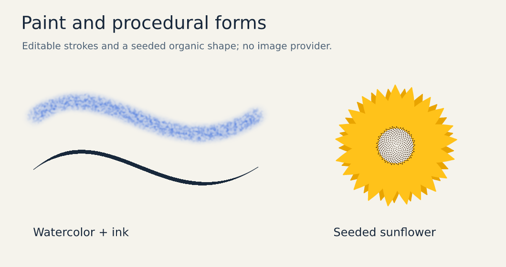

# Brushes and animation timelines



See the [motion tutorial](tutorials/motion.md) for a complete animation and its static poses,
and the [gallery](gallery.md) for editable paint and timeline examples.

[Documentation home](README.md) · [Getting started](getting-started.md) · [Visual gallery](gallery.md)

## Brushes

Paint layers store strokes, not pixels: each stroke keeps its points, optional pressure, brush, size, color, opacity, mode and seed. Strokes re-render deterministically at any time, survive moves and resizes (they live on the layer's own surface), and stay editable and undoable.

| Brush | Character |
| --- | --- |
| `round`, `soft-round`, `airbrush` | Clean, soft or build-up strokes |
| `pencil`, `ink`, `fineliner`, `brush-pen`, `calligraphy` | Line work: graphite grain, pressure tapers, even technical lines, thick–thin contrast, broad 45° nib |
| `marker`, `highlighter` | Chisel strokes that darken on overlap (multiply) |
| `chalk`, `charcoal`, `crayon` | Dry media with paper tooth and broken coverage |
| `watercolor` | Translucent washes with darker pooled edges |
| `dry-brush` | Bristle streaks that follow the stroke direction |
| `spray`, `splatter` | Dots and droplets around the path |

```bash
vixl brushes                                         # catalog and settings
vixl paint --brush ink --points '[[40,300],[200,220,0.4],[380,310,1]]' --size 8 --color '#1d3557'
vixl paint --brush watercolor --path 'M50 500 C200 380 400 620 600 480' --size 60 --color 'alpha(@accent, 0.8)'
vixl paint sketch --brush round --points '[[300,0],[300,600]]' --size 30 --erase
vixl paint-clear sketch --last 1
vixl brush-define soft-ink --base ink --settings '{"hardness": 0.4, "taper": [0.3, 0.4]}'
```

```json
{"type": "paint-layer", "name": "sketch"}
{"type": "paint", "target": "sketch", "brush": "charcoal", "points": [[10, 10], [200, 80, 0.6]], "size": 24, "color": "#222", "seed": 3}
{"type": "paint", "brush": "brush-pen", "path": "M10 100 C60 10 140 10 190 100", "settings": {"taper": [0.1, 0.5]}}
```

- Points are canvas pixels (`space: "layer"` for layer-local) as `[x, y]` or `[x, y, pressure]` (0–1); `pressure` may also be a parallel list. Without real pressure, presets simulate it with start/end tapers.
- `path` strokes any single-contour SVG path (M, L, H, V, Q, C, Z).
- Without `target`, `paint` uses the active paint layer or creates one named `paint`.
- `settings` overrides any brush setting: `shape` (round, bristle, spray), `hardness`, `spacing`, `flow`, `build` (max or accumulate), `jitter`, `size_jitter`, `angle`, `roundness`, `texture` (none, grain, paper, canvas), `texture_strength`, `taper` [start, end], `pressure_size`, `pressure_opacity`, `wet_edges`, `blend` (normal, multiply), `smoothing`, `bristles`, `scatter`, `density`.
- Limits: 4 096 strokes per layer, 10 000 points per stroke, 200 000 points per layer. SVG export embeds paint layers as raster images and reports them as fallbacks.

## Animation timelines

A timeline animates ordinary document layers over time. Each track targets one property of one layer (or the canvas background) and holds keyframes `{time, value, easing}`. The easing on a key shapes the segment that starts at that key. Rendering a time copies the document, applies the interpolated values and renders it normally, so every layer type, effect, style, mask and constraint is animatable. The pixel-art frame snapshots (`frame-save` …) remain available for sprite work.

Animatable properties: `x`, `y`, `translate-x`, `translate-y`, `opacity`, `rotation`, `scale`, `scale-x`, `scale-y` (about the layer's pivot, by default its center), `width`, `height`, `size` (font size), `spacing`, colors `color`, `fill`, `start`, `end`, `stroke_color`, `stroke` (mixed in OKLab), `text` and `visible` (stepped), `effect:ID` (an effect's amount; also `effect:1` for the first effect), and the canvas `background` (`target: "canvas"`). Animating position, rotation or scale freezes that layer's constraints for the frame; layers anchored to it still follow. An animated rotation keeps the center of the layer's document pose, so spins do not drift as the rotated bounds grow.

Times are milliseconds or strings: `"1.5s"`, `"250ms"`, `"50%"` of the duration, or a marker name.

Easings: `linear`, `hold`, `ease`, `ease-in`, `ease-out`, `ease-in-out`, `ease-in/out/in-out-sine|quad|cubic|quart|expo|back`, `bounce-in`, `bounce-out`, `elastic-out`, `spring`, `cubic-bezier(x1, y1, x2, y2)`, `steps(n)`.

Presets (`animate-preset`): `fade-in`, `fade-out`, `slide-in-left|right|up|down`, `slide-out-left|right|up|down` (fade by default), `pop-in`, `pop-out`, `zoom-in`, `zoom-out`, `spin`, `pulse`, `shake`, `bounce`, `float`, `blink`, `typewriter`, `color-shift` (`to`). `amount` and `distance` tune them.

```bash
vixl timeline set --duration 3s --fps 30 --loop 0
vixl animate-preset headline slide-in-up --duration 0.8s
vixl animate-preset cta pop-in --start 0.6s --duration 0.5s
vixl animate logo rotation --to 360 --duration 3s --easing linear
vixl keyframe dot fill 1.2s gold --easing ease-out
vixl animate-preset canvas color-shift --to '#1e1b4b' --duration 3s
vixl marker reveal 1.2s
vixl timeline                                        # inspect tracks
vixl timeline-sheet --out motion.png --count 8       # contact sheet to check motion
vixl render --time reveal --out frame.png
vixl export-timeline --out promo.gif --scale 0.5     # .gif .png(APNG) .webp .zip(PNG frames) .mp4 .webm
vixl export-timeline --out sheet.png --format sheet --columns 6
```

```json
{"type": "timeline-set", "duration": "3s", "fps": 30, "loop": 0}
{"type": "keyframe", "target": "title", "property": "opacity", "time": 0, "value": 0, "easing": "ease-out"}
{"type": "animate", "target": "title", "property": "translate-y", "from": 40, "to": 0, "start": 0, "duration": "0.6s", "easing": "ease-out-cubic"}
{"type": "animate-preset", "target": "badge", "preset": "pulse", "start": "1s", "duration": "0.6s"}
{"type": "keyframe-remove", "target": "badge", "property": "scale"}
{"type": "marker", "name": "reveal", "time": "50%"}
```

`targets: ["arm-left", "arm-right"]` on `animate`, `animate-preset` or `keyframe` (CLI: `arm-left,arm-right`) applies the same keys to every listed layer in one call.

`animate` without `from` starts from the current animated (or static) value; it sets keys at `start` and `end` (or `start + duration`). The timeline duration grows to fit new keys. Removing a layer removes its tracks.

### Characters: pivots and groups

Rotation and scale turn about a layer's **pivot**, given as fractions of its own unrotated box (`[0.5, 0.5]` is the center, `[0.5, 0]` the top middle). Set it with the `pivot` operation: `value: [x, y]`, `value` plus `units: "px"` for pixels from the box's top-left, an anchor name (`top-left`, `top`, `top-right`, `left`, `center`, `right`, `bottom-left`, `bottom`, `bottom-right`), or `clear: true`. Setting or clearing a pivot keeps the drawn pose; afterwards rotating keeps the pivot point fixed on the canvas, in still renders, timeline frames, layout bounds and SVG.

On a pivoted layer the stored `x`/`y` (and `x`/`y` keyframes) are the top-left of the unrotated box, which rotation does not move; `move`, `align` and `distribute` still place the drawn bounds. Layers without a pivot keep the original behavior (stored `x`/`y` are the rotated bounds' top-left).

Build a character as one layer per part, set each limb's pivot at its joint, and group the parts: a group's `translate-x/y`, `rotation` and `scale` move, turn and scale all its children together about the group's pivot. Nest groups for limbs (a forearm group inside an arm group); groups do not clip, so a limb that swings past its parent group's box stays visible.

```bash
vixl pivot arm 0.5 0.05              # shoulder: top middle of the arm
vixl pivot leg top                   # anchor names work too; --px for pixels, --clear to reset
vixl group kid body head arm leg
vixl pivot kid bottom
vixl animate arm rotation --from -20 --to 40 --duration 0.5s --easing ease-in-out-sine
vixl animate kid,shadow translate-x --to 120 --duration 2s    # shared timing for several parts
```

```json
{"type": "pivot", "target": "arm", "value": [0.5, 0.05]}
{"type": "animate", "targets": ["arm-left", "arm-right"], "property": "rotation", "from": -15, "to": 15, "duration": "0.6s"}
```

### Export

Frames render at the target resolution: `scale` (0.05–16) re-renders vectors, text and shapes crisply instead of enlarging a bitmap; raster images resample with LANCZOS and effects driven by a fixed-size selection fall back to an enlarged render. Each frame must fit the pixel budget (`--max-pixels`).

GIF size: results report `bytes`, and a GIF over 1 MB adds a `warnings` entry. Fully opaque animations are stored as frame differences (identical decoded frames, often 3–5× smaller); `colors` (2–256, default 256) shares one reduced palette across frames, and lower `fps` or `scale` shrink further. A 728×90, 4 s, 20 fps banner went from 0.93 MB to 190 KB at default settings, 76 KB with `--colors 64`, and 41 KB with `--colors 32 --fps 10`. For strict ad limits prefer WebP or MP4 when the network accepts them.

```bash
vixl export-timeline --out banner.gif --colors 64 --fps 12
vixl export-timeline --out hero@2x.webp --scale 2
```

Exports: GIF, APNG and animated WebP hold frames in memory, bounded by four times the pixel budget (use `scale`, `fps` or `start`/`end` to shorten). PNG-sequence ZIPs (with `timing.json`) and MP4/WebM stream frames; MP4/WebM need `ffmpeg` on PATH. Limits: 10 minutes, 60 fps, 3 600 frames, 1 024 tracks, 2 048 keys per track.

MCP: `vixl_timeline_inspect`, `vixl_timeline_preview(time=… | count=8)`, `vixl_export_timeline(scale=, colors=)`, and `time=` on `vixl_render_preview`/`vixl_export_file`. REST: `GET /timeline`, `GET /timeline/frame?time=1.5s`, `POST /timeline/export` (body fields as the CLI flags, including `colors`). Python: `vixl.timeline.export_timeline(project, path, scale=2, colors=64)`.
