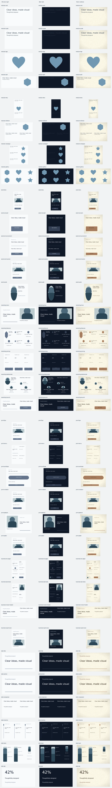

# Containers, template variants and comic pages

Containers are editable groups with semantic text and image slots. Their local layout can reflow at a new size, and named variants preserve the filled content. `vixl_workflow(action="resource-show", request={"kind":"containers","name":"profile"})` returns the resource's slots, defaults, bounds and variants. Use `kind: "templates"` to inspect a template's category, supported named sizes, slots and recommended looks.

## Place, fill and rearrange

```json
[
  {"type":"palette-apply","name":"slate"},
  {"type":"container-place","name":"person","resource":"profile","variant":"left","seed":42,"width":600,"height":400,"variables":{"name":"Ana Rivera","title":"Designer","bio":"Making complex ideas clear","photo":"assets/IMPORTED_HASH.png"}},
  {"type":"container-variant","target":"person","variant":"centered"},
  {"type":"container-fill","target":"person","variables":{"title":"Design lead"}},
  {"type":"resize","target":"person","width":720,"height":500}
]
```

Import the image first with `vixl_import_image` and use its returned asset ID. Python and CLI calls can also supply an image path inside the workspace; services accept embedded assets only. Source images remain embedded, so resizing recrops from the source rather than a previously cropped thumbnail.

`container-variant` preserves the group identity, image source, supplied variables and direct edits to slot text. It recreates the arrangement's children; use `container-reflow` when existing child IDs need to stay unchanged. `container-swap` replaces the resource while carrying compatible named variables across. Resources with different base sizes require explicit dimensions. Changing a size updates the group's local layout box, wraps/fits opted-in text and recomputes image crops. It does not geometrically stretch the group. An impossible fit or min/max violation fails atomically.

Omitting a seed selects a fresh one. Placement reports its seed and selected variant; save them to reproduce a composition. Explicit choices and workspace brand values take precedence.

## Built-in containers

| Resource | Slots | Arrangements |
| --- | --- | --- |
| `stat` | value, label, optional delta | default |
| `testimonial` | quote, name, role, photo | left, centered, split |
| `feature-icon` | title, body, geometric icon | left, centered, split |
| `cta` | title, button | default |
| `pricing-tier` | plan, price, features, button | default |
| `profile` | photo, name, title, bio | left, centered, split |
| `timeline-step` | date, title, body | default |
| `list-block` | title, items (plain, bulleted or numbered text) | default |
| `badge`, `ribbon` | label | default |
| `photo-caption` | photo, caption | default |
| `product-card` | photo, name, price, optional tag | left, centered, split |
| `section-header` | eyebrow, title | default |

The original headline, quote, feature and illustration containers remain available. Text and decorations use palette role swatches. Image-bearing resources show crossed neutral placeholders until filled. Both the normal blanks check and the `container-layout` suite report missing image slots; the container suite also reports sources with fewer pixels than the displayed image requires.

Custom resources can declare `min_width`, `max_width`, `min_height`, `max_height` and named `variants`, each containing `operations` and optional `rules`. Local content supports `frame: [x, y, width, height]` in fractions of the container, plus `fit_text: true` and `min_size` on text operations. A text frame wraps and shrinks only as far as its minimum; overly long copy is rejected rather than clipped. Vertical, horizontal and grid rules continue to support padding, gaps, columns and hidden-member collapse.

An image operation inside a resource can declare:

```json
{"type":"image-slot","name":"portrait","slot":"photo","width":200,"height":200,"fit":"cover","focal":[0.65,0.35],"mask_shape":"circle"}
```

`cover` crops around the focal point, `contain` letterboxes with transparency, and `fill` stretches. `mask_shape` accepts supported shape silhouettes, with `rect`, `rounded` and `circle` aliases; rounded masks accept `radius`. Source resolution is independent of the cropped asset generated for rendering.

## Hug-content buttons and badges

```json
[
  {"type":"text","name":"button-label","text":"${action}","size":24,"color":"white"},
  {"type":"stack","name":"button","targets":["button-label"],"size":"hug","background":"#245a70","radius":24,"padding":{"top":10,"right":20,"bottom":10,"left":20}}
]
```

Define the `action` variable before applying this example. Hug stacks measure visible children plus padding at render time. Updating the text or export variables adjusts both the box and its background; nested horizontal stacks adjust gaps and positions too. `stroke` and `stroke_width` add an outline. Padding can be uniform or per side. `size: "fixed"` keeps the traditional stack behavior, and `remove: true` freezes the current geometry before releasing the layout.

## Use-case templates

- Social: `social-story`, `social-carousel` (three pages), `social-announcement`, `social-event-promo`, `social-quote`.
- Marketing: `marketing-hero`, `marketing-features`, `marketing-pricing`, `marketing-testimonials`, `marketing-launch`.
- Print: `print-flyer`, `print-menu`, `print-certificate`, `print-invitation`, `print-postcard`, `print-poster`.
- Business: `business-one-pager`, `business-case-study`, `business-invoice-header`, `business-report-cover`.
- Slides: `slide-title`, `slide-section`, `slide-comparison`, `slide-timeline`, `slide-team`, `slide-stat`.

Create the canvas at one of the template's declared sizes, then apply it. Its grid computes cells from the current canvas, including padding and gutters. `columns` changes the grid; cells smaller than a usable container are refused. Print canvas metadata is retained. Each template includes the `container-layout` check suite. Unfilled text remains an explicit placeholder.

```json
{"type":"template-apply","name":"marketing-pricing","seed":42,"palette":"coffee","look":"paper","columns":3,"variables":{"slot-1":{"plan":"Starter","price":"$19","features":"One workspace\nShared projects","button":"Start now"},"slot-2":{"plan":"Team","price":"$49","features":"Five workspaces\nShared libraries","button":"Choose Team"},"slot-3":{"plan":"Studio","price":"$99","features":"Unlimited workspaces\nPriority support","button":"Contact us"}}}
```

Every modular/use-case template recommends minimal/light (`slate`, no finish), bold/dark (`midnight`, soft shadow), and warm/editorial (`coffee`, paper). `mode` selects light or dark, `palette` selects colors, `look` selects a finishing recipe, and `style` applies a catalog style's guidance and checks. The template result records the seed and choices. The gallery below renders all three recommended combinations with filled slots; regenerate it using `python examples/build_template_gallery.py`, which also checks all 102 combinations.



## Comic storytelling

`comic-layout` lays out a narrative panel sequence with configurable gutters, margins, borders and left-to-right or right-to-left reading order. Panels can span multiple columns, carry image slots, wrap a caption, and contain speech/thought/shout/whisper dialogue. Output remains editable groups, text, shapes and image layers.

```json
{"type":"comic-layout","name":"chapter-1","columns":2,"gutter":20,"reading_order":"rtl","panels":[{"caption":"A quiet morning","image":"assets/IMPORTED_HASH.png","dialogue":[{"text":"Something is different today.","style":"thought","x":0.08,"y":0.08}]},{"caption":"Across the street"},{"caption":"The whole picture","span":2}]}
```

The result records ordered panel IDs and bounds. Missing artwork is flagged as a blank. Dialogue uses the speech-bubble primitive and its anchor-following tails. For multiple comic pages, use the normal `page` operation, then apply `comic-layout` to each page.
