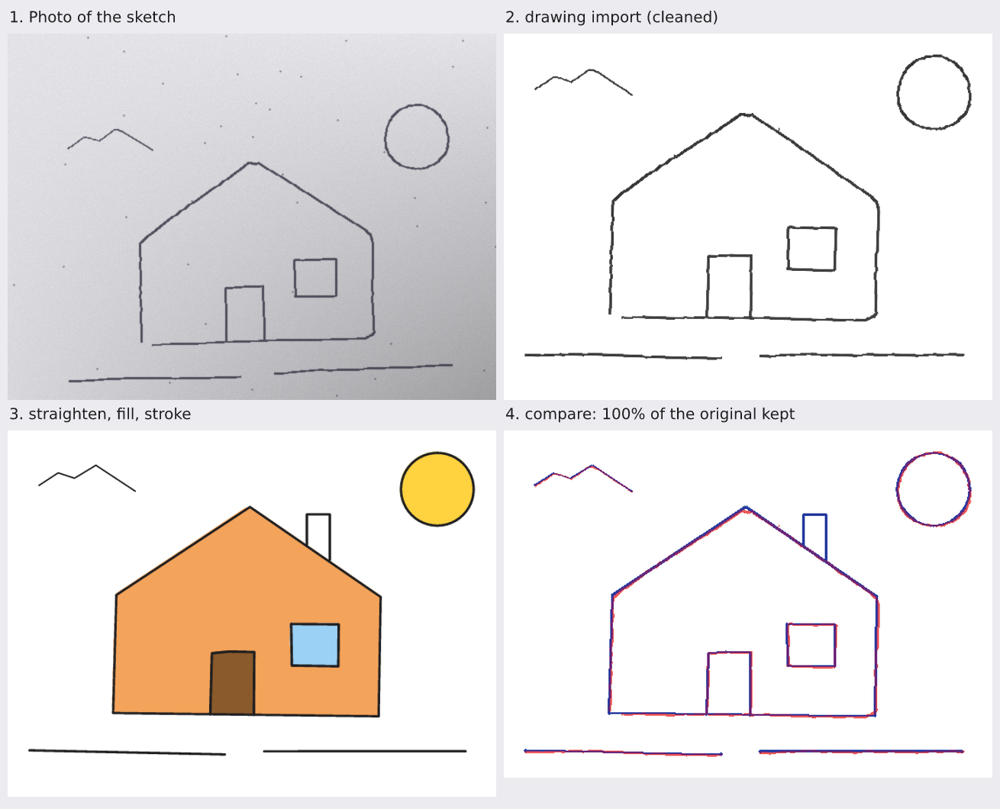

# Hand drawings

[Documentation home](README.md) · [Getting started](getting-started.md) · [Visual gallery](gallery.md)

Bring in a photo or scan of a hand drawing and build on it: clean it up, trace it into editable
strokes, straighten what should be straight, close gaps, colour the shapes, add new lines in the
same hand — while keeping as much of the original drawing as possible, and measuring how much was
kept.



```bash
vixl drawing import sketch.jpg --name house          # clean lines over a hidden copy of the photo
vixl drawing vectorize house                         # editable strokes house/s001 … (ink hidden)
vixl drawing vectorize house --settings '{"width": "uniform"}'   # one pen width for every stroke
vixl drawing straighten house --settings '{"close_gaps": 30}'    # close gaps; angles stay as drawn
vixl drawing straighten house --settings '{"angles": "axes"}'   # square up walls and floors too
vixl drawing report house                            # how much is kept, stroke kinds, regions to fill
vixl drawing fill house --points '[[1324, 211, "#ffd23f"], [916, 675, "#9ad1f5"]]'
vixl drawing stroke house --points '[[960, 330], [960, 230], [1010, 230], [1010, 360]]'
vixl drawing compare house --out compare.png         # the original in red under the result in blue
vixl check --checks drawing                          # warns when original lines were lost
vixl ai drawing-color house --prompt "soft watercolour, late afternoon light"   # optional, with a provider
```

```json
{"type": "drawing", "action": "import", "asset": "assets/…png", "name": "house"}
{"type": "drawing", "action": "straighten", "target": "house", "strokes": ["house/s003"], "settings": {"angles": [0, 90]}}
{"type": "drawing", "action": "vectorize", "target": "house", "settings": {"width": "uniform"}}
```

Through MCP, import the photo with `vixl_import_image` and pass its `asset`; `vixl_workflow`
actions `drawing-report` and `drawing-compare` return the report and write the comparison image.

## What a drawing is

`drawing import` creates a group (named by `name`) whose content is the cleaned drawing's pixel
grid. It holds:

| Layer | What it is |
| --- | --- |
| `NAME/original` | The photo, tilted and cropped like the cleaned lines; hidden. Show it to trace over the original. |
| `NAME/ink` | The cleaned lines. Hidden once the drawing is vectorized (`keep_ink` keeps it). |
| `NAME/s001` … | Strokes: editable path layers along the centre of each line, longest first. Each records its points, width and what was done to it (`traced`, `added`, `line`, `polyline`, `circle`, `smoothed`). |
| `NAME/fill-1` … | Colour under the lines. |
| `NAME/color` | An AI colouring under everything else (`ai drawing-color`). |

The group moves, scales and checks like any group; the photo as imported stays in the document
so the drawing can be cleaned again with other settings. `x`, `y`, `width` or `height` on import
place and size it (default: centred, at most 90% of the canvas).

## Actions

| Action | Does | Settings |
| --- | --- | --- |
| `import` | Cleans a photo or scan into lines: finds the sheet of paper in a photo and leaves out the desk or table around it (the paper's edge is not traced as ink), flattens a page photographed at an angle (perspective correction), divides out the paper's lighting and shadows, separates ink from paper, removes dust, corrects a tilted page, crops to the drawing, and keeps the pencil's own grain and anti-aliasing. | `threshold` (`auto` or 0–1), `sensitivity` (−1–1: higher finds fainter lines), `despeckle` (`auto` or the smallest mark in pixels), `weight` (−10–10 pixels thinner or bolder), `deskew` (true), `crop` (true), `margin` (24), `soft` (true), `ink` (the line colour, default `#1d1d1f`; or `original` to keep the pencil's own colour; the operation's `color` is shorthand for it), `flatten` (true), `max_size` (2400), `sheet` (true; false keeps everything in the frame, for a drawn border that runs right along the photo's edge), `perspective` (true; false leaves a keystoned page as photographed) |
| `clean` | Cleans again with other settings. Once there are strokes or fills, the tilt and crop stay as they are so everything stays aligned. | as `import` |
| `vectorize` | Traces each line along its centre into a stroke with the line's width (`centerline`), or the lines' outlines into one filled shape that keeps every change of pressure (`outline`). | `mode`, `min_length` (6), `detail` (0.75 px of simplification), `max_strokes` (240; the rest share `NAME/detail`), `keep_ink`, `color` (default: the import's `ink`, `#1d1d1f`), `width` (default: each stroke keeps the width it was drawn with; a number in pixels, or `uniform` for the median width, so every stroke has one weight; centerline only). Outline mode also takes `curves` (false; true fits cubic Bézier curves, keeping sharp corners, instead of hundreds of straight segments), `tolerance` (1 px: how far a curve may stray from the traced edge), `corner_threshold` (60°: a sharper turn stays a corner), `split` (`none`, or `components`: one layer per connected part, `NAME/part-001` … in reading order, each in its own box; past 256 parts the smallest share `NAME/small-parts`) and `min_area` (4 px: smaller specks are dropped) |
| `straighten` | Lines that are nearly straight become straight, **at the angle they were drawn at**; shapes made of straight sides keep their corners where they were drawn but get sharp corners and straight sides; curves (lobes, arcs, waves, wide rounded corners) keep their drawn shape, so a cloud or a tree's canopy is left as drawn and in an arched window or a U only the straight sides change; nearly round closed shapes become circles; sides snap to fixed `angles` only when asked; gaps are closed when `close_gaps` says so. | `tolerance` (4 px: how far a line may wander and still count as straight), `angles` (`drawn`, the default: every side keeps its own angle; `axes`: snap to horizontal and vertical; `45`: snap to 45° steps; `guides` for the document's guide angles; or a list of degrees such as `[0, 90]`), `angle_tolerance` (6°: how close a side must be to a listed angle to snap), `circles` (true), `polylines` (true; false keeps everything but single lines and circles as drawn), `corner` (24 px: shorter sides are rounded corners, made sharp; a curve more than twice as long between two sides is kept), `close_gaps` (0: close gaps this wide; `auto` is 2% of the drawing's longer side, at least 8 px) |
| `smooth` | Evens out shaky strokes, keeping their ends. Strokes `straighten` made into lines and polylines keep their straight sides and corners. | `amount` (0–1), `corners` (`keep`, the default, or `round` to smooth straightened strokes too; the `drawing` check then warns that their corners became curves) |
| `fill` | Colours the region around each point, under the lines. Small breaks in an outline are bridged; the fill reaches into every corner without crossing a line. | `points` [[x, y, colour], …] (canvas positions; `space: "group"` for the drawing's own coordinates), `gap` (6 px of break to bridge), `min_area`, `under` (true) |
| `stroke` | Adds a stroke in the drawing's hand: its width and colour, smoothed through the points. | `points` [[x, y], …] (canvas positions, or the drawing's own with `space: "group"`), `width`, `smooth` (true), `closed`, `color`, `name` |
| `restyle` | Recolours strokes or changes their width. | `color`, `width` (pixels, or `uniform`: the median of the chosen strokes) or `width_scale` |

`straighten`, `smooth` and `restyle` take `strokes` (layer names, or `all`, the default) so a
direction such as "straighten the walls but leave the tree alone" touches only those strokes.
Stroke layers are ordinary path shapes: move, remove, recolour or reorder them like any layer.

## Photos of a page on a desk

A phone photo of a sketch on paper shows the desk too, and the page is a trapezoid when the camera
looked at it from an angle. `import` deals with both before it traces anything:

1. **The paper is found.** Its bright outline on the darker desk is detected, and everything outside
   it (the desk, the page's edge and shadow) is left out, so none of it is traced as ink.
2. **A page photographed at an angle is flattened.** When the page's four corners are in the photo and
   the page is not a plain rectangle (opposite sides out of parallel by 1° or more, or 2% unequal), the
   outline is fitted with a four-sided polygon and the photo is warped so the page is a rectangle
   again: walls stand upright, floors run level and a circle comes out round. The page's proportions
   come from its corners alone (a pinhole camera looking at the middle of the photo). `perspective:
   false` skips this.
3. **The remaining tilt is corrected** from the lines themselves (`deskew`), up to 8°. A page that
   only turned, or that runs off the frame so its corners are not in the photo, has no perspective to
   correct; the desk is still cut away along the page's straight edges and the tilt is found as before.

`drawing report` says what happened: `paper_found`, `perspective_corrected` and `tilt_corrected`.
The flattening is stored with the drawing, so `clean` with other settings keeps strokes and fills aligned.

## Line weight, gaps, angles and colour

- **Weight.** Each stroke keeps the width it was drawn with, measured as the ink it covers over its
  length (so a diagonal line reads as wide as a straight one). For one weight throughout, vectorize
  with `{"width": "uniform"}` (the median width) or a number of pixels, or `restyle` with the same
  setting. `drawing report` returns `stroke_width` (`min`, `median`, `max`) so the result can be checked.
- **Gaps.** `straighten` with `close_gaps` closes gaps up to that many pixels, nearest first, after
  the sides have been straightened: two straight ends that were meant to make a corner both run on to
  where their lines cross (a sharp corner, each line keeping its angle); a straight end that was
  meant to land on another line runs on until it touches it; the two halves of a line broken in the
  middle meet halfway; curved ends are bridged. An end never runs on by more than half its own length,
  so a short tick is not turned into a long line, and rays that stand off a sun are not joined to it
  unless the gap is that wide. Only the strokes you list are changed (the others are only run on to).
  `fill` also bridges small breaks (`gap`, 6 px) without changing any stroke.
- **Angles.** `straighten` keeps each line at the angle it was drawn at, so the rays of a sun stay
  where the hand put them. Ask for fixed angles with `angles`: `axes` squares up walls and floors,
  `45` also snaps to the diagonals, or give a list such as `[0, 90]` or `guides`.
- **Colour.** Lines are near-black `#1d1d1f` unless you say otherwise. Set `ink` on `import` (or pass
  `color`, which is shorthand for it) for the cleaned raster lines and the strokes traced from them;
  `vectorize` takes `color` and `restyle` recolours existing strokes. Pure black is `#000000`.

## Keeping the drawing

The cleaned lines at import are the reference. `drawing report` (and the `drawing-report`
workflow action) returns:

- `preserved` — the share of the original lines the current drawing still covers (within about
  a line's width);
- `added` — the share of the current lines that is new;
- `stroke_kinds` — how many strokes were straightened, rounded into circles, smoothed or added;
- `stroke_width` — the thinnest, median and thickest stroke, in pixels;
- `paper_found`, `perspective_corrected`, `tilt_corrected` — what `import` did to the photo;
- `regions` — the closed regions with a point inside each, ready for `fill`: `point` on the
  canvas and `group_point` in the drawing's own coordinates;
- `space` (`canvas`, what `point` uses) and `group` — the `offset`, `scale` and `rotation` that take
  the drawing's own coordinates to the canvas;
- `fidelity` — how exactly the current drawing reproduces the original ink, pixel for pixel: `iou`
  (shared ink over all ink; 1 is an exact recreation), `mismatch` (the fraction of the drawing's pixels
  that differ), `mismatch_pixels` and `mismatch_region`. Use it to prove a traced logo matches its source.

`fill` and `stroke` read their points as canvas positions, through any move, scale or rotation of the
drawing group, so they land where the drawing is shown now. Pass `space: "group"` to give them in the
drawing's own coordinates instead (the `group_point` of a region), which stay valid wherever the
drawing is moved.

The `drawing` check (opt-in: `check --checks drawing`) warns when a drawing keeps less than 90% of
its original lines (an error below 70%) or when more than a third of it is new. `drawing compare`
draws the original lines in red under the current ones in blue — purple where they agree — so the
change is visible at a glance, and returns the report with `fidelity`.

## Recreating a logo from an image

A flat logo (type, a mark) traces best in outline mode with curves, one layer per part:

```json
{"type": "drawing", "action": "import", "asset": "assets/logo.png", "name": "logo", "settings": {"deskew": false}}
{"type": "drawing", "action": "vectorize", "target": "logo", "settings": {"mode": "outline", "curves": true, "split": "components"}}
{"type": "path-split", "target": "logo/part-003", "polygon": [[40, 10], [90, 10], [90, 80], [40, 80]], "overlap": 2, "names": ["X", "vine"]}
```

Each letter and mark becomes its own editable path of Bézier curves, named in reading order. Where two
shapes touch or cross (a vine through a letter) they trace as one part; `path-split` cuts it along a
`polygon` or a `line` into two named parts, and `overlap` lets both reach a few pixels across the cut so
each stays whole when moved apart (see [vector paths](vector-paths.md#constructive-paths)). Finish with
`drawing report` and read `fidelity.iou` (above 0.99 for a clean recreation).

## AI colouring

`vixl ai drawing-color DRAWING --prompt TEXT [--strength 0.6] [--provider NAME]` sends the drawing
as drawn so far (fills and lines on white) to an image-to-image provider and places the result as
`NAME/color` under the drawing's own fills and lines, so every line stays exactly as drawn and the
preservation report is unchanged. Python: `vixl.drawing.ai_color(project, "house", prompt,
backend)`. It needs a configured provider that supports image-to-image (see
[providers](providers.md)).
