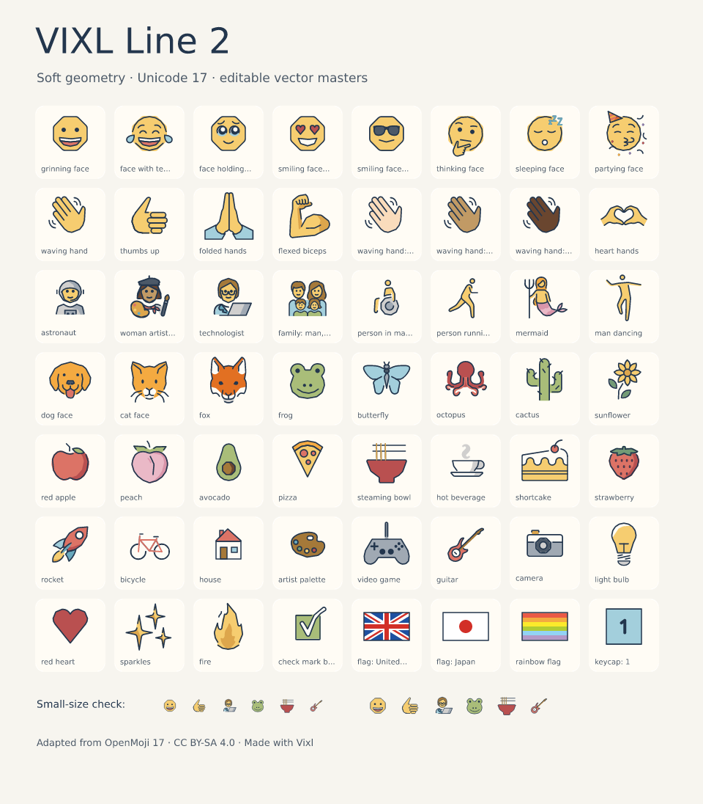
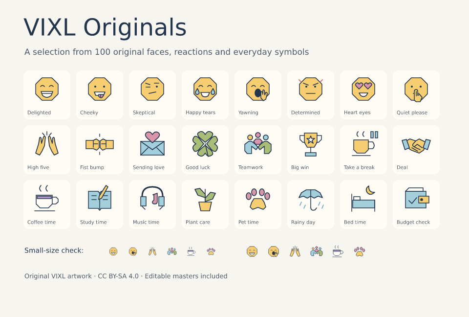

# Emojis and custom packs

VIXL Line bundles **Unicode Emoji 17.0**: 3,953 fully qualified emojis and standalone
components, with 5,225 supported qualification variants. Every entry has an offline
SVG fallback and an editable `.vixl` master. Skin tones, flags, keycaps, hair components
and joined sequences have their own artwork. **100 original VIXL emojis** bring the
pack to **4,053 entries**: 24 faces and moods, 44 reactions and gestures, and 32 everyday
symbols. No font installation or network is needed.

VIXL Line 2 uses straight sides, subtly faceted silhouettes and short curved corners,
with small round details retained. Its 1.7 px navy outlines, warm neutrals and muted
accents stay readable at emoji sizes, without snapping the artwork to a grid.
Unicode artwork adapts OpenMoji 17.0.0; national flag geometry and colors are preserved.
The extra faces, reactions and symbols are original VIXL artwork. Masters contain separate editable vector
shapes; compound even-odd fills are converted to editable outlines.



Rebuild this review sheet and the full image pack with `python examples/build_emojis.py`.
The script also creates a 48-emoji Discord starter pack, a 100-original collection,
separate category packs and a 512 px image pack in `examples/output/emojis/`.

## The 100-original collection



| Category | Count | Examples |
| --- | --- | --- |
| Faces and moods | 24 | `:delighted:`, `:cheeky:`, `:skeptical:`, `:yawning:`, `:quiet_please:` |
| Reactions and gestures | 44 | `:approved:`, `:high_five:`, `:fist_bump:`, `:sending_love:`, `:teamwork:` |
| Everyday symbols | 32 | `:coffee_time:`, `:study_time:`, `:music_time:`, `:plant_care:`, `:bed_time:` |

Browse the full collection in the exported pack's `index.html`. All 100 have their own
SVG and editable VIXL source. They are separate from the 3,953 Unicode fallbacks.
Catalog `original_count` counts the complete original collection; `unicode_count`
counts canonical Unicode entries. Query groups `VIXL Faces`, `VIXL Reactions` and
`VIXL Everyday` to browse by category.

These shortcodes render immediately, including in font preference mode. They can be
replaced, edited, exported and reset just like Unicode emojis.

| Original reaction themes | Examples |
| --- | --- |
| Approval | `:approved:`, `:nice_work:`, `:ship_it:` |
| Celebration | `:celebrate:`, `:confetti:`, `:on_fire:` |
| Thinking | `:thinking:`, `:idea:`, `:question:`, `:focus:`, `:mind_blown:`, `:taking_notes:` |
| Support | `:support:`, `:thank_you:`, `:cheer:`, `:hug:` |
| Status | `:available:`, `:in_progress:`, `:done:`, `:blocked:`, `:away:`, `:review:`, `:recharge:`, `:almost_there:` |

Search with `vixl emoji list --group 'VIXL Reactions'`. Export a subset with
`--emojis ':approved:' ':celebrate:' ':in_progress:'`.
Shortcodes are VIXL identifiers; image packs map them to destination custom emoji
names. Pasting a shortcode into another application requires installing its image there.

## Find an emoji and edit its source

```bash
vixl emoji list --query astronaut --limit 10
vixl emoji get '😀' --out grinning-face.vixl
vixl -p grinning-face.vixl inspect
vixl -p grinning-face.vixl check --checks bounds
vixl -p grinning-face.vixl render --out grinning-face.png
```

`get` without `--out` returns metadata. `--format svg` or `--format png` extracts an
image instead. `list` supports `--group`, `--offset`, `--limit` and `next_offset`.
Use the Unicode emoji itself or its hex sequence (`1F600`, `1F44B-1F3FD`).

## Rendering preference and replacements

VIXL artwork is the default, including when a font has the emoji. Set a document to
`font` to prefer its configured font stack; unsupported sequences still get the
bundled image. Coverage checks test complete joined sequences, rather than assuming
that a font containing each individual character can draw the combined emoji.
Text-default symbols such as `↗`, `©` and `♥` remain font text; add the emoji
presentation selector (VS16) for `↗️`, `©️` and `♥️`. VS15 explicitly requests text.
A registered custom replacement always wins over the font preference.

```bash
vixl new 600x160 --background white --no-fonts -o message.vixl
vixl -p message.vixl text add 'Hello 😀 👋🏽 🧑‍🚀' --size 48 --color '#23364D'
vixl -p message.vixl emoji settings --mode font
vixl -p message.vixl emoji settings --mode vixl
vixl emoji get '😀' --out my-grin.vixl
vixl -p message.vixl emoji replace '😀' my-grin.vixl
vixl -p message.vixl emoji replace ':my_emoji:' my-grin.vixl --name my_emoji
vixl -p message.vixl text --text 'Hello 😀 :my_emoji:'
vixl -p message.vixl emoji reset --emoji '😀'
```

Edit `my-grin.vixl` before replacing to change its appearance. Replacement accepts
`.vixl`, editable SVG geometry, and PNG. Custom shortcodes have 2–64 ASCII letters,
digits, underscores, hyphens or plus signs between colons. They work in plain text,
rich text and text flows. Sources, renderable SVG appearances and licenses are embedded
in the document; it stays portable, and replacement, mode changes, reset and pack
installation are undoable. `reset` without `--emoji` clears all overrides.
Changing the original file after replacement does not update the embedded copy: replace
again to adopt edits. Raster replacements remain raster artwork; only supplied VIXL
masters are editable as layers. SVG inputs use the engine's existing editable SVG
import restrictions (simplify unsupported SVG features before importing).

Text layout, fitting, wrapping and bidi preserve emoji sequences as one glyph. SVG
keeps vector emoji geometry; PNG renders the same shared layout. PDF and PowerPoint
preserve the appearance of emoji text using a reported raster fallback for the affected
text layer. The font preference uses supported outline fonts; color/bitmap faces that
the text engine cannot render fall back to artwork. Glyphs on a text path can be
positioned as artwork; bending emoji artwork with text warp presets is not supported.

## Create custom emojis from scratch

```bash
vixl emoji template face --out happy.vixl
vixl emoji template symbol --out heart.vixl
vixl emoji template blank --out custom.vixl
vixl emoji template sheet --out ideas.vixl
vixl -p happy.vixl check --checks bounds
vixl -p happy.vixl render --out happy-preview.png
```

`blank`, `face` and `symbol` are transparent 72×72 masters; `sheet` is a 4×4 layout
of 72 px cells with editable safe-area guides. The canvas is the emoji's bounding box,
so draw on one cell-sized document for an individual emoji. Sheet guides are ordinary
layers: hide or remove them and split the concepts into individual masters before
registration. Set `--destination discord` or `--destination slack` to record the intended
delivery profile. Template metadata contains the creation guide.

- Keep the identifying silhouette and key details inside an 8 px margin.
- Use navy `#23364D`, 1.7 px strokes, straight sides and softly curved corners.
  Keep small features round and let each silhouette determine its angles.
- Use few accent colors; keep skin tones and flag details recognizable.
- Judge at 24 and 32 px, on both a light and a dark background. Simplify anything
  that disappears at those sizes. A larger working canvas is fine: registration fits it
  into one em while preserving the aspect ratio.
- Retain a transparent background and save the `.vixl` master before delivery.

## Export and use in Discord or Slack

```bash
vixl emoji destinations
vixl emoji requirements --destination discord --emojis '😀' '👋🏽' '🧑‍🚀'
vixl emoji export --destination discord --emojis '😀' '👋🏽' '🧑‍🚀' --out discord-emojis.zip
vixl emoji export --destination images --emojis '😀' '👋🏽' --size 256 --out images.zip
```

Without `--emojis`, export includes the full Unicode set, all original VIXL emojis and any new shortcodes in the
selected document. Select a smaller subset for destinations with limited emoji slots.
The ZIP contains PNGs, SVGs, available VIXL masters, `manifest.json`, an offline
`index.html` preview, upload instructions, attribution and license texts.
`--no-sources` omits VIXL masters; `--overwrite` explicitly replaces an existing output.
Manifest entries identify their `kind`, `group` and `category`. Unicode entries include
`unicode_sequence` and `codepoints`; original and custom images include `shortcodes`
and have no invented Unicode assignment. Editable masters retain author and source
attribution through installation and re-export.

| Destination | Export profile | Use immediately |
| --- | --- | --- |
| Images | Transparent PNG, SVG and optional VIXL, 16–1024 px (default 128) | Unzip and open `index.html`; use PNG in image uploads or SVG on the web. |
| Discord | 128×128 PNG, under 256 KiB, normalized unique 2–32 character names | Unzip, then **Server Settings → Emoji → Upload Emoji** and select files in `png/`. |
| Slack | 128×128 transparent PNG, under 128 KiB, normalized unique names | Unzip, then **emoji picker → Add Emoji → Upload Image**, and use the filename as the name. |

Profiles are checked against [Discord's custom emoji help](https://support.discord.com/hc/en-us/articles/360036479811-Custom-Emojis)
and [Slack's custom emoji help](https://slack.com/help/articles/206870177-Add-custom-emoji-and-aliases-to-your-workspace)
on 2026-10-08. The 128 px canvas and conservative name lengths are export choices;
Slack describes its size/byte guidance as recommendations. `requirements` renders and
checks actual encoded bytes, canvas size and names and returns individual findings.
Export refuses assets over a profile's byte budget. Destination permissions, server
slots, workspace restrictions and cross-server use are controlled by those services.
The tool prepares a pack; upload happens through the destination's UI.

Install a complete or partial VIXL pack into a document:

```bash
vixl new 600x160 --background white --no-fonts -o pack-demo.vixl
vixl emoji export --emojis '😀' '👋🏽' --out starter.zip
vixl -p pack-demo.vixl emoji install starter.zip
vixl -p pack-demo.vixl text add 'Custom pack 😀 👋🏽' --size 48 --color '#23364D'
vixl -p pack-demo.vixl render --out pack-demo.png
```

Installation merges the pack's entries into the document, replacing matching keys;
entries absent from the pack keep their previous replacement or the bundled fallback.
It validates every source and then commits one atomic batch. Exported SVG appearances
are preserved exactly alongside source masters. Nothing is extracted to arbitrary paths.

## High-resolution images and future phone support

The example builder produces `vixl-originals-images.zip`: all 100 originals as transparent
512×512 PNGs, SVGs and editable VIXL masters. These are portable images for messaging,
design tools and later sticker integrations. The ZIP is an image pack, not a phone installer.

For another subset or resolution, use the `images` destination with `--size 512`.
The manifest keeps Unicode mappings separate from custom shortcodes, so future phone
integrations can retain standard emoji semantics and package original art as stickers.

The first phone milestone is a sticker-pack integration; a custom keyboard can follow.
Replacing system emoji fonts is a separate platform feature, with installation and
color-font format support that varies by OS and device. Neither phone installation nor
system font replacement is implemented by the current image-pack exporter.

## Python, MCP and REST

The canonical operations are `emoji-mode`, `emoji-set` (base64 source, `format`, `emoji`,
optional `name` and `license`) and `emoji-reset`. CLI, Python, REST and MCP use the same
operation schema and atomic edit boundary. `emoji-set.appearance` optionally supplies
an inert base64 SVG appearance from an exported pack while retaining its editable source.

```python
from vixl import Project
from vixl.emojis import export_pack

project = Project(600, 160, background="white")
project.apply([
    {"type": "emoji-mode", "mode": "vixl"},
    {"type": "text", "text": "Hello 👋🏽", "size": 48, "color": "#23364D"},
])
export_pack("wave.zip", ["👋🏽"], destination="discord", project=project)
```

All catalog, template, requirements and pack actions are also exposed through
`vixl_workflow` (MCP) and `vixl workflow` (CLI); the REST service accepts only the emoji
operations above through `POST /operations`, not these workflows. Discover typed request fields with
`vixl workflow schema`: `emoji-list`, `emoji-get`, `emoji-destinations`,
`emoji-requirements`, `emoji-export`, `emoji-template`, `emoji-replace`,
`emoji-pack-install`, `emoji-settings` and `emoji-reset`.
Paths are bounded to the workspace. CLI uses the current directory; use
`vixl emoji --workspace DIR …` for a different workspace.

## Licensing and updating the library

VIXL Line is adapted from [OpenMoji](https://openmoji.org), by OpenMoji contributors,
under **CC BY-SA 4.0**. The 100 original VIXL emojis use the same artwork license.
Attribution, per-entry authors, `source_origin`, source version and the changes
are recorded in the catalog and exported packs. Edited bundled masters retain this
license. Original user-supplied art keeps its stated license (or `unspecified`);
installing a pack retains its per-entry licenses. The engine's license is separate.
Unicode test data is included under the Unicode data license.

Maintainers rebuild with `python scripts/build_emojis.py --sources DIR`. The source
directory contains these pinned inputs, downloaded with TLS verification:

- [OpenMoji 17 SVG color archive](https://github.com/hfg-gmuend/openmoji/releases/download/17.0.0/openmoji-svg-color.zip), saved as `openmoji.zip`.
- [OpenMoji 17 metadata](https://raw.githubusercontent.com/hfg-gmuend/openmoji/17.0.0/data/openmoji.json), saved as `openmoji.json`.
- [Unicode 17 emoji test data](https://unicode.org/Public/17.0.0/emoji/emoji-test.txt), saved as `emoji-test.txt`.
- [OpenMoji license](https://raw.githubusercontent.com/hfg-gmuend/openmoji/17.0.0/LICENSE.txt), saved as `LICENSE.txt`.
- [Unicode license](https://www.unicode.org/license.txt), saved as `UNICODE-LICENSE.txt`.

Original faces, reactions and symbol sources live in `assets/emojis/reactions/`; the builder
bundles them alongside the Unicode library without applying the OpenMoji transformation.

Pin each next Unicode/OpenMoji version together, audit missing entries and preview
all changed artwork. Never replace an uncovered emoji with a generic placeholder.
Bundled artwork and catalog data ship in the wheel, with no runtime downloads.
