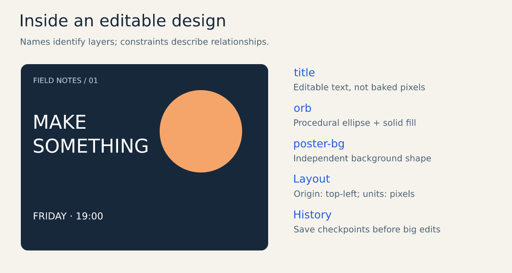
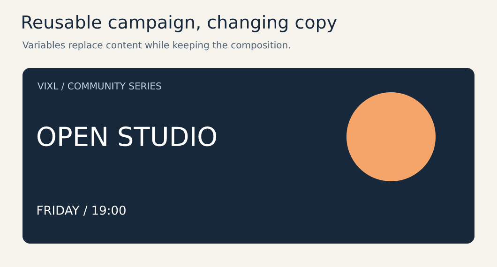
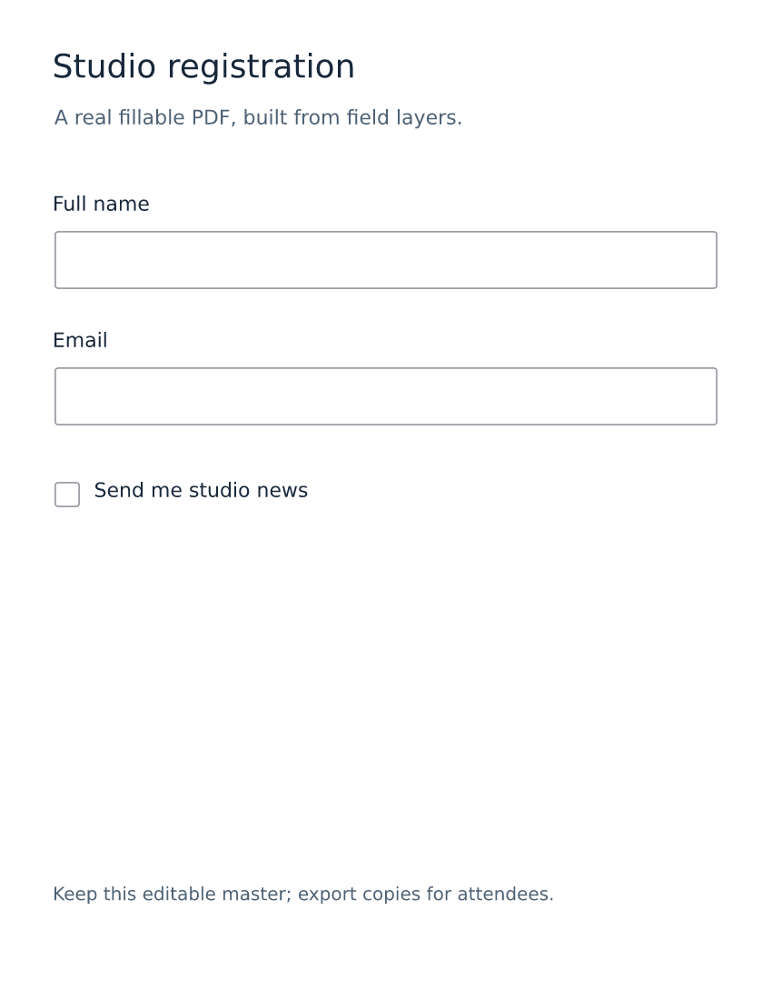
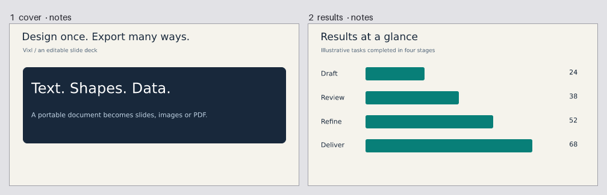
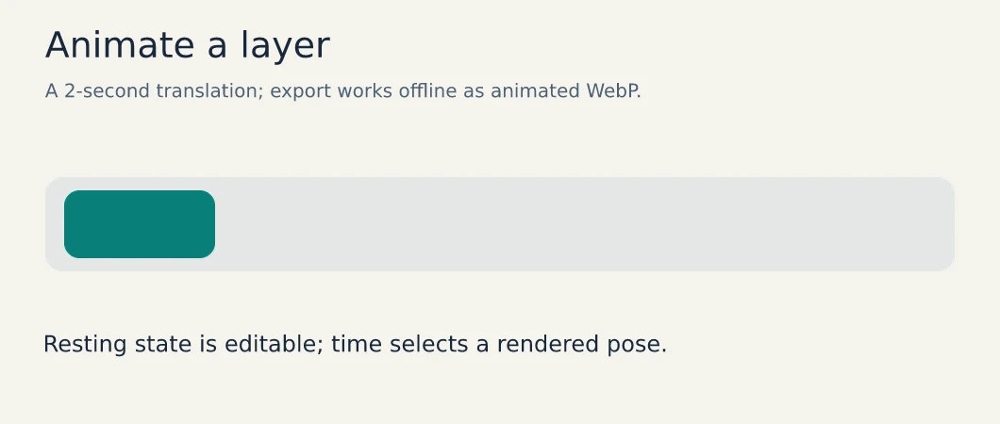

# Visual capability gallery

[Documentation home](README.md) · [Rebuild these assets](documentation-maintenance.md)

Every new illustration here was created with Vixl's operation engine. They are actual
exports, with editable masters and canonical recipes. Charts use labeled illustrative
data. These examples require no network service or AI credentials. Documentation artwork
uses the bundled DejaVu Sans proofing font; select suitable brand typography for production.

## Editable design and reusable campaigns

[Master](assets/generated/document-anatomy.vixl) · [Operations](assets/generated/document-anatomy.json)
· [Concepts](concepts.md)

[Master](assets/generated/campaign.vixl) · [Operations](assets/generated/campaign.json)
· [Campaign tutorial](tutorials/campaign.md)

Variables, constraints, groups, frames and styles support families of artwork. Named sizes
and seeded layouts provide starting points; [brands](brands.md) carries shared resources
and requirements across projects. [Production](production.md) adds checked variants and jobs.

## Diagrams and charts

[Master](assets/generated/workflow.vixl) · [Operations](assets/generated/workflow.json)

[Master](assets/generated/chart.vixl) · [Operations](assets/generated/chart.json)
· [Chart tutorial](tutorials/charts.md)

Both use text and geometry, keeping labels and dimensions editable. Vixl supplies the
graphics engine; your script supplies data transformations and diagram semantics.

## Paint and organic geometry

[Master](assets/generated/paint-organic.vixl) · [Operations](assets/generated/paint-organic.json)
· [Brushes](brushes-and-animation.md) · [Organic generators](organic.md)

Brush parameters, pressure and seeds stay editable. Organic presets compose procedural
geometry. Hand-drawing workflows clean and trace imported line work while retaining an
aligned original and preservation measurements; see [drawing](drawing.md).

## Forms, pages and presentations

[Master](assets/generated/registration.vixl) · [Operations](assets/generated/registration.json)
· [Fillable PDF](assets/generated/registration.pdf) · [Tutorial](tutorials/forms-and-decks.md)

[Master](assets/generated/slides.vixl) · [Operations](assets/generated/slides.json)
· [PowerPoint](assets/generated/slides.pptx) · [PDF](assets/generated/slides.pdf)

Field validation and CSV filling produce attendee copies. Pages, masters and speaker notes
produce decks, carousels and booklets. Supported text and shapes remain editable in slides;
export reports identify appearance fallbacks.

## Motion

[Master](assets/generated/motion.vixl) · [Operations](assets/generated/motion.json)
· [Static preview](assets/generated/motion.png) · [Motion tutorial](tutorials/motion.md)

The animation is a keyframed translation. Timelines also support easing, presets, markers
and multiple animated properties. Pixel sprites use saved timed frames. Video, audio and
shot assembly require the dependencies described in [production](production.md).

## More existing demonstrations

[Poster master](../examples/after-hours.vixl) · [Builder](../examples/build_poster.py)

- [Local artistic-filter gallery](artistic-filters.md): deterministic treatments of images.
- [Drawing cleanup pipeline](drawing.md): preserve and build on a scan or photo.
- [Organic forms gallery](organic.md): flowers, leaves, branching and generated textures.
- [Explorations](../explorations/README.md): print poster, brand identity, kinetic launch,
  pixel RPG, painting, photo lab, trading cards, infographic, campaign and character film.
- [Studio demonstration](../examples/build_studio_demo.py): selections, containers, custom tests and collaboration.
- [Production demonstration](../examples/build_production_demo.py): reusable recipes and checked outputs.

## Provider-backed capabilities

Configured services add image generation, inpainting, outpainting, image-to-image edits,
vision/OCR, background masks and planning. Capabilities differ by adapter and service.
This offline gallery does not claim to demonstrate live inference. Use the
[provider matrix and configuration](providers.md) to enable and verify the functions you need;
Vixl retains returned assets and provenance as ordinary editable document content.
