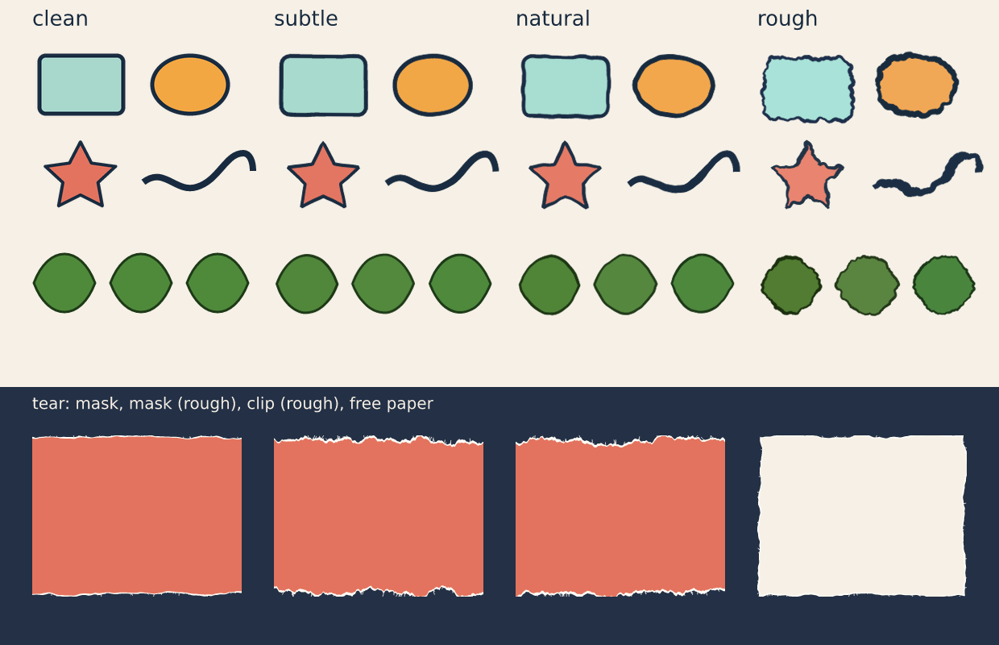

# Irregularity and torn edges

Vector output is exact: every curve is true and every copy identical. That is right for a logo
and wrong for an original character, a hand-inked outline or a sheet of paper that was ripped.
Two operations add the small, bounded flaws that make such things look made rather than computed:

* **`irregular`** perturbs existing vector layers (shapes, paths, strokes, or groups of them):
  outline wobble, vertex jitter, stroke weight, color drift and micro rotation, scale and position
  across a set.
* **`tear`** makes a torn, ripped edge: a fractal rough edge with an optional paper-white rim and
  loose fibres, as a mask or clip on a layer or as free path layers.



Everything is **seeded and deterministic**. The same `seed` always gives the same result, a
different seed gives a different one, and every effect is bounded by numbers you can read below.
Both are undone by normal history, regrown with a new `seed`, and removed with `remove`.

## When not to use it

Use it on a few chosen things, not as a finish for the whole document. Imperfection helps where
the viewer expects a person, a material or an accident, and hurts where they expect precision.

* **Not on logos, icons, UI, diagrams, charts, maps or technical drawings.** Exactness is the point:
  a wobbly bar chart reads as a wrong one.
* **Not on anything that must align, measure or register**: grids, tables, form fields, barcodes,
  print marks, safe-area and bleed boxes, text baselines. Overlap, spacing and alignment checks see
  the perturbed geometry.
* **Not on text** (text layers are refused). Distress lettering with `text-layout` or hand-draw it.
* **Not on small things.** Under about 20 px nothing visible happens, and `rough` on a thin line can
  break it. Pick a strength by looking at the preview, starting at `subtle`.
* **Not on every layer.** If everything is wobbly, nothing is: keep the structure (backgrounds,
  frames, type) clean and roughen the focal character, sticker, label or paper.
* **Not twice.** `organic` forms already have their own `naturalness`; use `irregular` on shapes,
  pen paths and imported vectors, and `tear` only where something is actually ripped.
* **Not to fix a weak design.** It adds character to a good one.
* **Not for randomness at export time.** The result is fixed by `seed` and stored in the document;
  to get another take, change the seed and look again.

## `irregular`

```bash
vixl irregular hero --seed 7                              # natural strength, every effect
vixl irregular hero eyes mouth --seed 7 --strength rough
vixl irregular hero --seed 8                              # regrow with another seed (same recipe)
vixl irregular hero --remove                              # back to the exact source
vixl irregular leaves --seed 3 --only placement color     # micro variation for a set of copies
```

```json
{"type": "irregular", "targets": ["hero", "outline"], "seed": 7, "strength": "natural",
 "wobble": 2.5, "wobble_length": 30, "pressure": 0.3, "lightness_drift": 0.02}
```

`target` (or `targets`) names layers; a group stands for all the vector layers inside it, so one
operation varies a whole set, each layer on its own stream of the seed.

| Field | Meaning |
| --- | --- |
| `seed` | **Required** (except with `remove`). Whole number; the same seed always gives the same result. |
| `strength` | `subtle`, `natural` (default) or `rough`: preset magnitudes, scaled to each layer's size. |
| `amount` | 0–2 multiplier for the preset's magnitudes (default 1). It does not scale fields you set yourself. |
| `only` | Switch on only these effects from the preset: `wobble`, `jitter`, `width`, `pressure`, `color`, `placement`. `[]` switches all off, leaving just the fields you set. |
| `wobble` | Largest outline displacement in pixels, along the outline's normals. 0 turns it off. |
| `wobble_length` | Correlation length of the wobble in pixels: long (60+) reads as a wavering line, short (4–10) as roughness. |
| `roughness` | 0–1: adds finer, stronger octaves to the wobble for a fractal edge. |
| `jitter` | Largest move of the path's own vertices in pixels (a hexagon's corners, a pen path's nodes). |
| `width_variation` | Each layer's stroke width changes by up to this fraction (0–1), a different amount per layer. |
| `pressure` | Stroke width varies *along* the line by up to this fraction (0–1), like ink or a brush. |
| `lightness_drift`, `chroma_drift`, `hue_drift` | Largest shift of fill and stroke in OKLab lightness (0–0.3), relative chroma (0–1) and hue degrees (0–45). Alpha is kept. |
| `rotation_jitter`, `scale_jitter`, `position_jitter` | Each layer turns by up to this many degrees, scales about its centre by 1 ± this fraction, and moves by up to this many pixels. |
| `remove` | Restore the layers to the source kept at the first application. |

### Strengths

Lengths are fractions of a layer's size: the side of its area, but at least 35% of its longest
side, so a thin line still gets visible waves. A 200 px layer at `natural` wobbles by 2 px.

| | `subtle` | `natural` | `rough` |
| --- | --- | --- | --- |
| `wobble` / `jitter` | 0.4% / 0.15% | 1% / 0.4% | 2.8% / 1.2% |
| wobble length | 20% | 16% | 10% |
| `roughness` | 0.15 | 0.35 | 0.65 |
| `width_variation` / `pressure` | 5% / 8% | 12% / 18% | 25% / 35% |
| lightness / chroma / hue | 0.008 / 4% / 1° | 0.02 / 8% / 2.5° | 0.045 / 16% / 6° |
| rotation / scale / position | 0.4° / 0.8% / 0.4% | 1.2° / 2% / 1% | 3° / 5% / 2.5% |

### What it does to a layer

* Outlines are sampled finely, displaced, and written back as `path` data. A primitive shape
  (rectangle, ellipse, star, arc…) becomes a path that looks the way it did, with its stroke still
  inside the box; its corners are kept as corners. Layers that only get color or placement changes
  stay as they are.
* A box that the outline now leaves grows evenly on every side, around the same center, so nothing
  is cut off.
* With `pressure`, a stroke is redrawn as a filled ribbon whose width varies. A stroke-only layer
  becomes the ribbon; a layer with a fill keeps its fill and gains a sibling `NAME-ink` layer just
  above it that holds the outline. Both are ordinary editable path layers.
* Color drift moves the fill and stroke together (one drift per layer) in OKLab, with swatches and
  variables resolved first. Constrained axes keep their position.
* Rotation, position and color drift change the layer's own `rotation`, `x`, `y`, `fill` and
  `stroke`; scale is baked into the path.

### Bounds

Nothing wanders: a point moves at most `wobble` along its normal plus `jitter`; stroke width stays
within `width_variation`, and `pressure` keeps a line between (1 − p) and (1 + p) of its width
(never under 15%); lightness, chroma and hue stay within their numbers; rotation, scale and position
stay within theirs. The first application keeps the pristine geometry, colors, size and position in
the layer's `irregular` record, so:

* applying again (same targets, same or new `seed`) **regrows from the source**; it never stacks
  imperfections, and it keeps the recipe, so `{"type": "irregular", "target": "hero", "seed": 8}`
  only changes the seed;
* `remove` restores the source exactly, primitive shape and ribbon sibling included;
* edits you made to the layer since (a new fill, a move) are replaced by a regrow or remove. Make
  such edits after you have chosen the seed.

## `tear`

```bash
vixl tear photo --seed 3 --edges bottom                   # mask on the photo, natural strength
vixl tear photo --seed 3 --edges top bottom --strength rough --as clip
vixl tear --name scrap --as path --seed 9 --width 600 --height 400 --edges all --fill '#f7f1e5'
vixl tear photo --seed 4                                  # regrow the same tear with a new seed
vixl tear photo --remove
```

A torn edge is a fractal rough line along any sides of a layer's box (or a free-standing sheet),
with the paper beneath showing as a pale **rim** and a few loose **fibres** on the exposed edge.

| `as` | What you get |
| --- | --- |
| `mask` (default with a target) | An alpha mask on the target (existing masks are kept and multiplied). Needs no extra layer for the cut; the rim and fibres are path layers just under the target. |
| `clip` | A vector `NAME-face` layer under the target that the target is clipped to (`clip`), with the rim below and fibres above. Editable and resolution independent. Fails if the target is already clipped. |
| `path` (default without a target) | Free `NAME-rim`, `NAME-face` and `NAME-fibres` layers: a torn sheet. With a target they go just over it and use its box; without one give `width`, `height`, `x`, `y`. |

| Field | Meaning |
| --- | --- |
| `seed` | **Required** (except with `remove`). |
| `strength` | `subtle`, `natural` (default) or `rough`; sets the defaults below from the box size. |
| `edges` | Any of `top`, `right`, `bottom`, `left`, or `all`. Default `bottom`. Two torn edges that meet cut each other cleanly at the corner. |
| `depth` | Deepest bite in pixels (kept under 45% of the shorter side). Default 1.5% / 3.5% / 7.5% of it. |
| `length` | Width of the widest bays in pixels; finer octaves halve it. |
| `roughness` | 0 gentle to 1 jagged. |
| `rim_width` | Widest strip of exposed paper in pixels (default 0.5% / 1.2% / 2%); 0 for none. `rim_color` (default `#fffdf7`). |
| `fibres` | Density of loose fibres, 0–1; `fibre_width` in pixels. |
| `fill` | Face color for `path` and `clip` (default `#f1ebdf`; a clip shows it only through translucent parts of the target). |
| `name` | Base name for the helper layers (default: the target's name). |
| `remove` | Undo: a mask returns to what it was, helper layers (and a clip or path face) go. |

The face is always inside the box and never torn deeper than `depth`; the rim lies between the box
edge and the face; fibres reach from the face toward the box edge and stay inside it. A mask is
made in the layer's own box and turned and flipped as the layer is, so it lines up on rotated
layers; if you rotate later, run the same `tear` again (regrow) to rebuild it. Regrow by targeting
the layer that was torn (or, for a free sheet, its `-face` layer) with a new `seed`.

Recipes:

* **Ripped-off ticket**: a rectangle, `tear --edges left --strength rough`, a darker rectangle
  behind it so the white rim reads.
* **Torn photo**: `tear photo --edges bottom --as clip`, then group the layers to move them together.
* **Scrapbook paper**: `tear --as path --edges all --fill '#f4eadb' --width … --height …`, then
  `irregular` the stamp or doodle on it, each on its own seed.

## Python

```python
from vixl.irregular import roughen_path, torn_shapes

roughen_path("M0 0 L200 0 L200 200 L0 200 Z", seed=3, wobble=2.5, length=30)   # SVG path data
shapes = torn_shapes(600, 400, 3, ("bottom",), depth=18, length=90, rim=6, fibres=0.4)
shapes["face"], shapes["rim"]      # point arrays;  shapes["fibres"]  ->  (start, control, end) curves
```

## Limits

A layer drawn with `repeat` is still one layer, so its copies stay identical: `duplicate` it into
separate layers first when each copy should differ. At most 256 layers per `irregular` operation;
each outline is limited to about 3,500 sampled points (a path takes 8,192 commands), so very long
outlines get a coarser sampling; fibres are capped at 1,500 per edge. Text and raster layers are
refused by `irregular`, and `tear` needs a box (a layer, or `width` and `height`).
