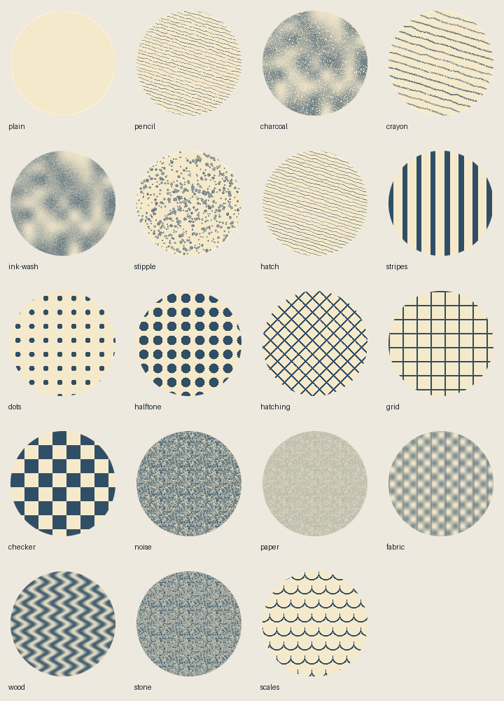

# Visual craft and media review

Read the built-in guidance resources `natural-color-light`, `anatomy-proportions`,
`illustration-perspective`, `drawn-textures`, and `film-review` using
`vixl_resource_get(kind="guidance", name=...)`. Each reference includes methods,
limits and source citations. `vixl_color(action="natural", colors=["foliage", "dusk"])`
returns an illustrative natural palette. Subjects: skin, foliage, sky, earth,
water, stone. Times: day, dawn, dusk, night. These palettes are starting points,
not measured reflectance data or classifications of human appearance.

## Patterns, handmade texture and clone stamping

Use `vixl_workflow(action="pattern-list", request={})` for the built-in list;
pass a document to include its custom patterns. Patterns include stripes, dots,
halftone, hatching, grid, checker, noise, paper, fabric, wood, stone and scales.
Scale, rotation, offset, spacing, two colors and seed control their appearance.

```json
[
  {"type":"shape","name":"paper","shape":"ellipse","width":300,"height":300,"fill":"#f5e9cc"},
  {"type":"drawn-texture","target":"paper","name":"graphite","preset":"pencil","color":"#334455","seed":42,"strength":0.7,"jitter":0.7,"pressure":0.6,"grain":0.5},
  {"type":"pattern-fill","target":"paper","name":"weave","pattern":"fabric","spacing":12,"scale":1.5,"rotation":30,"opacity":0.2}
]
```

`drawn-texture` supports pencil, charcoal, crayon, ink-wash, stipple and hatch.
Fill and texture operations add a raster overlay clipped to the rendered source
silhouette, keeping the source vector editable. They do not change its outline
geometry. For pressure-sensitive editable outlines, use the existing `paint`
brush presets and pressure points. Jitter shifts drawn line paths, pressure varies
coverage, and grain introduces tooth and broken marks. All stochastic choices
are reproducible with a seed.



Regenerate this comparison with `python examples/build_texture_comparison.py`.
Compare plain/textured forms at both thumbnail and delivery size. Zooming in is
useful for diagnosing grain, but a texture should read at the intended output size.

`pattern-define` captures a rendered layer or `selection:true` from the composite:

```json
{"type":"pattern-define","name":"my-paper","target":"graphite","seamless":true}
```

`seamless:true` rejects tiles with abnormally discontinuous opposing edges.
`pattern-check` returns a numeric seam report for a saved tile. This is a
heuristic; inspect a 3×3 repeat, especially with directional marks. Embedded tiles
survive save/load and history. `pattern-stroke` paints a pattern through a brush
path, for example `{"type":"pattern-stroke","pattern":"dots","size":24,
"points":[[20,20],[200,120]],"name":"dotted stroke"}`.

Clone stamping edits raster layers, including imported images, in an ordinary
atomic batch. Source pixels are frozen before painting so a stroke cannot feed
its freshly painted pixels back into itself. Undo/redo restores the asset.

```json
{"type":"clone-stamp","target":"photo","source":[50,50],
 "strokes":[[[200,100],[240,120]],[[280,100],[320,120]]],
 "brush":"round","size":32,"hardness":0.7,"opacity":0.8,
 "aligned":true,"sample_all":false}
```

Use round/square brush tips. Destination coordinates are target-layer pixels.
With `sample_all:true`, source coordinates are canvas pixels and the target must
be a top-level unrotated/unflipped raster. Non-aligned mode restarts the source
anchor at the start of every stroke; aligned mode retains one offset across all
strokes in the operation. Transparent/outside source pixels remain transparent.

## Construction helpers and checks

`figure-plan` with `spec:{"height":600,"head_units":7.5,"width_ratio":1}` returns
editable named parts and a grouping operation. Apply those operations, adjust
from references and pose, split limbs for articulation, then use character rigging.
It is a construction aid, not a definition of a normal body.

`perspective-guides` with `spec:{"width":800,"height":600,"horizon":240,
"points":2,"depths":[1,2,4],"reference_size":100}` returns a perspective grid
operation and projected sizes 100, 50, 25. Use a common camera/ground plane and
only compare objects of equal world size. One/two/three-point grids are supported.

`guide-check` accepts explicitly supplied measurements:

```json
{"spec":{"kind":"lighting","light":[100,50],"objects":[
  {"position":[300,300],"shadow":[30,40],"lit":"#d4b28a","shade":"#695b61"}
]}}
```

Other kinds are `anatomy` (head_units, style, joints with anatomical flexion angles,
upper/lower limb lengths), `perspective` (horizon, horizontal-family vanishing
points, objects with depth/size), and `illustration` (normalized value samples
and silhouette contrast). Findings are advisory: stylization, foreshortening,
multiple lights and deliberate low contrast can explain an apparent mismatch.
The checks do not infer anatomy or physical lighting from arbitrary image pixels.

## Preview before exporting

`film-preview` uses the same render path as export: camera, crossfades and captions
are visible. All times use **milliseconds**, as do film specs and timeline keys.
It defaults to draft quality (longest side at most 640); explicitly set spec quality
to final for delivery-resolution inspection.

```json
{"spec":{"width":1280,"height":720,"fps":30,"shots":[
  {"source":"scene.vixl","duration":5000,"camera":{"from":[0.5,0.5,1],"to":[0.6,0.5,1.5]}}
]},"time":2500,"output":"checks/frame-2500.png"}
```

For a loop, use GIF with `start`, `end`, and `loop` (0 means forever). For a
single shot, use its zero-based `shot` index and GIF/ZIP/MP4/WebM output. For a
narrow view, add `region:[x,y,width,height]` in original film pixels. PNG scrubbing
seeks directly to the requested time and does not render preceding frames.
Interval renders likewise skip unrelated shots; video clips seek at the decoder.
GIFs are limited to 300 frames and 80 million total pixels; choose MP4 for longer
previews. Interval videos include the corresponding mixed audio interval.

Review shot starts/middles/ends, transition midpoints and extreme camera poses
before full export. After a change, re-render only that shot/interval. Draft
encoding uses a lower quality setting. Static scenes skip repeated timeline
cloning/hashing and render their unchanged document once; existing bounded disk
layer caching also persists unchanged layer pixels between renders. Parallel
frame rendering is not enabled: its memory/ordering tradeoffs need a separate
profile. Performance depends on scene and codec; no fixed film render time is
promised. The regression suite verifies that a selected static 10-frame interval
renders its document once, and that seeked transition pixels match full rendering.
Persistent cache inserts track byte usage and directory changes, avoiding a full
PNG directory scan per animated frame while retaining LRU eviction and the byte
budget across cooperating writers. This matters for subpixel animation: thousands
of distinct frame states no longer incur quadratic cache-directory bookkeeping.

## Watch video and inspect audio

`video-sample` accepts source, output, explicit `times` or `interval`, optional
start/end, thumbnail width, and `contact_sheet` (default true). A PNG contact
sheet labels every frame with its time. With contact_sheet false, output names a
new directory and the result lists individual PNGs. At most 64 samples are
returned; MCP displays compact sample images through the workflow tool.

`audio-analyze` accepts source, an optional PNG output for the spectrogram,
window (RMS bin milliseconds), silence_db, min_silence, and video `events` in
milliseconds. It reports unweighted RMS/peak **dBFS, not perceptual LUFS**,
clipping, silence runs, spectral-flux onsets, a heuristic tempo and nearest-onset
sync deltas. Mono/stereo channels are analyzed separately for peak/clipping;
multichannel sources are explicitly reported as downmixed. Audio is decoded at
22.05 kHz, so this is review tooling rather than a mastering or true-peak meter.
The spectrogram labels time/frequency axes and uses an 80 dB relative range.

Outputs are bounded to ten-minute media, 1200 RMS bins, 500 displayed onsets and
100 sync events. Onsets are not guaranteed musical beats; ambiguous or sparse
inputs may have no tempo estimate. Audition through an audio-capable model/player
when available: measurements cannot establish whether the score suits the scene.

### Reproducible frame-loop benchmark

`python examples/benchmark_film_static.py afa38bffdb9484f62e77a0357493b2e92a18dddc`
compares the previous film driver with the current driver using the same current
render engine: 80 static ellipses, a 1280×720 scene, draft output, 300 frames, three
runs, no video encoding. In the development container the median was 0.494 seconds
before and 0.043 seconds after (11.47× faster). This isolates avoided timeline
copy/hash work on static holds; it is not a forecast for animated scenes, codec
speed, or a full twelve-minute render. Timings vary with machine and cache state.
