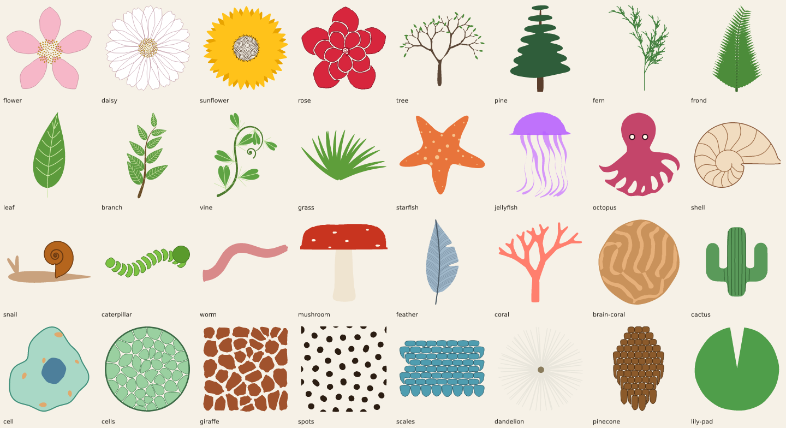

# Organic shapes

The `organic` operation draws living things — plants, flowers, trees, creatures, shells, cells,
coral, animal markings — as editable path layers. A form is a list of **parts**. Each part gets
its geometry from a **generator**, then applies **rules** in order. **Presets** are ready-made part
lists with natural defaults. The rules are the point: they are the growth patterns, symmetries
and imperfections that make shapes read as alive, and they combine freely.



```bash
vixl organics                                       # presets, generators and rules (also workflow organic-catalog)
vixl organic flower --name bloom --set petals=6 --set rings=2 --color petals=#f2a1b8 --width 400 --x 100 --y 80
vixl organic tree --name oak --set habit=decurrent --seed 12 --width 600
vixl organic --target oak --seed 13                 # regrow with another seed; colors you changed are kept
```

```json
{"type": "organic", "preset": "starfish", "name": "star", "seed": 4, "naturalness": 0.6,
 "params": {"arms": 5}, "colors": {"body": "#e8743b"}, "width": 300, "x": 40, "y": 40}
```

The result is one `shape` path layer when the form has one visible part, otherwise a group of
path layers named `NAME/part` (plus `NAME/part-veins`, `-chambers` … for extra outputs). The top
layer stores the recipe under `organic`; `organic --target NAME` with a new `seed`, `params`,
`colors` or `parts` regrows it in place, keeping its ID, position and any colors you changed.
A regrow restyles only what the operation names: `fill` or `colors` reset fills, `stroke` and
`stroke_width` reset lines (the same result as creating the form with them), and a new `preset` or
`parts` restyles everything. A plain new `seed` keeps the colors on the layers. When none of
`fill`, `colors`, `stroke` is given, each preset keeps its default colors.
Leaving out `height` (or `width`) sizes the box to the form's own proportions. Output is pure
vector: SVG export writes native paths.

| Field | Meaning |
| --- | --- |
| `preset` | One of the presets below. |
| `parts` | A custom part list (instead of a preset). |
| `params` | Preset parameters, such as `petals`, `habit` or `depth`. |
| `colors` | Fill per part name, such as `{"petals": "#fff", "center": "@accent"}`. |
| `seed` | Integer. The same seed always gives the same form. |
| `naturalness` | 0–1 (default 0.5). Scales jitter, asymmetry and wobble in every rule that uses it. 0 is perfectly regular. |
| `fill` | One fill for every filled part, so a form stays inside a palette. `colors` names single parts and wins over it; line-only parts (a fern, veins) stay unfilled. |
| `stroke`, `stroke_width` | Applied to every part and to every extra line output (shell chambers, leaf veins, feather barbs), so the preset's own line colors never show through. |
| `padding` | Pixels between the form and its box. |
| `stretch` | Fill the box without keeping proportions. |
| `target` | Regrow an existing organic layer or group. |

## Presets

| Preset | Built from | Parameters |
| --- | --- | --- |
| `flower` | petals in alternating whorls (`radial` with `rings`) around a Vogel seed centre | `petals`, `rings`, `tip`, `petal_width`, `center`, `florets`, `petal_color`, `center_color` |
| `daisy` | 21 notched rays | as flower |
| `sunflower` | two offset whorls of pointed rays, 340-seed golden-angle head | `petals`, `seeds`, `petal_color` |
| `rose` | three spiralling, occluded whorls around a spiral bud | `petals`, `petal_color` |
| `tree` | Honda/Leonardo branching, leaves `at` the twig tips | `habit` (decurrent, excurrent, weeping, shrub, coral, roots), `depth`, `angle`, `leaves`, `leaf_shape`, `leaf_size`, `leaf_color`, `bark_color` |
| `pine` | trunk with tapering tiers of boughs, blended | `tiers`, `needle_color` |
| `fern` | classic L-system fern (strokes) | `iterations`, `angle`, `color`, `stroke_width` |
| `frond` | crenate pinnae `along` a curved rachis with a lanceolate envelope | `pinnae`, `color` |
| `leaf` | one leaf with venation and petiole | `shape`, `margin`, `teeth`, `tooth_depth`, `veins`, `vein_count`, `petiole`, `width`, `bend`, `color`, `vein_color` |
| `branch` | alternate leaves along a curved twig | `leaf_count`, `leaf_shape`, `leaf_color` |
| `vine` | heart-shaped leaves along a waving vine, tendril at the tip | `leaf_count`, `leaf_color` |
| `grass` | a fan of bending blades | `blades`, `color` |
| `starfish` | superformula (m=5, n1=2, n2=n3=7) with tubercles scattered inside | `arms`, `bumps`, `color`, `bump_color` |
| `jellyfish` | scalloped half bell, waving tentacles | `tentacles`, `bell_color`, `tentacle_color` |
| `octopus` | a head and eight fanned arms blended into one body, eyes mirrored | `color` |
| `shell` | Raup planispiral with septa | `growth`, `chambers`, `ribs`, `color` |
| `snail` | coiled shell on a teardrop body with horns | `body_color`, `shell_color` |
| `caterpillar` | occluded segments on an S-curve, head at the front | `segments`, `color`, `head_color` |
| `worm` | a wriggling tapered tube | `color` |
| `mushroom` | dome cap with scattered spots, tapering stem | `spots`, `cap_color`, `stem_color`, `spot_color` |
| `feather` | curved rachis, asymmetric vane with splits, barbs | `barbs`, `color` |
| `coral` | branching coral with Murray's-law (α=3) thickness, blended | `depth`, `color` |
| `brain-coral` | a reaction–diffusion labyrinth clipped to a dome | `color`, `base_color` |
| `cactus` | saguaro column with elbowed arms, blended, with ribs | `ribs`, `color` |
| `cell` | membrane, nucleus and scattered organelles | `color` |
| `cells` | relaxed Voronoi tissue in a round boundary | `count`, `color` |
| `giraffe` | inset, rounded Voronoi patches | `count`, `color` |
| `spots` | Gray–Scott animal markings | `kind` (spots, stripes, labyrinth, coral, mitosis, holes), `grid`, `color` |
| `scales` | staggered fish scales with paint-order occlusion | `rows`, `columns`, `color` |
| `dandelion` | a seed head of radiating stalks | `seeds`, `color` |
| `pinecone` | pointed scales clipped to an egg, occluded | `rows`, `color` |
| `lily-pad` | notched pad with radiating veins | `color` |

## Custom forms

```json
{"type": "organic", "name": "critter", "seed": 7, "width": 360, "parts": [
  {"name": "legs", "generator": "tentacle", "params": {"length": 1.2, "width": 0.07, "curl": 0.5},
   "rules": [{"rule": "radial", "count": 6, "radius": 0.25, "start": 30, "spread": 120},
             {"rule": "noise", "amount": 0.02}], "fill": "#ff8fab"},
  {"name": "body", "generator": "superformula", "params": {"m": 6, "n1": 8, "n2": 3, "n3": 3},
   "rules": [{"rule": "transform", "scale": 0.55}, {"rule": "warp", "kind": "noise", "amount": 0.2}], "fill": "#ff5d8f"},
  {"name": "spots", "generator": "blob",
   "rules": [{"rule": "scatter", "count": 14, "within": "body", "scale": 0.05}], "fill": "#ffd6e0"},
  {"name": "eyes", "generator": "ellipse",
   "rules": [{"rule": "transform", "scale": 0.07, "translate": [0.16, -0.12]}, {"rule": "mirror", "axis": "x"}],
   "fill": "white", "stroke": "#30101a", "stroke_width": 3}
]}
```

Part fields: `name` (a lower-case slug), `generator`, `params`, `rules`, `fill`, `stroke`,
`stroke_width`, `opacity`, `seed`, `styles` (`{"veins": {"stroke": …, "stroke_width": …}}` for
extra outputs) and `hidden` (build the geometry for other parts to use, without drawing it).
Parts draw in order, first at the back.

**The frame.** Geometry is built in a unit frame of about −1…1 with y pointing down. Forms grow
**upward** from a base at +y (a leaf's base is at (0, 1) and its tip at (0, −1)); placement rules
attach each copy by its base and point it along the requested direction, so leaves, petals and
tentacles all orient the same way. `transform` scales, then rotates, then moves; use two
`transform` rules to rotate before scaling. The whole form is fitted into the layer box at the end.

### Generators

| Generator | Draws | Parameters (defaults) |
| --- | --- | --- |
| `superformula` | Gielis outline: starfish, flowers, cells, diatoms, cactus sections | `m` 5, `n1` 2, `n2` 7, `n3` 7, `a` 1, `b` 1, `rotate` −90, `samples` |
| `blob` | soft irregular loop | `lobes` 0, `variation` 0.25, `lobe_depth` 0.12 |
| `leaf` | blade by profile with margin and venation; outputs `veins` | `shape` (lanceolate, ovate, elliptic, obovate, orbicular, linear, spatulate, cordate), `width`, `margin` (entire, serrate, dentate, crenate, lobed), `teeth`, `tooth_depth`, `veins` (none, pinnate, palmate, parallel), `vein_count` 6, `asymmetry` 0.04, `petiole` 0, `tip` 1 |
| `petal` | petal | `tip` (round, pointed, notched, fringed), `width` 0.5, `profile` obovate, `cup` 0 |
| `spiral` | log or Archimedean spiral line, or a tapered ribbon with `width` | `kind` log, `turns` 3, `growth` 3 per turn, `width` 0 |
| `shell` | planispiral shell; outputs `chambers` (septa and inner whorls) | `growth` (W) 3, `chambers` 14, `ribs` 0, `whorls` 1 |
| `tentacle` | tapered tube on a curling, waving spine; anchors `base`, `tip`, `spine` | `length` 1.6, `width` 0.12, `taper` 1, `tip_width`, `curl` 0.5, `wave` 0.6, `waves` 1.5, `heading` −90, `wobble` 0.3, `elbow` 0, `elbow_at` 0.4 |
| `branch` | recursive tree; anchors `tips`, `forks` | `habit`, `depth` 6, `angle`, `ratio`, `children`, `length` 0.42, `width` 0.07, `alpha` 2, `tropism`, `jitter` 0.25, `curve` 0.15 |
| `lsystem` | turtle L-system (F/G draw, f move, ± turn, [ ] branch, \| reverse) | `axiom`, `rules`, `iterations` 5, `angle` 25, `width` 0 (strokes) or > 0 (tapered branches), `taper` 0.7, `jitter` 4 |
| `phyllotaxis` | Vogel seed head; anchors `points` | `count` 160, `angle` 137.508, `element` (circle, seed, petal, diamond), `size` 0.8, `gradient` 0.35, `skip` |
| `cells` | relaxed Voronoi cells; outputs `outline` | `count` 40, `relax` 2, `gap` 0.1, `round` 2, `within` (circle, square, a part), `outline` |
| `pattern` | Gray–Scott reaction–diffusion | `kind` (spots, stripes, labyrinth, coral, mitosis, holes), `feed`, `kill`, `grid` 112, `steps` 3200, `scale` 1, `threshold` 0.25 |
| `scales` | staggered overlapping scales | `rows` 7, `columns` 8, `shape` (round, pointed, diamond), `overlap` 0.45, `gradient`, `jitter` |
| `segments` | segmented body along a spine; anchors `points`, `head`, `tail` | `count` 12, `spine` (straight, arc, s-curve, spiral, wave), `bend`, `width` 0.18, `profile` (caterpillar, worm, even, bamboo, tail), `overlap` 0.3 |
| `feather` | vane; outputs `rachis` and `barbs` | `barbs` 36, `curve` 0.12, `asymmetry` 0.35, `splits` 2 |
| `ellipse` | ellipse, egg, teardrop or crescent | `form`, `aspect` 1, `point` 2 |
| `rings` | concentric growth rings | `count` 10, `noise` 0.04, `spacing` (even, growth) |
| `path` | any SVG path, normalized | `d` |

### Rules

| Rule | Effect | Parameters (defaults) |
| --- | --- | --- |
| `transform` | scale, rotate, shear, move | `scale`, `scale_x`, `scale_y`, `rotate`, `translate` [x, y], `shear` |
| `radial` | n copies pointing outward; `rings` adds whorls that sit in the previous ring's gaps | `count` 5, `radius`, `start` −90, `spread` 360 (less makes a fan), `rings`, `ring_scale` 0.78, `ring_radius` 0.75, `spiral` (degrees of twist per ring), `jitter` |
| `mirror` | bilateral symmetry with fluctuating asymmetry | `axis` x or y, `at` 0, `keep` true, `asymmetry` 0.03 |
| `along` | copies along a spine | `spine` (a spine name, [[x, y] …] or `part:NAME`), `count` 8, `side` (alternate, both, left, right, center), `angle` 50, `turn`, `scale` [start, end], `envelope` (a leaf shape name), `range` [0.05, 0.95], `jitter` |
| `at` | copies at another part's anchors | `anchors` PART.ANCHOR, `scale`, `probability`, `limit`, `orient`, `angle`, `jitter` |
| `scatter` | Poisson-disc scatter with log-normal sizes | `count` 30, `within`, `spacing`, `scale` 0.15, `size_variation` 0.2, `rotation` |
| `phyllotaxis` | copies at golden-angle positions | `count` 60, `angle`, `scale` [inner, outer], `radius` |
| `grid` | copies on a hex or square grid | `rows`, `columns`, `layout`, `scale`, `jitter`, `within` |
| `noise` | smooth wobble along outlines (each element differently) | `amount` 0.04, `frequency` 3, `octaves` 3 |
| `warp` | coordinate warps after D'Arcy Thompson | `kind` (bend, taper, bulge, pinch, twist, shear, wave, noise), `amount` 0.3 |
| `jitter` | per-element position, rotation and size changes | `position`, `rotation`, `scale` |
| `smooth` | round corners (Chaikin) | `iterations` 2 |
| `clip` | keep elements whose centre is inside | `within` |
| `inset` | shrink elements toward their centres | `amount` 0.1 |
| `gradient` | size gradient radially or along an axis | `axis`, `scale` [start, end] |
| `use` | add an earlier part's geometry | `part` |
| `blend` | smooth union with rounded fillets (metaball-like) | `radius` 0.03 (of the box) |
| `occlude` | paint-order occlusion: later elements cover earlier ones, each visible piece kept with a `gap` | `gap` 1.5 px |
| `intersect` | keep what lies inside a part, or a circle/square fitted to this part, and/or one `half` of it | `within`, `half` (top, bottom, left, right), `gap` |

`blend`, `occlude` and `intersect` work on the fitted outlines in pixels, after every other rule.
`within` names `circle`, `square` or an earlier part; `scatter`, `clip`, `grid` and the `cells`
generator also accept a boundary built on the spot, `{"generator": …, "params": …}`.

Limits: 32 parts, 24 rules per part, 2,000 copies per rule, 6,000 elements and 400,000 points per
part, and 8,192 path commands per output (detail is simplified to fit).

## Why these rules: the research

The generators and rules follow how living forms actually grow. A research brief behind them
summarised the following. (The brief's sources were read through search summaries because the
network blocked direct page fetches; values marked as starting points are tuning defaults, not
published figures.)

- **Superformula** (Gielis): r(φ) = (|cos(mφ/4)/a|^n2 + |sin(mφ/4)/b|^n3)^(−1/n1). `m` sets the
  rotational symmetry. Starfish use m = 5, n1 = 2, n2 = n3 = 7; n2 = n3 < 2 gives pointed lobes,
  > 2 rounded ones; smaller n1 deepens the notches. It also fits diatoms and many leaves.
- **Phyllotaxis** (Vogel): element n at n·137.508° and radius c·√n fills a disc evenly; the visible
  spirals are consecutive Fibonacci numbers (sunflowers 34/55 or 55/89, pinecones 8/13). A
  fraction of a degree off the golden angle breaks the pattern into spokes.
- **Log spirals and shells**: r = a·e^(bθ). Anything that grows by adding at its edge (shells,
  horns, claws) is self-similar. Raup's model sweeps the aperture around an axis growing by W
  per turn; a nautilus is about W ≈ 3, which is not the golden ratio.
- **Branching**: L-systems and the Honda model (trunk ratio ≈ 0.9, laterals ≈ 0.6–0.7, branch
  angles 30–45°). Branch thickness follows d^α = Σ d_child^α: α ≈ 2 for trees (Leonardo's rule),
  3 for vessels and coral (Murray's law). Habits differ: excurrent conifers keep a leader;
  decurrent broadleaf trees fork; weeping trees bend down (negative tropism).
- **Leaves**: a half-width profile tᵖ(1−t)^q puts the widest point at p/(p+q) (ovate low,
  obovate high, elliptic in the middle). Margins are serrate (forward saw teeth), dentate
  (outward), crenate (rounded) or lobed; venation is pinnate, palmate or parallel.
- **Cells and spacing**: Voronoi cells of evenly spaced seeds (Lloyd relaxation, Poisson-disc
  sampling) give giraffe coats, plant tissue, dragonfly wings and honeycomb; inset and rounded,
  they become patches.
- **Reaction–diffusion** (Gray–Scott, Turing patterns): feed/kill pairs select spots (0.030,
  0.062), labyrinths (0.029, 0.057), coral growth (0.0545, 0.062), dividing cells (0.0367,
  0.0649) and holes (0.039, 0.058); small changes switch pattern type.
- **Symmetry**: monocot flowers 3 or 6, eudicots 4 or 5, echinoderms 5, jellyfish 4; most animals
  are bilateral. Real organisms show **fluctuating asymmetry**: build one unit, replicate it,
  then vary each copy slightly. Perfect symmetry reads as artificial.
- **Growth and form** (D'Arcy Thompson): one shape becomes a family of species through shear,
  stretch and bend warps; allometry (y = a·x^b) and tapering limbs follow power laws.
- **Naturalness**: layered low-frequency noise for bends and only a little high-frequency detail;
  no exact repeats; log-normal sizes; gradients along a body; paint order for overlaps (outer
  whorls first, scales overlapping toward the tail); smooth unions instead of hard joins.
- **Segments and whorls**: caterpillars have a head, 3 thoracic and 10 abdominal segments;
  successive petal whorls sit in the gaps of the previous one (rotated by 180°/n).

Sources: Gielis, *A generic geometric transformation that unifies a wide range of natural and
abstract shapes* (arXiv nlin/0405057); Prusinkiewicz and Lindenmayer, *The Algorithmic Beauty of
Plants* (algorithmicbotany.org); Runions et al., space colonization (2005, 2007); Raup (1961) on
shell coiling; Bridson (2007) on Poisson-disc sampling; Pearson's Gray–Scott classes and Karl
Sims' reaction–diffusion notes (karlsims.com/rd.html); Murray, *How the leopard gets its spots*;
D'Arcy Thompson, *On Growth and Form*; and the Wikipedia articles on the superformula,
phyllotaxis, the golden spiral, fluctuating asymmetry and floral morphology.

## Composition recipes

Agents can build new organisms by combining the same steps the presets use:

- **Flower**: petal → `radial` (count = symmetry, `rings` for whorls, `jitter`) → centre from
  `phyllotaxis` → optional stem `tentacle` with leaves `along` it.
- **Tree**: `branch` (choose a habit) → leaves or blossoms `at` `branches.tips` → `jitter`.
- **Fern**: rachis `tentacle` → lanceolate `leaf` `along` it with `side: both` and an
  `envelope` → optionally recurse with a smaller frond `along` each pinna.
- **Starfish / urchin / cactus section**: `superformula` → `warp noise` → bumps `scatter`ed
  `within` the body with a `gradient`.
- **Jellyfish / octopus / squid**: body outline → `tentacle`s `along` its lower edge (`turn: 90`)
  or `radial` with a `spread` → `noise` so each differs → `blend` for one smooth body.
- **Creature**: hidden body parts (`hidden: true`) → `use` them in one part → `blend`; eyes with
  `mirror`.
- **Shell / horn / fiddlehead**: `shell` or `spiral` (ribbon `width`) → ribs or septa outputs.
- **Caterpillar / worm / bamboo**: `segments` → `occlude` → a head `at` `body.head`.
- **Animal coat or tissue**: `pattern` (spots, stripes, labyrinth) or `cells` → `intersect` with
  the body part so the markings stay inside it.
