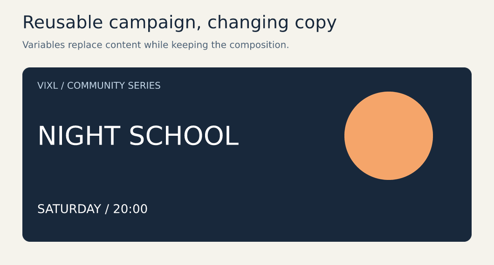

# Create a reusable campaign

[Documentation home](../README.md) · [Export guide](../exporting.md)




This example combines editable text, an ellipse and a background panel. `${headline}` and
`${date}` vary its copy. The images above are actual Vixl exports, not mockups. Start in
the repository root after [installation](../getting-started.md).

## Rebuild the master

```bash
vixl new 1060x570 --background '#f5f3ec' -o campaign.vixl
vixl -p campaign.vixl apply docs/assets/generated/campaign.json
vixl -p campaign.vixl checkpoint approved-layout
vixl -p campaign.vixl render --out campaign-preview.png
vixl -p campaign.vixl check --checks bounds contrast
vixl -p campaign.vixl export campaign.png
```

Open the preview and inspect the headline, date and whitespace. The tutorial illustration
contains an explanatory heading; for production artwork, remove the `heading` and `subtitle`
layers and adapt the canvas/panel to the destination's named size. The
[operation recipe](../assets/generated/campaign.json) exposes every coordinate and color.

## Change copy without changing the master

<!-- docs-test: continue -->
```bash
vixl -p campaign.vixl render --set headline='NIGHT SCHOOL' --set date='SATURDAY / 20:00' --out alternate.png
```

Render overrides affect that output only. To make a permanent copy change:

<!-- docs-test: continue -->
```bash
vixl -p campaign.vixl variable set headline 'NIGHT SCHOOL'
vixl -p campaign.vixl variable set date 'SATURDAY / 20:00'
vixl -p campaign.vixl render --out permanent-preview.png
vixl -p campaign.vixl checkout approved-layout
```

Longer text needs a defined box. Fit the campaign title before trying long variants:

```json
{"type": "text-layout", "target": "campaign-title", "width": 650, "height": 130, "fit": true}
```

Apply this as an operation file, then inspect at the smallest intended display size.
Automatic fitting can reduce type size enough to affect readability; review every important
copy length. Choose typography through [font pairings](../typography.md) for finished work.

## Produce several outputs

Create `campaigns.csv` with these exact headers (no `${}` in headers):

<!-- docs-test: save campaigns.csv -->
```csv
headline,date
OPEN STUDIO,FRIDAY / 19:00
NIGHT SCHOOL,SATURDAY / 20:00
```

<!-- docs-test: continue -->
```bash
vixl -p campaign.vixl render --data campaigns.csv --out campaign-output
```

Inspect the output report and files. Variables must exist and rows must fit; data rendering
can run checks. For named output variants, saved suites, contact sheets and resumable jobs,
use [checked production](../production.md), rather than an untracked shell loop.

## Hand off

Share the [editable master](../assets/generated/campaign.vixl), a preview, required exports,
fonts/license information and the content data. Keep source artwork and export settings
alongside it. To review changes in Git, commit the folder that `vixl unpack campaign.vixl campaign-source`
writes and rebuild with `vixl pack` ([source folders](../production.md#source-folders-for-git-review)). [Brands](../brands.md) shows how to reuse colors, logos, fonts and contrast rules
across documents; [design tools](../design-tools.md) covers frames and image replacement.
