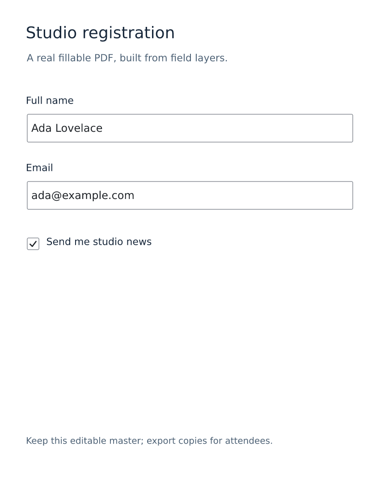

# Create forms and presentations

[Documentation home](../README.md) · [Field reference](../forms.md) · [Page reference](../slides.md)

## Make a registration form


This is a real Letter-size form at 100 dpi (850×1100 px). Its fields become interactive
PDF widgets. The labels are separate visible text layers; `label_layer` supplies the
accessible name for the text fields. Form keys are stable data names, not display labels.

From the repository root:

```bash
vixl new 850x1100 -o registration.vixl
vixl -p registration.vixl apply docs/assets/generated/registration.json
vixl -p registration.vixl check --checks form --sample worst
vixl -p registration.vixl render --show-fields --out fields-preview.png
vixl -p registration.vixl export registration.pdf --fillable
```

The recipe sets physical size and dpi. Preview outlines show keys and tab order; the normal
export omits those overlays. Open the PDF in your intended viewer and verify typing and
tabbing; viewers can add their own field highlight. The
[committed fillable PDF](../assets/generated/registration.pdf) is ready to try.

## Fill copies from data



<!-- docs-test: continue -->
```bash
vixl -p registration.vixl form fill --set full_name='Ada Lovelace' --set email=ada@example.com --set newsletter=yes --out ada.pdf
```

Required values and formats are validated. This writes a flattened copy; the master keeps
its blank fields. Use `--mode editable` to prefill a PDF whose fields remain interactive.
For multiple attendees, make `attendees.csv`:

<!-- docs-test: save attendees.csv -->
```csv
full_name,email,newsletter
Ada Lovelace,ada@example.com,yes
Grace Hopper,grace@example.com,no
```

<!-- docs-test: continue -->
```bash
vixl -p registration.vixl form fill --data attendees.csv --dry-run
vixl -p registration.vixl form fill --data attendees.csv --combine attendees.pdf
```

Preflight validates rows before publication. Check long names, non-Latin text and the
target viewer. Interactive entry uses PDF's Helvetica entry font; flattened fills use
the field's font. [Forms](../forms.md) covers overflow, dates, radio groups, signatures,
privacy behavior and the workflow contract. A signature field is a signing location;
Vixl does not perform certificate-based signing.

## Make a deck with actual editable slides


```bash
vixl new 1060x595 --background '#f5f3ec' -o slides.vixl
vixl -p slides.vixl apply docs/assets/generated/slides.json
vixl -p slides.vixl pages
vixl -p slides.vixl render --page all --out slides-preview.png
vixl -p slides.vixl check --checks deck
vixl -p slides.vixl export slides.pdf
vixl -p slides.vixl export slides.pptx
```

The cover and results page carry speaker notes. The deck check also examines presentation
requirements such as minimum text size; the explanatory captions in this documentation
example may need enlargement for projection. Inspect findings before using it as a real
presentation. [Slides](../slides.md#deck-checks) explains each rule and exemptions.

Try the [PowerPoint](../assets/generated/slides.pptx) and [PDF](../assets/generated/slides.pdf).
Ordinary chart bars and labels remain editable in PowerPoint. Supported PDF text is
selectable. Effects or unsupported appearances can become pictures; consult export reports
for `raster_fallbacks`. Install the referenced fonts on the presentation computer.

For a longer deck, add a master for shared footer/logo layers, then add named pages that
use it. Page-specific variables provide copy without duplicating the design. Pages also
work for carousels and booklets; use `export slide.png --pages all` for numbered images.
