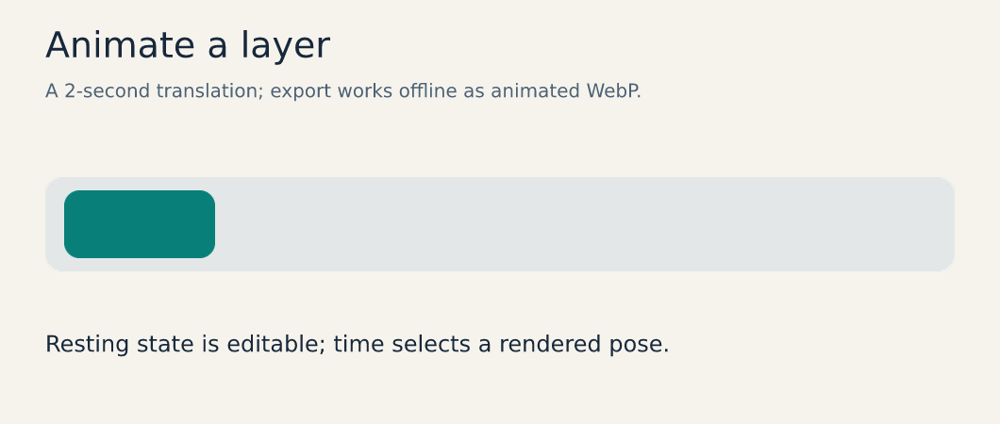
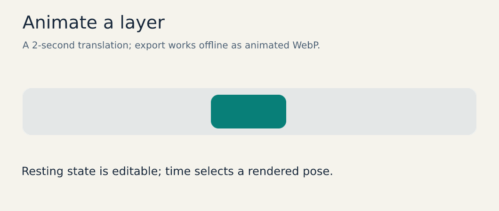
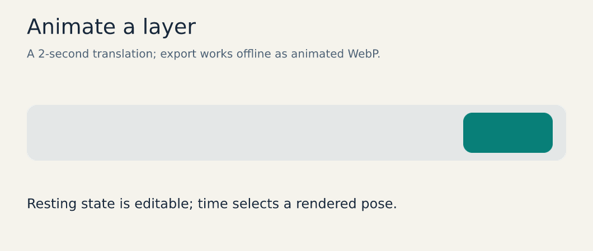

# Animate designs and pixel sprites

[Documentation home](../README.md) · [Timeline reference](../brushes-and-animation.md)


This is an actual two-second Vixl animation. Ordinary layers can animate position,
translation, rotation, scale, opacity, color and other supported properties. The saved
document retains its resting state and editable keyframe tracks.

## Rebuild and inspect three poses

```bash
vixl new 1060x450 --background '#f5f3ec' -o motion.vixl
vixl -p motion.vixl timeline set --loop 1
vixl -p motion.vixl apply docs/assets/generated/motion.json
vixl -p motion.vixl render --time 0s --out start.png
vixl -p motion.vixl render --time 1s --out middle.png
vixl -p motion.vixl render --time 2s --out end.png
vixl -p motion.vixl timeline-sheet --out timeline.png
vixl -p motion.vixl export-timeline --out motion.webp --fps 12
```

The operation that adds the motion is:

```json
{"type": "animate", "target": "moving-card", "property": "translate-x",
 "to": 760, "duration": "2s", "easing": "ease-in-out"}
```

New design documents start seamless loops; this card travels once, so `timeline set --loop 1` makes the timeline play once before any key exists. Without it, the `motion` check reports a `loop-seam` where the card jumps back.

Translation adds to the resting layout, which makes it useful with constraints. Use a
`pivot` at a joint before rotating a limb. Check start, midpoint and end, and inspect
additional poses where easing, overlap or overshoot could matter. A resting-state bounds
check alone cannot certify the whole animation. [Production suites](../production.md)
support explicit time coverage for automated review.

### Static poses







## Choose a motion deliverable

Animated WebP preserves useful quality in a compact browser-oriented format. GIF has
limited colors; lower fps and a smaller color palette help. APNG retains full-color PNG
frames. Sprite sheets or PNG-frame ZIPs support game and downstream workflows. MP4/WebM
video encoding requires ffmpeg on PATH. Core animation export does not need an AI provider.

```bash
vixl -p motion.vixl export-timeline --out motion.gif --fps 12 --colors 64
vixl -p motion.vixl export-timeline --out motion.mp4 --fps 24
```

The MP4 command needs ffmpeg; retain WebP or frame exports when that dependency is absent.
For audio, shots, crossfades or lyric synchronization, see [films](../production.md#films-scenes-shots-captions-and-sound)
and [lyric videos](../lyric-video.md).

## Pixel frames use a different model

Pixel art is a palette-indexed character grid. Save each sprite state with a duration,
then export the frame sequence. Rebuild the existing offline potion example:

```bash
python examples/build_sprite.py --output examples/output/docs-sprite
```

It creates a `.vixl` master, GIF, APNG and sprite sheets from a 12×12 editable grid. Nearest
sampling and integer scaling keep edges crisp; smooth sampling blurs the intended pixels.
Use keyframe timelines for continuous movement and named pixel frames for discrete sprite
poses. [Pixel animation](../pixel-animation-spacing.md) documents both inspection and export.
