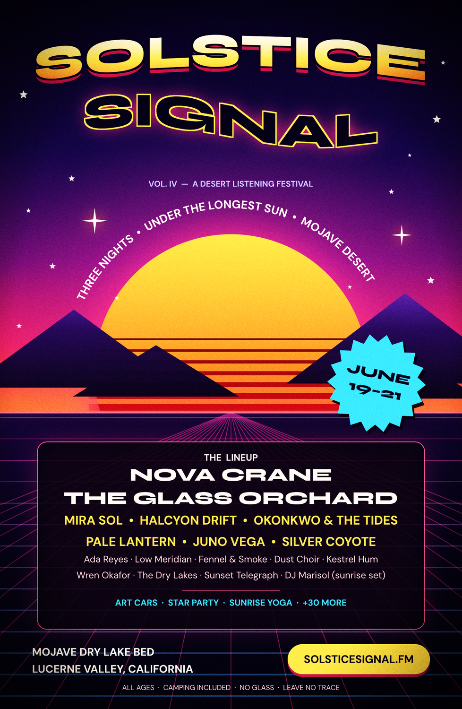
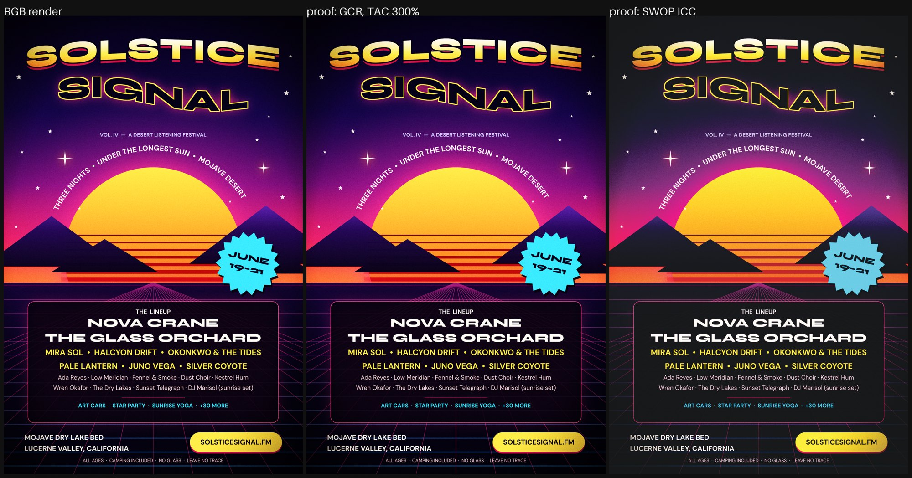
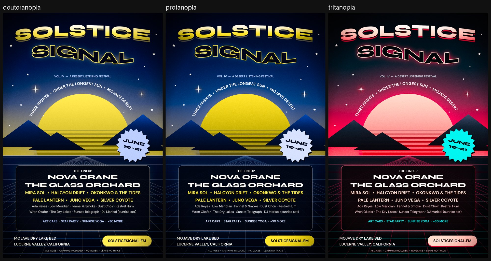

# SOLSTICE SIGNAL: print-ready festival poster

A poster for a made-up three-night desert music festival, built entirely with Vixl. It was first built with 0.16.0; the committed outputs are rebuilt with 0.20.0. The canvas is the named `tabloid` size (11 × 17 in) with 1/8 in bleed. The look is retro-synthwave: a multi-stop dusk sky, a sliced gradient sun clipped to its disc, glowing sparkles, a perspective grid drawn as one multi-contour path, warped Syne 800 headlines, a line of DM Sans text set on an arc concentric with the sun, a lineup panel and a sunburst date badge. Footer, title and badge positions are constraints anchored to the generated `guide:safe-*` guides. After the design, `build.py` runs print QA (`check` with `print` and `color_vision`, plus contrast on every text layer), renders two soft proofs and three colour-blindness simulations, and exports a CMYK PDF with a 300% ink limit, a CMYK JPEG separated with an ICC profile, an RGB PNG and an SVG.



| RGB render vs. soft proofs | Colour-vision simulations |
| --- | --- |
|  |  |

Run it from the repo root with `python explorations/01-print-concert-poster/build.py`. It needs network access for Google Fonts and the ICC profile.

With 0.20.0 the build takes about 2 minutes (1 min 56 s on a shared 4-core container, fonts and ICC profile cached), and the contrast check now covers every text layer. With 0.16.0 it took about 10 minutes while checking only the five smallest text layers; checking all of them took 30 to 40 minutes (see Findings). `QUICK=1` stops after the document and writes a preview to `.work/quick.png`.

## Outputs (`output/`, about 15.4 MB)

| File | What |
| --- | --- |
| `solstice-signal.vixl` | The editable document: 47 layers, fonts embedded, comps `print` and `vector`, checkpoint `poster-v1`. |
| `poster-rgb.png` | RGB render, scaled to 1500 px tall. |
| `poster-softproof-swop.png` | Soft proof through the Artifex SWOP CMYK ICC profile (perceptual). |
| `compare-rgb-vs-proof.jpg` | RGB, GCR proof and SWOP proof side by side. |
| `colorvision-sims.jpg` | Deuteranopia, protanopia and tritanopia simulations (`--simulate`). |
| `poster-cmyk.pdf` | CMYK PDF with GCR separation and `--ink-limit 300`: one 1688 × 2588 px DeviceCMYK image at 150 dpi. The MediaBox is 11.25 × 17.25 in including bleed, with a TrimBox and BleedBox. 7.5 MB, because 0.20.0 stores the image with Flate and ignores `--quality` (0.16.0 wrote a 2.4 MB JPEG page). |
| `poster-cmyk-swop.jpg` | CMYK JPEG separated with `--icc default_cmyk.icc --intent relative`. |
| `poster.svg` | SVG of the `vector` comp: 486 paths and no images (the two `repeat` layers were images in 0.16.0). |
| `qa-report.json` | Raw output of every `check`, the export metadata, the ink-coverage numbers and the proof difference stats. |

`DPI = 150` is set at the top of `build.py` so the deliverables stay inside the size budget. Every hand-tuned coordinate scales with the canvas, so `DPI = 300` produces a press-resolution document.

## Vixl features exercised

- **Named print size with bleed.** `vixl new tabloid --bleed --dpi 150` generates the `trim-*` and `safe-*` guides. Constraints anchor to them, for example `{"left": "guide:safe-left.left+60", "bottom": "guide:safe-bottom.bottom-70"}`.
- **Font pairing.** `vixl font pair syne-dm-sans` (Syne 800 for headings, DM Sans 400 for body), plus `vixl font install "DM Sans" --weight 700`. Text uses the `heading`/`body` roles and the registered `dm-sans-700` name.
- **Colour system.**
  - `palette-generate` with a `scale` scheme (`@dusk-50…950`) and a `split-complementary` scheme (`@volt-1…3`).
  - Semantic role swatches built on them (`@background @ink @muted @accent @accent-text @teal @lilac`).
  - Colour-language expressions: `oklch()`, `mix()`, `alpha()` and `readable()`.
- **Gradients.**
  - A 5-stop vertical sky.
  - A 3-stop radial haze (with `blend: screen`).
  - A 3-stop angled ground (`angle: 80`).
  - `gradient-overlay` styles on the sun, the title and the mountain group.
- **Shapes.**
  - Shape types: `ellipse`, 5-point `star` field, 4-point sparkles (`inner_radius: 0.16`), an 18-point sunburst badge, 3-sided `polygon` mountains, `rounded-rectangle` panel, `capsule` button and `line` rule.
  - A `shape: "path"` with 25 `M…L…` subpaths for the perspective rays.
- **Repeats, groups and clipping.**
  - `repeat-blend` for sun slices whose height and colour interpolate from thin to thick.
  - `repeat-blend` for the grid rungs.
  - `group` for the slices, mountains and grid.
  - `clip` to put the slice group inside the sun.
- **Layer styles.** `drop-shadow` (hard offset), `outer-glow`, `stroke`, `gradient-overlay`.
- **Text layout.**
  - `text-layout` `warp: "arc"` on SOLSTICE and `warp: "flag"` on SIGNAL.
  - Text on a path: a 61-point arc concentric with the sun, sized from a dry-run measurement of the set line.
  - `text-set` stroke, `rotate`, and constraints between siblings (`"top": "lineup-label.bottom+28"`, `"center-y": "badge.center-y"`).
- **Blend modes.** `screen` (haze, grid), `multiply` (sun slices), `overlay` (grain).
- **Effects.** Adjustment layers with `vignette` (`strength`/`radius`) and `grain`.
- **Comps.** `comp-save`, `comp-apply`, and `export --comp vector` for a vector-friendly SVG.
- **Dry runs.** `apply(..., dry_run=True)` measures text widths without touching the document. It drives the auto-fit for the Syne headings and the arc length.
- **QA.**
  - `vixl check --checks bounds overlap safe_area legibility print color_vision --ink-limit 300`
  - `vixl check --checks contrast` on all 13 text layers.
- **Proofs and simulations.** `export --proof` (GCR, and with `--icc`); `export --simulate deuteranopia|protanopia|tritanopia`.
- **Exports.**
  - `export --cmyk --ink-limit 300 --quality 75` to PDF.
  - `export --cmyk --icc … --intent relative` to JPEG.
  - `export --scale` to PNG.
  - `export --comp vector` to SVG.
- **History.** `checkpoint("poster-v1")`.

## Findings

> **Status in 0.20.0:** Bugs 1–3 are fixed (0.18.0): `@swatch` works in repeats, `fit` shrinks a word instead of breaking it, and warped text is moved back inside its box. `build.py` no longer resolves swatches to literals for the repeats or pads the warped headlines with a transparent stroke, and the rebuilt headlines look the same. `--ink-limit` now applies with `--icc` too (this build's SWOP JPEG doesn't pass one). The full contrast check takes seconds and is now the default. The CMYK PDF has a TrimBox and BleedBox (0.19.0). Blend modes still rasterize the whole SVG.
>
> **0.20.0 bugs, since fixed:**
> - Exporting this poster to a CMYK PDF with the default vector content crashed with `KeyError: 'type'` (the page fallback for blend modes and adjustment layers). Fixed in 0.21, so `build.py` no longer passes `--pdf-content raster`. The page is still one image, now JPEG-compressed because `--quality 75` is honoured (2.4 MB; without `--quality` the image stays lossless).
> - `--quality` was ignored for PDF export, so the PDF was a 7.5 MB Flate image. Fixed in 0.21.
> - The contrast check could not measure 5 of the 13 text layers (`eyebrow`, `headliners`, `extras`, `cta-text`, `fineprint`) because they land on half-pixel positions. Fixed: all 13 are measured. In 0.21 the canvas safe area is checked by default, which reports the SIGNAL title (and the print live area) as outside it; the design is left as it was.

### Bugs

1. **`repeat` / `repeat-blend` reject `@swatch` colours.** If the repeated layer's `fill`, or the `end.fill`, uses a swatch reference, the whole batch fails. The error names the base layer's swatch, even when `end` is a literal colour:
   ```python
   p = Project(200, 200)
   p.apply([{"type": "swatch", "name": "a", "color": "#ff0000"},
            {"type": "shape", "shape": "rectangle", "name": "r", "width": 50, "height": 5, "fill": "@a"}])
   p.apply({"type": "repeat-blend", "target": "r", "count": 3, "dy": 10, "end": {"fill": "#00ff00"}})
   # VixlError invalid_color: Invalid color '@a'; use a name, #hex, ... or a function such as lighten(@swatch, 10%)
   ```
   **Cause:** `design_render.repeat_items()` and the validator in `design.py` call `render.color()` directly, without `colors.resolve_expression()`. A plain `"@a"` fill works on every other layer.
   **Workaround (0.16.0):** `build.py` resolved the swatches to literal `#rrggbbaa` before using them in a repeat. Removed for 0.20.0.

2. **Warped text is clipped at the top of its box.** `text.plan()` places the glyphs flush with the top of the `text-layout` box. `warped()` then shifts them by `amount * box_height * f(t)`:
   - `flag` lifts the left half above y = 0.
   - `arc` lifts the middle above y = 0.

   So the tops of the glyphs get cut off: SIGNAL lost its top, and the middle letters of SOLSTICE were flattened. The docs say to "allow room for curvature", but a taller box makes it worse, because the displacement grows with the box height. Repro: `text "SIGNAL" size 140` + `text-layout width 800 height 300 warp flag amount 0.16`. A leading `\n` doesn't help either: blank lines have no glyph bounds.
   **Workaround (0.16.0):** a transparent text stroke padded the glyph box (`text-set stroke_width 42, stroke_color transparent`), and the visible outline is drawn with a `stroke` layer style. The padding is removed for 0.20.0.

3. **`fit: true` breaks a single word across lines instead of shrinking it.** `text "SOLSTICE"` (Syne 800, size 270) with `text-layout width 1560 height 420 fit true` rendered as "SOLSTI / CE". The fit search accepts any size whose wrapped block fits, and oversized words wrap mid-word. I measured with a dry run and set the size myself instead, and `build.py` still does.

### Rough edges and surprises

- **`check` contrast was very slow at print sizes (fixed).** `measure(target=…)` renders the full document 3 times per text layer. On this 1688 × 2588 canvas one layer took 45 to 137 s under load (profiled: `render_layers`, `composite`, `styled_image`), so the default `vixl check` (13 text layers) ran for more than 10 minutes before I stopped it. The other checks together took about 3 minutes.
- **Without an ICC profile, `--proof` is a no-op for in-gamut documents.** The GCR separation round-trips exactly to RGB, so the GCR proof was byte-identical to the RGB render (`mean_abs_rgb 0.0`). It only changes where the ink limit or `--black-generation` bites; for example, `#1a0530` with `--ink-limit 200` becomes `(29,10,48)`. Vixl bundles no CMYK profile, so the build downloads Artifex's free `default_cmyk.icc` (SWOP). With it the proof differs on 91% of pixels.
- **`--ink-limit` was silently ignored when `--icc` was given (fixed).** I got the same CMYK values with and without `--ink-limit 240`, and no warning. The SWOP JPEG reaches 340% total ink coverage (p99 303%), while `check --checks print` (which models the GCR separation) reported no ink problems.
- **The CMYK PDF had no `TrimBox` or `BleedBox` (fixed in 0.19.0).** The MediaBox was the full bleed size, so a printer had to be told the trim. The 0.20.0 PDF has `TrimBox [9 9 801 1233]` and `BleedBox [0 0 810 1242]`.
- **SVG export rasterizes the whole document when backdrop-dependent layers are present.** Any `screen`/`multiply`/`overlay` blend or adjustment layer turns the SVG into a single 10.8 MB `<image>` (`raster_fallbacks` names them clearly). A comp that hides those layers and resets the blends to `normal` produced a 0.3 MB SVG with 486 paths. Only the two `repeat` layers stayed raster in 0.16.0; since 0.17.0 they are vectors too. The full comp is still one image in 0.20.0.
- **The overlap check counts occluded and clipped geometry.** It warns that `sun` overlaps `headliners` (the lower half of the sun is hidden under the ground) and `slice` overlaps `badge-text`. The bounds check also warns about the mountains and haze that deliberately run into the bleed. All were warnings, not errors.
- **CLI `check --checks` is missing three checks.** It only offers `bounds overlap contrast safe_area legibility print color_vision`; `fonts`, `blanks` and `brand` exist in `checks.CHECKS` but can't be selected one at a time from the CLI.
- **`text` `spacing` has a minimum of 0**, so leading tighter than the default line gap is impossible (`spacing -6 is less than the minimum of 0`).
- **There is no letter-spacing control.** The `THE  LINEUP` tracking is done with doubled spaces.
- **The "safe area" on named print sizes equals the bleed (1/8 in).** That is very tight for a poster, so every anchor adds its own inset (`guide:safe-left.left+60`).
- **Doc mismatch on paths.** SKILL.md lists "path arcs/multiple contours" as *not supported*, and operations.md says paths are "single-contour". docs/agent-resources.md says multiple contours and arcs work. They do: the rays are one path with 25 `M` subpaths and render (and export to SVG) correctly.
- **`palette-generate` scale puts the base colour at step 400.** `#ff4f8b` became `@dusk-400`, not 500. Not wrong, but worth knowing before referring to `-500` as "the brand colour".

### Worked well

- **Constraint anchors.** Constraints to `guide:safe-*`, to sibling edges and to `sun.center-y` kept the layout stable through many size changes.
- **Dry-run measuring.** `apply(dry_run=True)` returning `bounds` is a clean way to measure text before laying it out.
- **Clipping a group.** Clipping a repeat-blend group to an ellipse that has its own gradient overlay and glow worked first time.
- **Swatch expressions.** `alpha()`, `mix()` and `readable()` in swatches worked everywhere except repeats.
- **Text on a path.** The polyline produced clean, evenly spaced glyphs along the arc.
- **Colour-vision QA.** The `color_vision` check passed, and the simulations confirm the hierarchy survives all three deficiencies, because the type contrast is carried by lightness.
- **What the SWOP proof showed.** The out-of-gamut indigo night sky turns into flat charcoal, and the electric cyan badge and magenta grid lose most of their punch. The sun, the yellow type and the overall hierarchy hold up. For press, the sky should be rebuilt from in-gamut purples, or the client warned.
- **CMYK files are correct.** The PDF is `DeviceCMYK` at the correct physical size (`DCTDecode` in 0.16.0, Flate in 0.20.0, `DCTDecode` again in 0.21 because `--quality` is honoured), and the JPEG is a real 4-channel CMYK file with dpi metadata.
