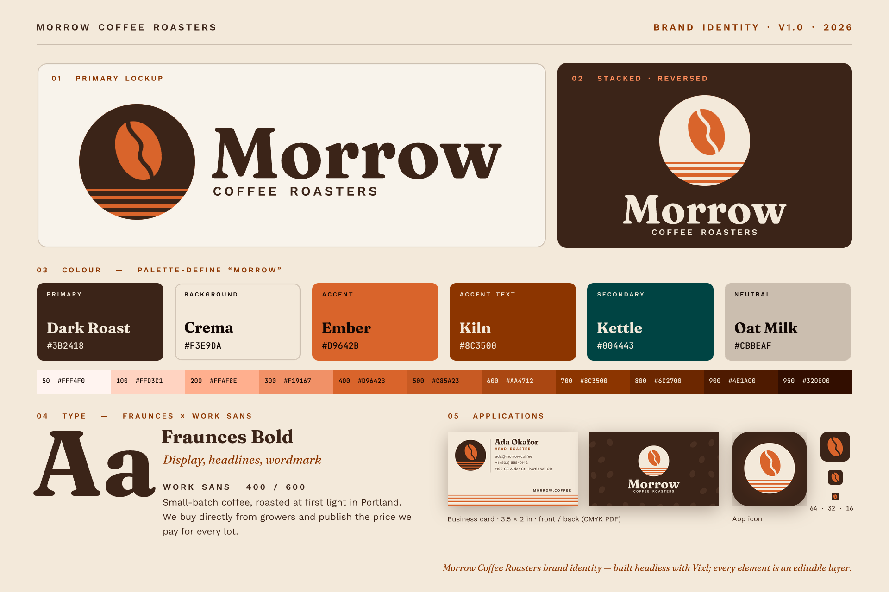

# 02 · Brand identity system: Morrow Coffee Roasters

Morrow is a fictional Portland coffee roaster. This project builds its whole identity headlessly with Vixl
0.16.0. The mark is a coffee bean, drawn with the pen tool and split by a Bézier crease, set inside a disc
and rising over sunrise "reflection" bands. It is built only from vector geometry and pathfinder booleans.
On top of that sit a palette generated from one ember colour (a tonal scale plus a split-complementary
harmony, frozen with `palette-define`) and a Fraunces × Work Sans pairing. From there the script produces
horizontal and stacked lockups as artboards, symbol masters with instances, a business card front and back
with bleed (CMYK PDF), an app icon with the full icon set, a small-size favicon and a brand board (PNG + HTML).
The logo is then checked against the brand palette with a saved suite and with `palette-check`.

Run from the repo root: `python explorations/02-brand-identity/build.py`. A full run took about 7–8 minutes, almost
all of it spent in `check()` on the brand board; with the fixes in the [changelog](../../CHANGELOG.md) the whole run takes about 15 s. `QUICK=1` skips that check. Everything
is written to `output/`:

| Path | What |
| --- | --- |
| `output/logo/morrow-mark.{png,svg}`, `morrow-mark-1color.svg` | Mark: transparent PNG, strict SVG, one-ink SVG |
| `output/logo/morrow-logo-{horizontal,stacked}.{png,svg}` | Lockups rendered from two artboards (PNG transparent, SVG `svg_policy="strict"`) |
| `output/card/card-{front,back}{.png,-cmyk.pdf,-softproof.png}` | 3.5×2 in card with 0.125 in bleed; CMYK PDF (GCR, 300% ink limit) and RGB soft proof |
| `output/icons/app-icon-1024.png`, `icons/set/*` | App icon + `export-icons` set `all` (web/apple/android/windows, ICO, webmanifest) |
| `output/icons/favicon.ico`, `favicon-512.png` | Simplified small-size mark, ICO 16/32/48/64 |
| `output/board/brand-board.{png,html}`, `brand-board-deuteranopia.png` | Brand board, standalone HTML export, colour-vision simulation |
| `output/work/*.vixl`, `output/work/.vixl-resources.json` | Editable sources; workspace resource library holding the saved `morrow-bean` shape |
| `output/reports/*.json` | Palette-check / suite results, design + print check reports, build log |

## Vixl features exercised

- **Named sizes:** `Project.sized("logo-mark" | "logo-horizontal" | "business-card" (bleed=True) | "app-icon" | "favicon")`. Artboards come from the presets `logo-horizontal` and `logo-stacked`. The card's generated `trim-*`/`safe-*` guides position its content.
- **Pen tool**: `pen` with explicit Bézier `nodes` (`point`/`in`/`out`) and `closed: true` for the bean.
- **`shape: "path"`** with an SVG `C`/`L` contour for the S-shaped crease. Shape shortcuts: `ellipse`, `rectangle` and `rounded-rectangle`.
- **Pathfinder**: `subtract` (bean − crease), then a *nested* `subtract` (disc − bean-halves − 4 bands). The nested operand is a resized and rotated pathfinder.
- **Symbols**: `symbol` masters (positive and reversed), kept hidden, with many `symbol-instance` copies in every document.
- **Artboards** with `targets` (each shows a single group). Exports per artboard: `export(..., artboard=)` and `check(artboard=)`.
- **Colour**: `palette-generate` with `scheme: "scale"` (ember-50…950) and `scheme: "split-complementary"`. Swatches use `@ref` modifiers: `shade()`, `mix()`, `lighten()`, `alpha()` and `readable(bg, a, b)`. The resolved colours are frozen with `palette-define "morrow"`.
- **Typography**: `typefaces.pair_fonts("fraunces-work-sans")` (heading/body roles), plus `install_font` for Work Sans 600/300, Fraunces italic and JetBrains Mono. Fonts are downloaded from Google Fonts and embedded. Paragraph wrapping uses `text-layout`.
- **Saved shapes**: workflow `shape-save` stores the pen bean; `shape-place` scatters 30+ beans on the card back through a `Session` (with `rotate` and `group`).
- **Layout and decoration**: `constrain` (canvas-relative anchors), `grid`, `reorder`, `crop` (trims the bleed off rendered cards), `clip` (rounded app-icon preview), `layer-style drop-shadow`, `add` raster.
- **Exports**: strict SVG, transparent PNG, ICO via `icon_sizes`, `exports.export_icons(icon_set="all")`, HTML, CMYK PDF via `color_space="cmyk", ink_limit=300`, `proof=True` soft proof, and CLI `export --simulate deuteranopia --scale 0.5`.
- **QA**:
  - `suite-set` with `kind: "palette"` rules: one follows the named palette and one freezes literal colours. Both are run through workflow `check` on each artboard.
  - Workflow `palette-check` on the mark and on the card front.
  - `Project.check()` on every document, plus `checks=["print"]` on the cards.
  - CLI `vixl --json check --checks print color_vision --strict`.

## Findings

> **Status:** Finding 3 is fixed: `check()` on the brand board takes seconds, and the whole build about 20 s. Findings 1 and 2 are fixed too: a pen without `width`/`height` gets a box that fits its nodes, stroke and handles, and a box too small for its nodes is rejected instead of clipping them. Finding 12 is fixed as far as the error goes: it now names the operation that uses the undefined swatch (`operations[0] (shape): Unknown swatch: @roast`); a swatch still can't refer forward to one defined later. The other findings are still open. See the Unreleased section of the [changelog](../../CHANGELOG.md).

Bugs and rough edges, with repros:

1. **A pen layer without `width`/`height` becomes canvas-sized instead of fitting its nodes.** `Project(400,300).apply({"type":"pen","name":"a","nodes":[{"point":[10,10]},{"point":[50,40]}]})` gives `resolved_bounds (0,0,400,300)`. A pathfinder built from such a layer, or a `resize` of it, then works on that huge box. I had to pass the node-space size (`width:220,height:300`) explicitly.
2. **A pen layer whose `width`/`height` is smaller than its node extent clips silently.** The nodes are not scaled into the box. A closed 40×40 square drawn with `width:20,height:20` renders only its 20×20 corner (`path_view` = `[20,20]`), with no warning or error. My first bean was cut in half this way. Expected behaviour: either fit the nodes to the box or reject the operation.
3. **`check()` is very slow on a text-heavy board.** On the 1920×1280 brand board (82 layers, 49 text layers) it took **212 s**. One render takes about 2 s. The contrast check calls `measure(target=…)`, which re-renders the whole canvas twice for each text layer, and pathfinder/group layers are excluded from the render cache (`render.py`: `cacheable = … layer["type"] not in ("group","pathfinder")`). The other documents check in under 4 s.
4. **Text has no letter-spacing/tracking control.** The caps labels are spaced with U+2009 thin spaces. Those spaces leak into exported text: the HTML export titles the page and sets `` from the *first text layer in stack order*, so the page title read `M O R R O W  C O F F E E…`. My workaround was to `reorder` a plain-text footer to the bottom of the stack. There is also no option to set the HTML title or alt text.
5. **Strict SVG keeps pathfinder results as `<mask>` elements, not real boolean path geometry.** The horizontal logo SVG has 10 `<mask>`s. It renders correctly, and resvg confirms it with no `<image>`. But a designer opening it in Illustrator or Figma gets masked groups instead of one clean compound path. The docs do say "opaque pathfinder operands as scalable geometry".
6. **The CMYK PDF is one raster page with no `TrimBox`/`BleedBox`.** It is `DeviceCMYK`, 1126×676 px, and the MediaBox includes the bleed. Text is rasterised at 300 dpi, and the printer has to be told where the trim is.
7. **`shape-save` only accepts a single `shape`/`pen` layer.** A pathfinder result is refused ("use library-save for full components"), so the finished mark can't be stored as a saved shape. Only the bean contour is saved. Single-contour paths also make a holed or split mark impossible without pathfinder.

Surprises and doc mismatches:

8. **Rotated layers are placed by their *expanded* bounding box.** To keep the bean centred I had to rotate first and then `move` it using a box computed from cos/sin. The docs do say this; it is still the most common source of off-centre artwork.
9. **`readable()` accepts candidate colours**, as in `readable(@ember, @espresso, @crema)`. The docs only show `readable(bg)`, which picks pure black or white. I found the candidates form in `colors.py`. Even with it, no candidate may reach 4.5:1: `readable(@ember, @roast, @crema)` returned roast at 4.0:1, and `check` correctly flagged the chip labels. I added a darker `espresso = shade(@roast, 50%)` helper.
10. **`palette-generate scheme:"scale"` puts the input colour at step 400, not 500**, so `#D9642B` became `ember-400`. That is reasonable, but the docs don't mention it.
11. **`export_icons` is not a `Project` method.** Python callers must import `vixl.exports.export_icons`, unlike `export`, `check` and the rest.
12. **An undefined swatch passes the operation that uses it.** A shape with `fill:"@roast"` before `@roast` exists is accepted. The error only appears later in the batch, here at the following `pathfinder` (`Unknown swatch: @roast`). The batch still rolls back atomically, so nothing breaks. A *swatch* behaves the other way: it is resolved when it is defined. `{"type":"swatch","name":"on-ember","color":"readable(@ember, @espresso, @crema)"}` fails with `Unknown swatch: @espresso` if `espresso` is defined later in the same batch, so swatch order matters. Despite "redefining updates every use", a swatch can't refer forward to one that doesn't exist yet.

What worked well:

- Pen + `shape: path` + nested pathfinder produced a clean, editable mark quickly. Symbol instances followed hidden masters perfectly across five documents.
- Artboards with `targets` made two lockups in one file easy.
- Palette QA was convincing. Through the suite, both lockups passed against the frozen `#3B2418`/`#D9642B` pair and against the `morrow` palette. The workflow `palette-check` measured the mark at 1.6% out-of-palette pixels, all antialiased edges, with a maximum distance of 40. Reports are in `output/reports/palette-checks.json`.
- The checks found real problems:
  - Contrast on the ember chips (finding 9).
  - Type below 6 pt on the card (5.8 pt and 5.3 pt).
  - Card stripes stopping at the trim instead of running into the bleed.
  - Pattern beans fully off-canvas.

  All of these are fixed in the build.
- Font install/pairing "just worked", and fonts are embedded so the `.vixl` files render offline.
