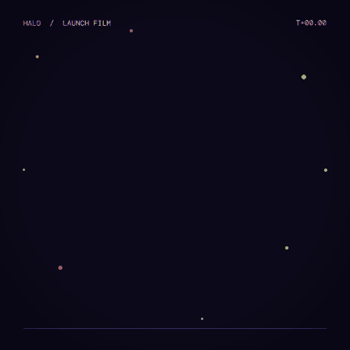

# HALO — kinetic-typography launch film

An 8-second, 1080×1080, 30 fps product-launch animation for a fictional smart ring, "HALO". The
film is built entirely from editable Vixl layers and timeline tracks. Act one stacks three words
("SLEEP. MOVE. RECOVER.") that rise in on a staggered motion recipe, recolour, and leave upwards.
In act two the canvas shifts from night to violet, and a glowing lime ring springs open with
`elastic-out` while its blur clears. The letters of HALO drop in one by one on a `spring`
easing, a tick bezel (a star minus a disc via `pathfinder`) slowly turns, and a coral satellite
orbits the ring through an off-box pivot. Act three types the tagline, pops three spec chips
(the battery count ticks up through stepped text keys), and brings in a pulsing CTA that ends in
coral. Throughout, a monospaced timecode ticks and a segmented `steps(16)` progress bar fills.
Type is **Bricolage Grotesque 800** for display, **Figtree 500** for body and **DM Mono 500** for
UI labels, all downloaded from Google Fonts and embedded in the `.vixl`.



Contact sheet (16 evenly spaced frames): [`output/contact-sheet.jpg`](output/contact-sheet.jpg).
Sheet at named markers: [`output/contact-markers.jpg`](output/contact-markers.jpg).

Rebuild from the repo root: `python explorations/03-kinetic-launch/build.py` (about 12 minutes on a
shared machine when it was built, mostly frame rendering; about 2 minutes with the fixes in the [changelog](../../CHANGELOG.md); `QUICK=1` skips the animation exports).

## Outputs

| File | What | Size |
| --- | --- | --- |
| `output/halo-launch.mp4` | H.264, 810×810 (scale 0.75), 30 fps, 240 frames | 631 KB |
| `output/halo-launch.gif` | 432×432 (scale 0.4), 12 fps, `colors=48` | 876 KB |
| `output/halo-launch.webp` | 540×540 (scale 0.5), 15 fps, quality 70 | 742 KB |
| `output/halo-reveal-apng.png` | APNG of the reveal only (`start="reveal"`, `end="4.2s"`), 324×324, 10 fps | 1004 KB |
| `output/halo-sprites.png` + `.json` | Sprite sheet, 24 frames at 3 fps, 8 columns, 194 px cells | 436 KB |
| `output/halo-launch.vixl` | Saved document: layers, fonts, timeline, markers, roles, motions, suite | 105 KB |
| `output/contact-sheet.jpg`, `contact-markers.jpg`, `cli-sheet-markers.png` | Timeline previews (Python API and CLI `timeline-sheet --times reveal 3.2s specs hero`) | 368 / 200 / 314 KB |
| `output/frames/still-*.jpg` | Single frames at 1.4 s, 3.4 s and 7.6 s | ~270 KB total |
| `output/timeline.json`, `check.json`, `check-moments.json`, `suite-end-card.json`, `build-log.json` | Timeline inspection, static check, per-moment checks, time-sampled suite report, build log | small |

The whole `output/` folder is about 4.9 MB.

## Vixl features exercised

- **Typography:** `install_font` (Python API for `vixl font install`) for three Google Fonts
  families, the `heading`/`body` font roles, and a registered font name (`dm-mono-500`).
- **Layers:** `text`; `shape` (`ellipse` with stroke, `star` with 72/90 `sides` and an
  `inner_radius`, `rounded-rectangle`, `rectangle`); radial `gradient` with alpha stops;
  transparent `solid`; `adjustment` layer (vignette); `swatch`.
- **Structure and styling:** `pathfinder` `subtract` (star minus disc gives a tick bezel);
  `group`, `lower` and `raise`; `layer-style` `outer-glow` and `color-overlay`; `effect` blur on
  groups; `select` `none`.
- **Pivots:** `pivot` with `"left"` anchors (wipe bars) and `units:"px"` far outside the box (orbit).
- **Constraints:** `constrain` with `canvas.*` and sibling anchors (`tagline.bottom+30`,
  `badge-bg.center-x`, `cta-pill.center-y`), animated through `translate-y` and `scale`.
- **Timeline:** `timeline-set` (duration, fps, loop). `marker` × 7, including a percentage
  marker (`"90%"`) and markers used as `start`/`time` everywhere.
- **Keyframes:** `keyframe` on `scale-x`, `opacity`, `rotation`, `text`, `color`, `effect:1` and
  canvas `background`. `targets` shares keys across the three chip labels and across the CTA
  pill and label.
- **`animate`** on `opacity`, `scale`, `scale-x`, `rotation`, `size`, `color`, `fill`, `stroke`,
  `translate-y`, `effect:1` (group blur and the adjustment layer's vignette).
- **Easings:** `spring`, `elastic-out`, `cubic-bezier(0.8,0,0.1,1)`, `cubic-bezier(0.3,0.1,0.25,1)`,
  `steps(6)`, `steps(16)`, `hold`, `ease-out-back`, `ease-in-back`, `ease-out-expo`,
  `ease-out-quart`, `ease-out-cubic`, `ease-out-quad`, `ease-in-out-sine`, `ease-in-sine`,
  `ease-out-sine`, `ease-out`, `ease-in`, plus `bounce-out` through the `bounce` preset.
- **`animate-preset`:** `typewriter` (×2), `slide-in-up`, `slide-out-up`, `pop-in`, `fade-in`,
  `fade-out`, `pulse` (×2), `float`, `spin`, `bounce`, and `color-shift` on both the canvas and a
  shape.
- **Production motion workflow:** `role-set` (words, letters, chips, sparks) and
  `motion-define` (4 recipes, using `stagger`, `after`, `distance`, `amount`, `easing` and
  `description`). `motion-apply` takes a marker `start`, and the `drift` recipe is applied three
  times with `speed` 1, 1.3 and 1.6.
- **QA:**
  - `inspect_timeline` / CLI `vixl timeline`;
  - `contact_sheet` with `count` and with marker `times`;
  - CLI `timeline-sheet --times`;
  - CLI `check --json`;
  - `Project.check` on `project_at(p, t)` copies;
  - a time-sampled `suite-set` (`sampling: {"mode":"times","times":["hero","7.9s"]}`) with
    `assert` and `design` rules, run with `check_suite` and CLI `workflow check`. It passed.
- **Export:** `export_timeline` to MP4, GIF (`colors`), WebP (`quality`), APNG (marker-bounded
  `start`/`end`) and `sheet` (`columns`), each with `scale`/`fps`. `Project.save` writes the
  `.vixl`.

## Findings

> **Status:** Bugs 1 (blur clipped to the layer box), 2 (stroke wider than its box crashing the renderer) and 3 (a 1-pixel sliver at scale 0) are fixed: a layer scaled below one pixel on either axis draws nothing. Rough edge 4 is fixed too: a `units:"px"` pivot that is too far away is reported in pixels, with the allowed range. Rough edges 5 and 6 are still open. See the Unreleased section of the [changelog](../../CHANGELOG.md).

### Bugs

1. **A blur effect is clipped to the layer's own box.** A blurred text glyph or small shape
   turns into a soft-edged *rectangle* with hard outer edges. The glow cannot spread past the
   layer bounds. Repro:
   ```python
   p = Project(300, 200, "#000")
   p.apply([{"type":"text","name":"t","text":"H","size":120,"color":"#fff","x":100,"y":40},
            {"type":"effect","target":"t","name":"blur","amount":20}])
   p.render()   # a grey box: pixel row y=100 jumps 0 -> 154 exactly at x=100 (the box edge)
   ```
   The same happens to a stroked `ellipse` (its blur came out as a rounded square). This matters
   a lot for "blur-in" motion. **Workaround used here:** wrap the layer in a `group` together with a
   transparent full-canvas `solid`, and put the blur on the group.
2. **A stroked shape crashes the renderer with a raw PIL error once its box is smaller than the
   stroke.** The error is `ValueError: x1 must be greater than or equal to x0`, not a structured
   `VixlError`. It happens statically and in animation. A `scale` key of 0 (or 0.05, or 0.1) on a
   600 px ellipse with `stroke_width: 26` crashes every frame render. So does a 20×20
   `rectangle`/`ellipse`/`rounded-rectangle` with `stroke_width: 26`
   (`design_render.shape_image` insets the box by half the stroke). The crash only shows at render
   time: `apply` succeeds and the contact sheet fails. **Workaround:** animate the ring from
   `scale` 0.12 and fade it in.
3. **`scale` / `scale-x` 0 still draws a 1-pixel sliver.** A 80×10 rectangle with
   `pivot:"left"` and a `scale-x` key of 0 renders a 1×10 px fully opaque line (`getbbox()` →
   `(10,15,11,25)`). `scale: 0` leaves a 1×1 dot. A wipe that starts or ends at 0 leaves a visible
   tick. **Workaround:** add `opacity` keys with `hold` easing.

### Rough edges

4. **`pivot` with `units:"px"` is stored as a box fraction clamped to ±10.** The error message
   names the fraction, not the pixel value you passed. Orbiting a 30 px dot around a centre 314 px
   away failed with `operations[11] (pivot): pivot y must be at most 10`. The satellite had to be
   36 px.
5. **`constrain` refuses non-sibling anchors** (`Constraints must reference sibling layers`).
   Once the ring went into its blur group, the tagline could no longer hang off `ring.bottom` and
   had to use `canvas.center-y+166`. Workaround 1 therefore forces you to give up constraint
   anchors.
6. **`check` only judges the rest frame,** and there is no time option. In a motion piece every
   scene sits in the rest frame at once, so `vixl check` reports 5 overlap errors and 6 contrast
   errors that never occur on screen (`output/check.json`). Two things give meaningful results:
   `Project.check` on `vixl.timeline.project_at(p, t)` copies (`check-moments.json`), and
   time-sampled suites. The per-moment check also caught a real transient (the badge label at
   1.46:1 contrast mid-pop-in at 3.6 s).
7. **`shape` has no `opacity` field** (`Unknown field(s) 'opacity' for 'shape'… Did you mean
   'path'`). Use an 8-digit hex fill or a separate `opacity` op.
8. **Shapes animate `stroke`, not `stroke_color`.** The error is clear:
   `Layer 'ring' has no 'stroke_color' to animate`. The docs' property list mentions both without
   saying which layer types own which.
9. **A motion recipe can silently stretch the timeline.** A `motion-apply` with `speed: 0.9` near
   the end extended the duration from 8000 to 9322 ms with no warning. Duration "grows to fit
   keys" as documented, but a warning would help.
10. **Rendering is slow for motion work:** about 1–2 s per 1080² frame here (the machine was
    shared with 9 other builds). Exports at a `scale` below 1 are faster. The full build took
    about 12 minutes.
11. **APNG and GIF sizes depend on content.** A `grain` adjustment layer made every frame
    unique: an 80-frame 324 px APNG came out at 10.8 MB and the GIF at 2.5 MB. APNG has no
    palette option (`colors` is rejected outside GIF). Dropping the grain and bounding the APNG
    with marker `start`/`end` brought them to 1.0 MB and 0.9 MB. The GIF export's own >1 MB
    warning was helpful.

### What worked well

- Markers as times work **everywhere**: `keyframe.time`, `animate.start`, preset `start`,
  `motion-apply.start`, `contact_sheet(times=…)`, CLI `timeline-sheet --times`, export `start`/
  `end` and suite `sampling.times`. A `"90%"` marker also resolves correctly.
- `motion-define`/`motion-apply` with `stagger` + `after` is a genuinely good abstraction. One
  recipe drives a staggered rise, hold and staggered exit. The `drift` recipe was reused three
  times at different `speed`s, and the output is ordinary editable tracks (visible in
  `timeline.json`).
- Text keyframes (stepped) make counters and timecodes trivial. `typewriter` is one line.
- An off-box `pivot` plus `rotation` makes a clean orbit. `elastic-out`, `spring`, `steps(n)` and
  `cubic-bezier()` all look right in the frames.
- Constrained layers (chips → tagline, label → pill) keep their layout while animated by
  `translate-y`/`scale`. `targets` on presets moved the CTA pill and label together.
- Font install from Google Fonts with embedding just worked. The saved `.vixl` (105 KB) carries
  all three faces.
- Errors were structured and named the operation index and field, with suggestions. The one
  exception was the PIL crash in bug 2.
