# Vixl Quest — a pixel-art RPG asset pack

A small, complete game asset pack built only with Vixl operations through the Python API
(`build.py`, no external art). It was first built with Vixl 0.16.0; the committed outputs are
rebuilt with 0.20.0. It has a 16×16 side-view hero rigged from swappable pixel layers:
a body, four leg poses, three sword poses and a slash arc. The hero has a 4-frame walk, a 2-frame
idle and a 4-frame attack, saved with `frame-save`/`frame-apply`. There are palette-swapped
monsters and hero variants made with `pixel-palette`. A 13-tile Sweetie-16 tileset is drawn only
with `pixel-draw` `pixel`/`line`/`rect`/`fill`. A 20×12-tile overworld map is assembled with
`repeat` and repeated groups. Two comps (map only, and map with the HUD/dialogue overlay) use the
`press-start-space-mono` font pairing. The map is animated two ways: with sprite frames, and with
a keyframe timeline where stepped `visible` keys switch poses and `steps()` easing moves the hero
in whole pixels. A title screen mixes dithered pixel art with Press Start 2P and Space Mono at an
integer upscale.

Rebuild from the repo root: `python explorations/04-pixel-rpg/build.py` (it wipes and recreates
`output/`; 36 s with 0.20.0 on a shared 4-core container; about 2 min CPU with 0.16.0, mostly the timeline export).

## Title screen and HUD

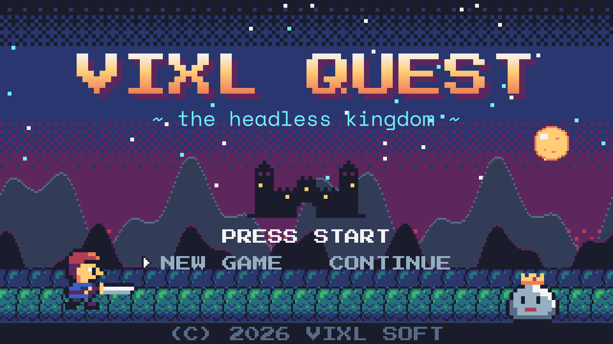

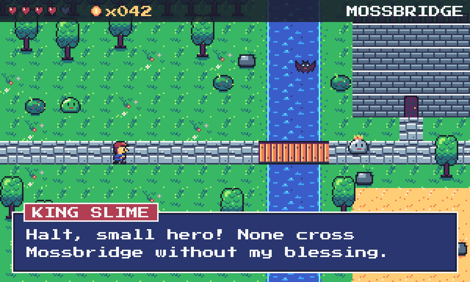

## Map

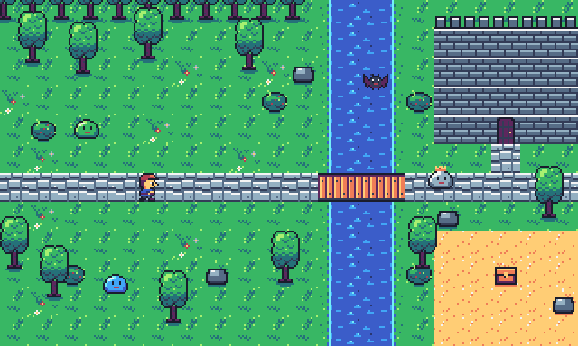

Animated: 

Timeline version (keyframes): 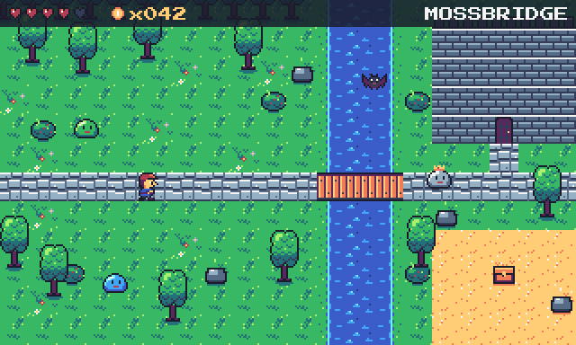 — also
`output/map-timeline.mp4` and `output/map-timeline-contact.png`.

## Hero

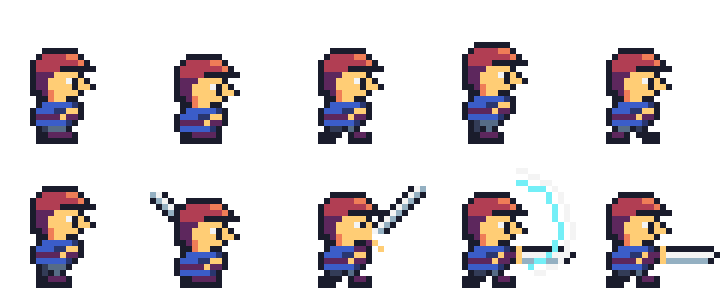

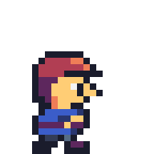 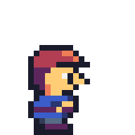 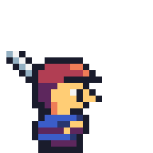

Variants (one rig, recolored with `pixel-palette`):
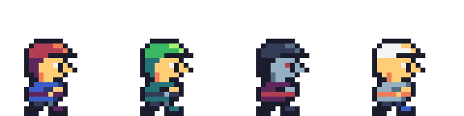 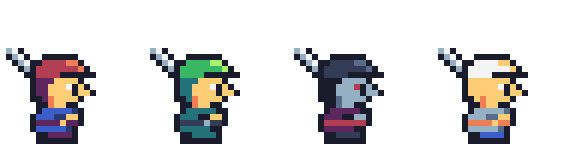

## Monsters and tileset

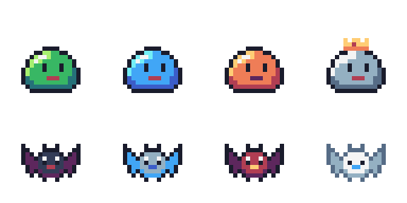

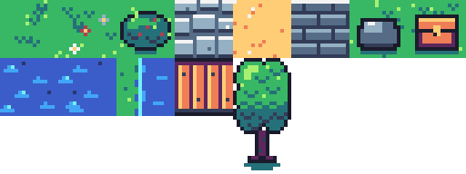

## Output files

| File | What |
| --- | --- |
| `hero.vixl`, `hero-walk.gif/.apng`, `hero-idle.gif`, `hero-attack.gif/.apng` | 24×24 hero clips, 8x nearest |
| `hero-sheet.png/.json`, `hero-sheet@6x.png/.json` | All 10 frames as a sprite sheet with frame rectangles and durations, plus the named `walk`/`idle`/`attack` animations |
| `hero-variants.vixl`, `hero-variants-*.gif`, `hero-variants-sheet.png/.json` | hero / ranger / shadow / paladin palette swaps |
| `enemies.vixl`, `enemies.gif`, `enemies@6x.png`, `enemies-sheet.png/.json` | 4 slimes and 4 bats, 2 frames each |
| `tileset.vixl`, `tileset.png`, `tileset@4x.png` | 13 tiles (grass, flowers, bush, path, sand, wall, rock, chest, water×2, shore, bridge, 16×32 tree) |
| `map.vixl`, `map.png`, `map@3x.png`, `map-hud@3x.png`, `map-hud.gif` | 320×192 scene; comps `map-only` / `with-hud`; 4 frames |
| `map-timeline.vixl`, `.gif`, `.mp4`, `-contact.png` | 4.8 s keyframed walk across the bridge |
| `title.vixl`, `title.png`, `title@4x.png`, `title@4x-nearest.png`, `title.gif` | Title screen, with blinking PRESS START |

## Vixl features exercised

- `pixel-art` from `rows` (hero, monsters, icons, castle, generated dithered sky and mountain ridges) and as blank `width`/`height`/`background` grids.
- `pixel-draw` with all four tools: `line` (swords, slash arc, outlines), `rect` (bricks, cobbles, chest), `pixel` (tufts, flowers, crown), `fill` (canopy, bush and moon interiors, tree shadow).
- `pixel-palette`: monster and hero variants, the night-time forest on the title, props recolored to stand on sand, and adding *new* symbols (the king slime's crown colors).
- `frame-save`/`frame-apply`, named animations (`animation-set` with `name`, `order` and `loop`; `export_animation(animation=…)`), plus `export_animation` to GIF/APNG/sheet, `scale` up to 8 with nearest sampling, `sampling="smooth"` for the title GIF, and `colors=64`.
- `repeat` on pixel layers (grass row, road, bridge, river columns, hearts, merlons, tree line, mountains, forest) and on **groups** (`ground` 20×12, castle wall, sand yard).
- `group`, `show`/`hide`, `move`, `flip`, `rotate` (90° cursor), `resize` (integer 2× of the sky, castle and king slime), `pivot` + `scale` of the hero group (2×, nearest), `opacity`, `solid`, `layer-style gradient-overlay`.
- `comp-save`/`comp-apply` and `export(comp=…)`.
- `text` with font roles after `pair_fonts(project, "press-start-space-mono")`; `text-set`.
- Timeline: `timeline-set`, `keyframe` on `visible`, `translate-y` (hold) and `text`, `animate` with `steps(n)` easing, `export_timeline` to GIF and MP4, and `contact_sheet`.
- `Project.clone()` (the timeline map starts from a copy of the map), `inspect_pixels()` to copy tile rows between documents, `inspect_animation()`.

## Findings

> **Status in 0.20.0:** Bugs 1, 2 and 4 are fixed (0.18.0) and bug 3 is fixed in 0.19.0 (named animations). `build.py` now scales the title hero by scaling its group (`pivot` top-left, `scale` 2, `move`) instead of ungrouping and resizing each layer, and exports the walk, idle and attack clips as named animations of one document instead of cloning it and deleting frames. Every PNG and every GIF/APNG frame is pixel-identical to the 0.16.0 output. The sheet JSON now also lists the named animations, and the timeline GIF's frame durations alternate 80/90 ms to keep the requested 12 fps (0.17.0).

**Bugs and real rough edges**

1. **`scale` on a group of pixel layers blurs them.** In `render.transform_layer_image`, layers
   are resampled with NEAREST only when `kind == "pixel"`. A group therefore gets LANCZOS. Repro:
   `pixel-art rows ["#.", ".#"]` → `group g` → `{"type":"scale","target":"g","value":4}` renders
   20 distinct colors, while `scale` on the pixel layer itself renders 2. The docs say "Pixel
   layer transforms use nearest-neighbor sampling", but that stops being true once you group a
   sprite rig, which is the natural thing to do.
2. **Resizing a child inside a group clips it to the group's old box.** The group's bounds are
   not recomputed. Repro: a 2×2 layer `a` and a 1×1 layer `b` at (2,2), grouped as `g` → `resize a
   8×8`. The child reports bounds `(0,0,8,8)`, but the group stays `(0,0,3,3)` and only 9 pixels
   render. Combined with (1), the only way to make a crisp 2× copy of a grouped sprite in 0.16.0 was
   `ungroup` → resize/move each child → `group` again.
3. **`animation-set` cannot choose a subset of frames.** `order` must list every frame ("Order
   must list every frame exactly once"), and export always uses all frames. One document holding
   walk + idle + attack therefore can't export a "walk.gif" directly. The 0.16.0 workaround was
   `Project.clone()` then `frame-delete` the other frames. Named clips/tags would help a lot; 0.19.0
   added them as named animations, which `build.py` now uses.
4. **Ragged `rows` give no location.** The error is just `Pixel rows need equal widths of
   1–256`, with no row index or expected/actual width. `build.py` validates rows itself
   (`grid()`) before calling Vixl.

**Surprises and gotchas (by design, but cost iterations)**

- **Children of a group use group-local coordinates.** The origin is the members' bounding box
  *at grouping time*, and it moves when you add a member that sticks out further. My pose code
  first used canvas coordinates. It broke silently when I added a slash layer: the body was offset
  by (1,4) and covered the legs. `inspect` of a child also returns local `x`/`y`/`resolved_bounds`.
- **Comps capture the visibility of *every* layer.** That includes animation pose layers. A comp
  saved before posing re-showed all three swords and the slash when it was applied on export. Save
  comps last, from a posed frame.
- **`pixel-draw fill` is index-based (4-neighbour, same symbol).** Grass tufts drawn before
  filling a canopy split the fill region. Draw the outline, fill, then decorate.
- **`rotate` is clockwise for positive values** (`value: 90` turned a down-arrow to point left).
  The operation table doesn't state the direction.
- **Export scale limits differ:** `export()` allows `scale` up to 16, but `export_animation` up
  to 32.
- The `pixel-palette` docs say "Recolor symbols everywhere", but it also *adds* new symbols
  (`layer["palette"].update`). That was handy for the crown and isn't documented.
- `export_timeline` has no `sampling` argument. In practice its smooth path re-renders a scaled
  proxy, and pixel layers inside it still come out crisp (27 colors in a 2× frame, no
  blur). Its stepped `visible` keys and `steps(n)` easing worked well for sprite switching and
  whole-pixel motion. It was the slowest step, though: 58 frames of a ~120-layer 320×192 scene,
  plus MP4, dominated a full build of ~2 min CPU (6 min wall time on the shared machine) in 0.16.0; the whole 0.20.0 build takes 36 s.
- Space Mono at 11 px is antialiased at native resolution, so a `sampling="nearest"` upscale
  makes it mushy (`title@4x-nearest.png`). `sampling="smooth"` (`title@4x.png`, `title.gif`)
  re-renders text crisply while pixel layers stay blocky. That's the right way to pair a pixel
  font with a non-pixel body font. Press Start 2P at 8/24 px is pixel-exact at native size.

**Authoring pixel art via `rows` strings**

- Hand-typed rows are fine up to about 16 wide. Past that, counting characters is the main cost:
  most of my early errors were off-by-one rows. A ruler or mirror helper and a row-indexed width
  error would remove most of that friction.
- There's no operation to replace the rows of an existing pixel layer. You can only make a new
  layer, or edit cell by cell with `pixel-draw`. So animation poses became separate pixel layers
  toggled with `show`/`hide`. That works well, and it plays nicely with timelines.
- Generated rows (dithered sky gradient, sine-wave mountain ridges) are a strength. Strings are
  trivial to produce in code, and `repeat` tiles a 160-column ridge across the 320 px canvas
  because the 256-cell grid limit rules out a single layer.
- `inspect_pixels()` + `pixel-art rows=…` is an easy way to "instance" a tile from the tileset
  document into the map document.

**Worked well**

- `repeat` on groups gives true 2D tiling (20×12 ground from one 16×16 tile in 4 operations).
- Sheet export with its JSON metadata (frame rects + durations) is game-engine ready, and nearest
  upscaling of pixel layers, sheets and GIFs was crisp everywhere it was documented to be.
- Font install from Google Fonts via the pairing catalog worked first time, and fonts are
  embedded in each `.vixl`.
