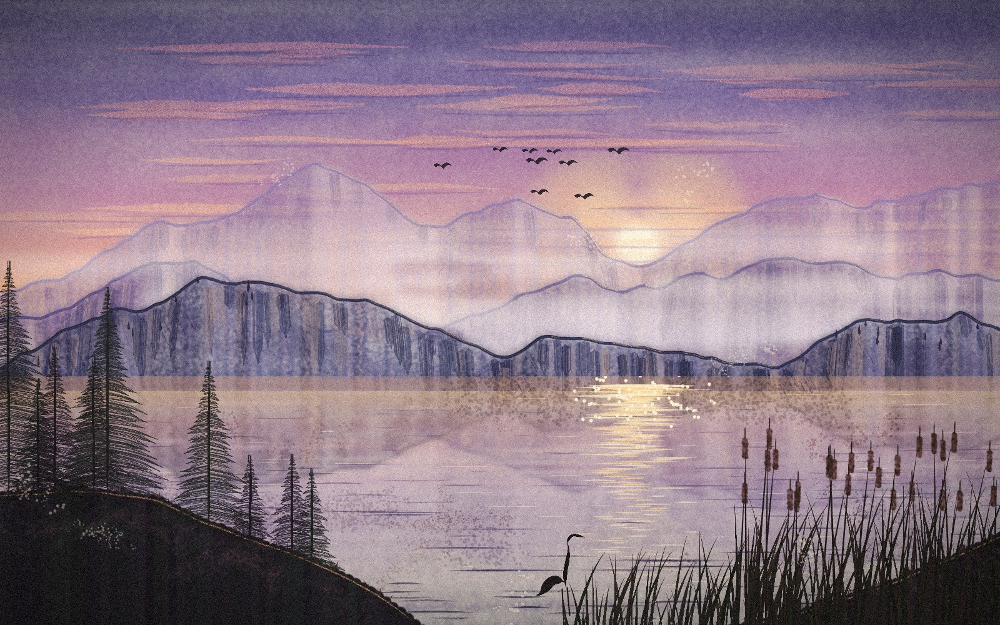
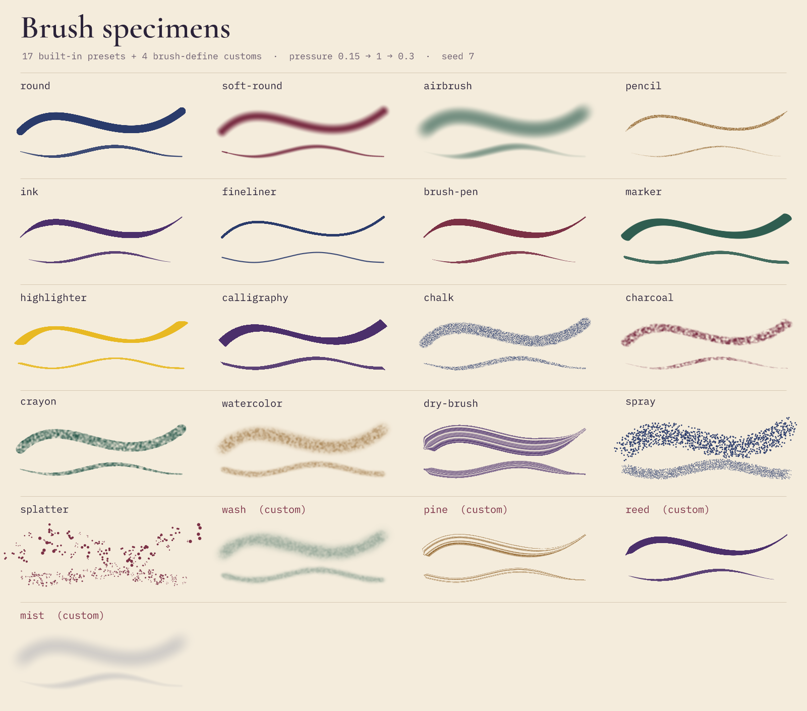
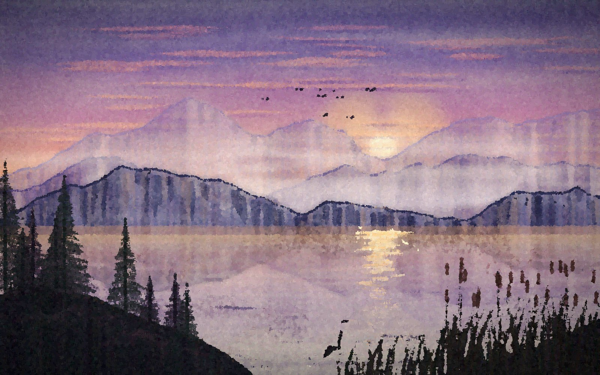
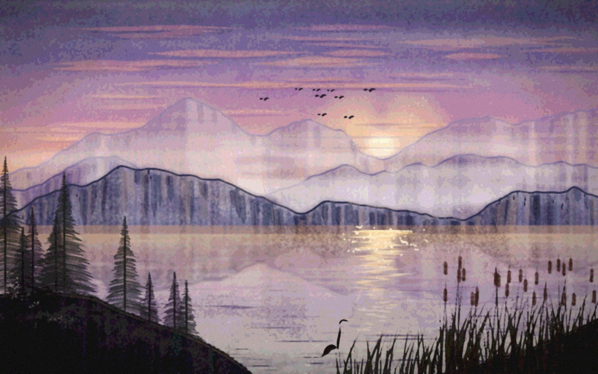
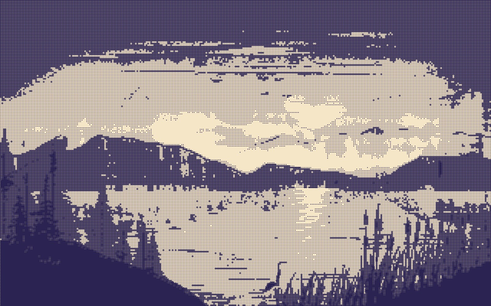
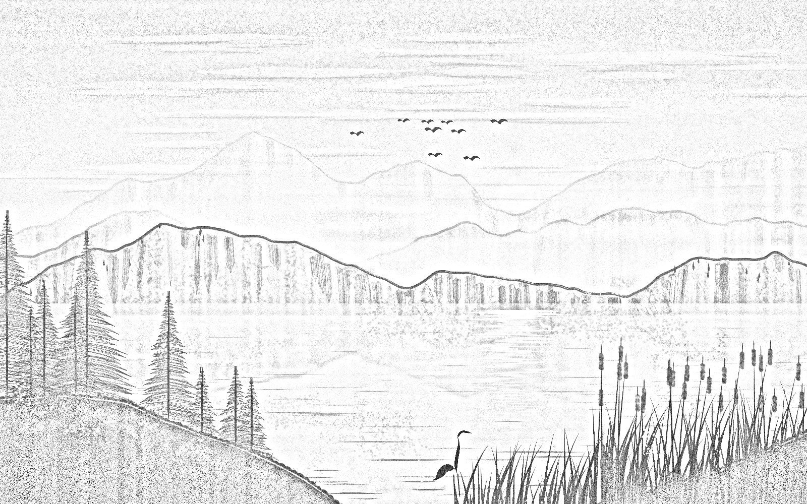
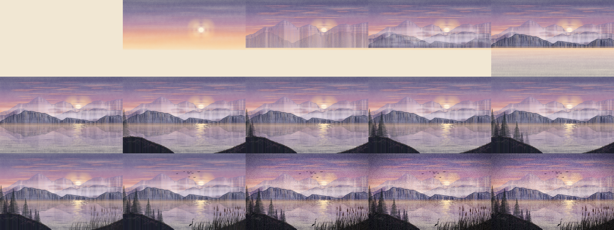

# Generative brush painting: a misty mountain lake at dusk

`build.py` paints a landscape stroke by stroke from one seeded Python RNG (`PAINT_SEED`, default
1907). Value-noise ridgelines give three mountain ranges. The sun sets in the deepest notch of the far
ridge. Every element is its own editable paint layer: a watercolor sky wash with an airbrushed sun glow,
chalk cloud streaks, watercolor/dry-brush ranges with pencil rim light, a screen-blended masked mist,
horizontal water washes, mirrored reflections broken up by erase strokes, a sun glitter column, a
round/charcoal/crayon headland with grass tufts, nine generated pines, pressure-curved reeds and
cattails, ink and calligraphy line work (birds and a heron), splatter texture and an adjustment-layer
grade. The script also renders a labelled brush specimen sheet and four artistic-filter variants. A
timelapse brings in the layers (and the pines one tree at a time) in painting order as a GIF and an MP4.
The final document holds **3,723 strokes on 26 paint layers**. 3,072 of them are authored strokes; the
other 651 are copies made when the mountain layers are duplicated for the reflections. All of it stays
editable in `output/painting.vixl`.

Run from the repo root: `python explorations/05-generative-painting/build.py` (about 13 minutes when it was built; about 4 minutes with the fixes in the [changelog](../../CHANGELOG.md)).

| Oil paint | Watercolor filter |
| --- | --- |
|  |  |
| **Riso halftone (brightness → halftone → duotone)** | **Pencil sketch** |
|  |  |

Timelapse ([MP4](output/timelapse.mp4)):

Outputs: `painting.jpg`, `painting.vixl` (editable, 333 KB), `brush-specimens.png`,
`variant-*.jpg` (4), `timelapse.gif` (560×350, 100 frames, 0.99 MB), `timelapse.mp4` (960×600),
`timelapse-sheet.png`, `stats.json` (stroke counts and timings). About 6.5 MB in total.

## Vixl features exercised

- **Brushes:** 16 of the 17 built-ins appear in the painting: round, soft-round, airbrush, pencil, ink,
  fineliner, brush-pen, highlighter, calligraphy, chalk, charcoal, crayon, watercolor, dry-brush,
  spray and splatter. All 17 (marker included) appear on the specimen sheet.
- **`brush-define`:** four custom brushes. `wash` (watercolor, low flow and texture), `pine` (dry-brush
  with 9 bristles and grain texture), `reed` (brush-pen with a steep taper) and `mist` (low-flow airbrush).
- **Per-stroke `settings`:** texture, texture_strength, taper, hardness, flow, build, pressure_size,
  blend, density and spacing.
- **Pressure:** `[x, y, p]` points, the parallel `pressure` list (reeds, cattails, distant pines, the ink
  contour) and pressure-driven airbrush opacity for the sun glow.
- **SVG `path` strokes:** cubic paths for 12 clouds, the birds (quadratic), the heron and every
  specimen. Smoothed sparse `points` for everything else.
- **Erase-mode strokes:** gaps lifted out of the mist, plus 210 ripple breaks erased from the flipped
  reflection layers.
- **Layers:** paint layers sized to sub-regions (`x/y/width/height`), `duplicate` + `flip vertical` +
  `move` for reflections, `group` (reflections, pines), `top`/`reorder`, `blend` (screen, multiply),
  `opacity`.
- **Masks and effects:** feathered `select` (ellipse/rect) then `mask from-selection` on the mist layer
  and the reflections group. `blur` + `wave` effects on a group.
- **Adjustment layers:** the grade (curves, temperature, saturation, vignette, grain). Artistic filters
  also run inside adjustment layers for the variants (oil-paint, watercolor, pencil-sketch, and
  halftone→duotone chained in one adjustment).
- **Typography:** `install_font` downloads Cormorant Garamond and IBM Plex Mono from Google Fonts for
  the specimen sheet.
- **Branch workflow:** `vixl workflow branch-fork` / `branch-merge`. Each layer is painted on its own
  branch in a 4-process pool, then three-way merged.
- **Rendering:** `vixl.render_cache.enable` (persistent per-layer PNG cache). Isolated per-layer renders
  with `hide` and a transparent canvas.
- **Timeline:** `timeline-set`, `keyframe` (hold) + `animate` opacity per plate, `marker`,
  `export_timeline` to a contact sheet, GIF (`colors=64`, `fps=10`) and MP4 (ffmpeg).

## Findings

> **Status:** Real problems 1–4 are fixed: painting is linear in strokes (a paint operation validates only its new stroke, layout no longer copies strokes, and adding strokes renders only the new ones), strokes rasterize over their own footprint, the in-memory cache is least-recently-used and sized for documents like this one, and moving layers reuse their cached image between timeline frames. The branch-per-layer and plate workarounds in `build.py` are no longer needed for speed. Problem 5 (`oil-paint` fringes) is still open. See the Unreleased section of the [changelog](../../CHANGELOG.md).

Timings come from the final run on a shared 4-core container, with other agents' builds running
(load average 1–3). An earlier run under load ~8 took 731 s for the same cold render.

| Step | Time |
| --- | --- |
| Generate ops, fork 22 branches, paint them in 4 processes, merge 22 | 78 s (fork 7 s, paint 18 s, merge 49 s) |
| **First full render, 1600×1000, 3,723 strokes** | **242 s** |
| Second render (disk cache) | 0.09 s |
| Specimen sheet (42 strokes + text) | 13 s |
| Each artistic-filter variant (adjustment layer over cached layers) | 4–6 s |
| 24 isolated layer plates for the timelapse | 42 s |
| GIF, 100 frames at 0.35× | 103 s |
| MP4, 120 frames at 0.6× | 222 s |

### Real problems

1. **`paint` apply time is quadratic in strokes per layer, and it grows with every stroke elsewhere in
   the document.** Each `paint` op calls `validate_paint`, which re-validates every stroke already on the
   layer (`brush_settings` + `finite()` per point). It also calls `resolve_layout`, which deep-copies
   *all layers including all strokes* (`render.resolved_layers`) just to get one layer's bounds.

   Repro: `Project(800,500).apply([paint-layer] + N round strokes)` takes 0.34 s for N=100, 1.38 s for
   N=200 and 4.72 s for N=400. Adding one more stroke afterwards costs 14 → 27 → 91 ms.
   Extrapolated, a single layer at the documented 4,096-stroke limit would take many minutes to fill.

   Building this painting the obvious way (one document, one batch per layer) needed 21 s for the first
   312-stroke range layer and 62 s for the third. I stopped it after ~3 minutes with half the layers
   done. The workaround here forks one branch per layer from the empty document (so each branch only
   deep-copies its own strokes), paints the branches in parallel and merges them, which brought the
   build to 78 s.

   SVG `path` strokes make it worse: they are sampled to ~24 points per segment, and every one of those
   points is re-validated and deep-copied on every later op. 92 all-path cloud strokes took 20 s (under heavy load);
   with 80 of them switched to 4–6 smoothed `points` the branch took 2 s (lighter load).
2. **Render cost is strokes × layer area.** `stroke_alpha` allocates a full-layer float buffer per
   stroke and applies texture and wet-edge blur over the whole layer. `paint_image` then composites each
   stroke over the full layer (about 10 full-array numpy ops). A 50-stroke pine on a canvas-sized layer
   costs as much as the same 50 strokes on a 1600×1000 sky. Sizing paint layers to their content
   (`width/height/x/y` on `paint-layer`, one small layer per tree) was the biggest render win. A
   per-stroke bounding-box crop inside `stroke_alpha`/`paint_image` would probably make paint rendering
   an order of magnitude faster.
3. **The in-memory layer cache thrashes on documents with more than about 10 large layers.**
   `render.layer_image` keeps at most 16 entries and 64 MB, and evicts first-in-first-out. A 1600×1000
   RGBA layer is 6.4 MB, so this 29-layer document re-rendered every stroke on a second
   `render()`: 479 s vs 731 s cold. That was a noisy measurement on a heavily loaded machine, but the
   point stands: no reuse. Enabling the persistent cache
   (`vixl.render_cache.enable(project, dir)`) fixed it (0.09 s). That switch is documented in
   `docs/production.md` ("Persistent rendering cache"), but not in the brushes docs, where you need it
   most.
4. **Timelines on a big paint document are expensive because of the cache in finding 3.**
   Animating opacity does *not* by itself invalidate a layer. In a 100-chalk-stroke test the first frame
   took 13 s and the following frames 0.01 s, at both `scale` 1 and 0.5. But a scaled export renders a
   separate proxy (a cold repaint at the new scale), and with 29 layers the 16-entry / 64 MB in-memory
   cache cannot hold them all, so each frame would repaint strokes. I did not test disk cache plus scaled
   proxy. Instead each layer is rendered once to an RGBA plate (`hide` the others, transparent canvas;
   disk-cache hits, 42 s for 24 plates) and the plates are animated in a lightweight raster document.
   Even that takes about 1–2 s per frame at 0.35–0.6× (LANCZOS-resampling 24 full-size plates plus the
   grade on each frame).
5. **`oil-paint` creates false-colour fringes.** `artistic.py` runs Pillow's `ModeFilter` on RGB, which
   picks the mode of each channel independently. Thin dark strokes on a light ground (the reeds, birds,
   the heron) get saturated green, magenta and blue pixels; zoom into `variant-oil-paint.jpg` at the
   reeds. Taking the mode of a luminance key and copying the RGB triple would avoid this.

### Surprises, rough edges and doc mismatches

- **No "write-on" for strokes.** The brief hoped the paint `end` property could be animated. In the
  timeline docs, `start`/`end` are the gradient's *colour* properties, and paint layers have no stroke
  progress property. A timelapse has to be built from layer/plate visibility.
- **Watercolor looks like speckle, not wash.** Each built-in watercolor stroke peaks at about 50 %
  alpha, and the "darker pooled edges" (`wet_edges`) are barely there. With `texture: none`, a 60 px
  stroke's alpha profile across its width is
  `…88, 120, 127, 126, 127, 120, 88…` with wet edges vs `…93, 122, 136, 139, 136, 122, 93…` without:
  no rim darker than the centre. The `paper` texture is a 1.6 px-blurred noise field shared by all
  strokes, so washes read as fine sandpaper grain (see the watercolor and wash specimens). I dropped
  `texture_strength` to 0.07 for the sky.
- **Merged branches land at the bottom when forked from an empty document.** `merge_states` inserts
  added layers after their nearest predecessor, or at index 0 when there is none. Each merged branch's
  layers therefore went *under* the earlier merges. I merged in reverse order and then fixed the stack
  with `top` ops. Branch-merge also reloads all three documents per merge, so 22 merges took 49 s.
- **Grain and brush textures are per output pixel, not per canvas unit.** Timeline frames at
  `scale=0.2` look about 2.7× noisier than a downscaled full render (mean horizontal pixel difference
  10.0 vs 3.7 on a grain-only test). This is visible in the last frames of the contact sheet.
- **`export_timeline(format="sheet")` also writes a `timelapse-sheet.json`** frame-metadata sidecar
  next to the PNG. The build deletes it.
- **The 1,000-ops-per-batch error is vague.** The limit is documented, but the error message is just
  "Expected a nonempty, bounded list of operations" with no number. The build splits branches into
  900-op batches.
- **Paint layers must be unrotated** for canvas-space strokes. That is documented and was not a problem
  here. Flipped layers worked: erase strokes in canvas coordinates landed correctly on the vertically
  flipped reflection layers.

### What worked well

- Strokes really are data. The 333 KB `.vixl` re-renders the whole painting deterministically, every
  seed reproduces exactly, and `duplicate` + `flip` of a 250-stroke layer made convincing reflections
  that still accept more (erase) strokes.
- The brush set is expressive: dry-brush bristles following the stroke direction, chalk/charcoal paper
  tooth, pressure-tapered brush-pen and ink, and splatter/spray all read clearly. `brush-define` with
  small overrides was enough to get pine needles, reeds and mist. Unknown setting keys fail loudly with
  the allowed list.
- Adjustment layers accept the artistic filters, so each stylized variant is one op on a clone and costs
  4–6 s on top of the cached layers. Chaining brightness → halftone → duotone in one adjustment gave a
  risograph look with no flattening.
- Masks from feathered selections, group effects (blur + wave) and screen/multiply blending composed
  as expected.
- Branch fork/merge worked first time, with clean conflict-free merges of 22 independent branches.
- The GIF exporter's size warning and the `colors`/`fps`/`scale` knobs got the GIF from 2.4 MB to
  0.99 MB.
