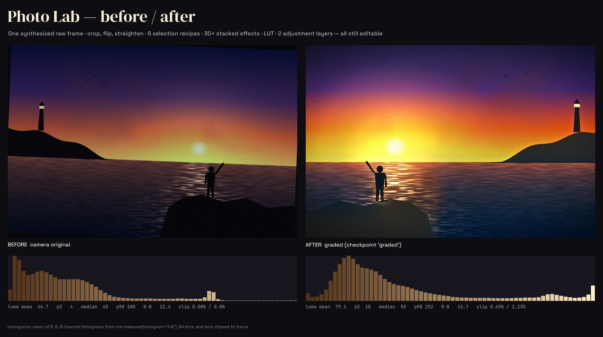
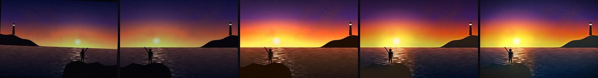
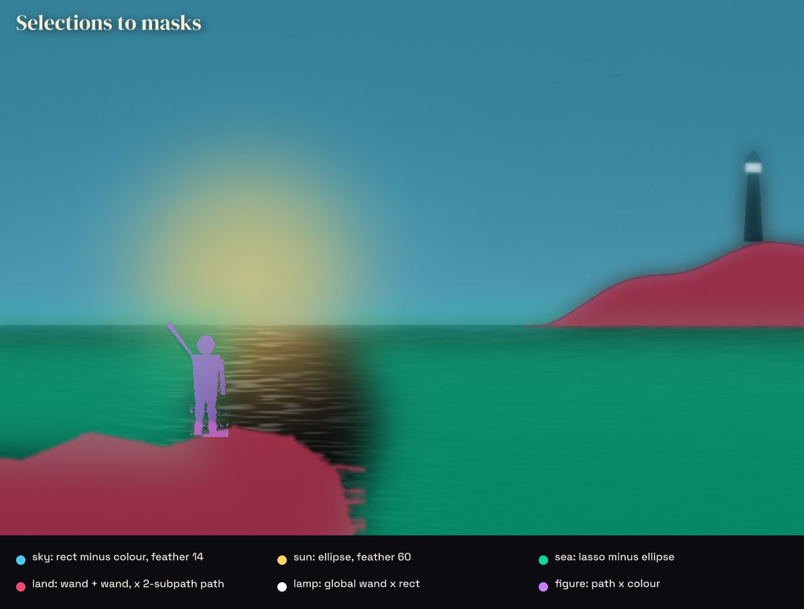
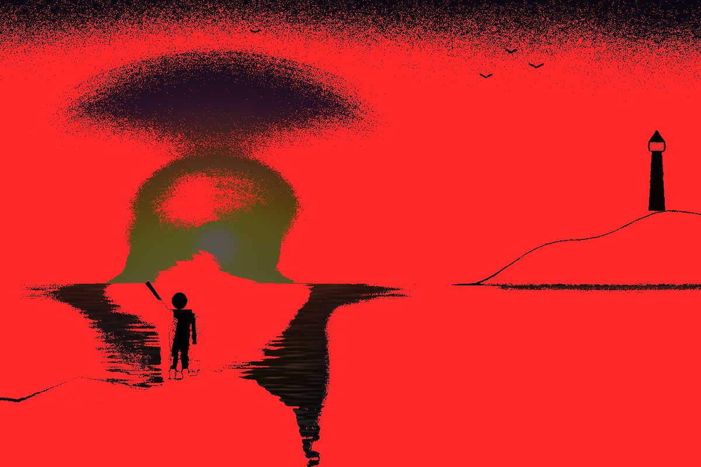
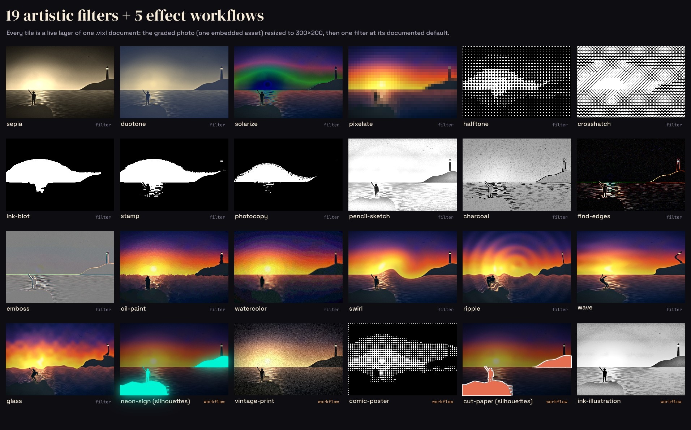
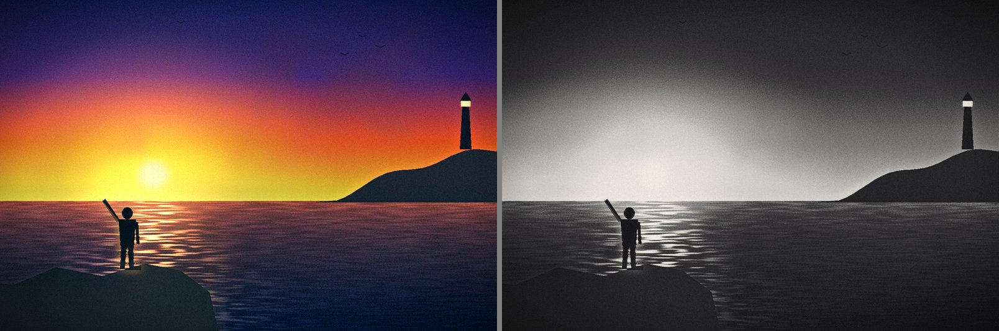
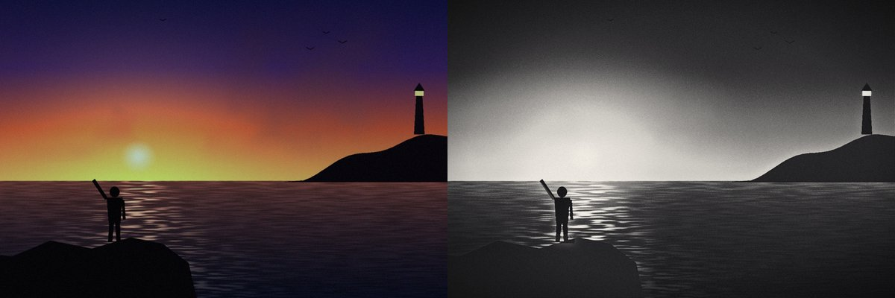
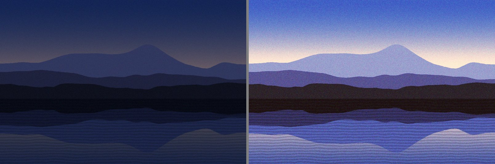

# 06 · Photo Lab — a non-destructive edit pipeline on a synthesized photograph

There are no photos in the repo and no AI provider, so `synth.py` paints a deterministic
"camera original" with numpy/Pillow: a sunset coast with lighthouse, sun-glitter sea, rocks and
a waving figure. It also bakes in real camera faults: a 2.2° tilted horizon, a dark sensor border,
underexposure, a cool/green cast and sensor noise. The frame is saved as a JPEG in `photos/` and
imported as a raster layer. `build.py` then edits it the way a photo editor would, and every step
stays editable. It crops, flips and straightens the frame. It builds six selection recipes from
every selection kind (rect, ellipse, colour, wand, lasso, path, alpha, asset, invert with
add/subtract/intersect and feather). Those selections drive scoped effects and layer masks. The
build also applies a full tonal stack, a teal-orange 17³ LUT on an adjustment layer and a
film-finish adjustment layer. It manages the effect stack, transfers a preset to a second photo,
and uses checkpoints, undo/redo, a branch and revision comparison. The last outputs are a labelled
contact sheet of all 19 artistic filters plus the 5 effect workflows, and before/after numbers
from Vixl's own `measure()`.

Run from the repo root: `python explorations/06-photo-lab/build.py` (≈2 min when it was built; about 35 s with the fixes in the [changelog](../../CHANGELOG.md)). It wipes and
recreates `output/` and sets `VIXL_RESOURCES` and `VIXL_FONT_CACHE` inside this folder.

## Before / after

History checkpoints `original → straightened → toned → local → graded`, rendered with `project.at(ref)`:

## Selections → masks

These are the six recipes the lab uses, replayed in a separate document onto hidden solid layers
(`mask from-selection`). The replayed masks are byte-identical to the ones used in the lab
(`selection_map_max_diff` = 0 in `metrics.json`).

| recipe | kinds used | drives |
| --- | --- | --- |
| sky | rect, colour (subtract), rect (intersect, feather 14) | highlights/saturation/curves; mask of the screen-blended golden-hour gradient |
| sun | ellipse, feather 60 | exposure + temperature bloom; added to the golden-hour mask |
| sea | lasso, ellipse (subtract, feather 30) | cool temperature, contrast, exposure |
| land | wand + wand (add), 2-subpath SVG path (intersect) | shadows, desaturation; union with figure → imported mask on contact sheet |
| lamp | global (non-contiguous) wand, rect (intersect) | exposure +0.8 |
| figure | path with curves, colour (intersect) | `duplicate` → `subject` layer + `mask from-selection` + outer-glow rim light |
| halo | **alpha** of the masked subject → **invert** → ellipse intersect, feather 40 | warm exposure halo behind the figure |

Each recipe runs once on the straightened frame. Later edits re-activate it with
`{"type":"select","shape":"asset","asset":"masks/…"}`.

Diff (`vixl.checks.compare(mode="diff")`, the engine behind `vixl_render_compare`) between the
`toned` and `local` checkpoints. Red means changed: only the selection-scoped edits and the
masked gradient. Untouched areas are the dark upper sky, the glitter path subtracted from the sea,
and the figure.

## 19 artistic filters + 5 effect workflows

The sheet is one `.vixl` document (`output/contact-sheet.vixl`). It holds 24 live layers that
share one embedded asset. Each layer is resized to 300×200 and gets one filter at its documented
default. The five workflows run through `workflow effect-run`. The style-based ones (`neon-sign`,
`cut-paper`) target a silhouette cut-out: a duplicate tile with `mask import` of the lab's
land ∪ figure masks, placed over a dimmed tile.

## Branch, CLI compare and preset transfer

The `mono` branch adds a grayscale/curves/duotone adjustment layer. It is compared against
`graded` with `compare()`:

`vixl -p output/lab.vixl compare straightened mono --out …` (CLI, checkpoint vs branch):

`preset-save coastal-base` (the global stack, auto-tone stored *disabled*) is applied with
`preset-apply` and overrides `{"temperature":900,"saturation":-10}` to a second synthesized photo:

## Numbers (from `vixl.measure.measure(histogram="full")`)

The full frame is compared with the raw import. Regions are compared with the `straightened`
checkpoint so the pixels line up. Luma is Rec. 709 from the mean RGB. p2, p50 and p98 are
percentiles of the mean R/G/B histogram.

| region | luma before → after | p2 / p50 / p98 before | after | R−B before → after | white clip after |
| --- | --- | --- | --- | --- | --- |
| full frame | 46.7 → 79.1 | 4 / 40 / 180 | 10 / 58 / 252 | 12.4 → 41.7 | 1.23 % |
| sky (top 300 px) | 44.0 → 62.7 | 15 / 56 / 134 | 20 / 67 / 221 | −8.3 → 13.9 | 0.09 % |
| horizon band | 115.1 → 161.5 | 3 / 104 / 190 | 28 / 144 / 255 | 76.5 → 128.2 | 5.47 % |
| sea | 27.9 → 40.1 | 10 / 31 / 64 | 0 / 46 / 91 | 0.0 → −20.9 | 0 % |
| sun 80×80 | 172.6 → 243.8 | 71 / 176 / 198 | 70 / 250 / 255 | 60.9 → 98.3 | 25.5 % |
| lake (preset transfer) | 40.3 → 110.1 | 8 / 43 / 96 | 20 / 117 / 223 | −37.1 → −52.4 | 0.01 % |

Other measured experiments, all in `output/metrics.json`:

- Disabling **auto-tone** (per-channel stretch) took the frame from R−B −4.7 to +54.6 at almost the same luma (80.8 vs 79.2). Per-channel stretching neutralizes a sunset's colour.
- Moving **auto-contrast** from slot 2 to the end of the stack dropped the mean luma from 79.9 to 67.1. Order matters. The experiment was undone with one `undo`.
- Toggling **sharpen** with `effect-disable` / `effect-enable` changed the mean absolute pixel value by 0.62.
- Disabling the golden-hour layer's **mask** raised the sea's luma by 3 levels (31.8 → 34.8).
- `compare()` reported a changed fraction of 0.97 for original→graded, 0.80 for toned→local and 0.69 for graded→mono.

Output files: `lab.vixl` (5 layers, 37 revisions, 6 checkpoints, branches `main` and `mono`),
`lake.vixl`, `selections.vixl`, `diptych.vixl` and `contact-sheet.vixl` (all editable), the
JPEG renders above, `before.jpg`, `after.jpg`, `after-mono.jpg`, `metrics.json` and
`edit-log.json` (63 logged batches, 452 operations).

## Vixl features exercised

- Raster import from a path (Python API), `resize`, `align`, `crop`, `flip`, `rotate`, `move`, `duplicate`, `reorder`, `hide`/`show`, `opacity`, `blend` (screen), `canvas` resize after masking
- `select`: rect, ellipse, color, wand (contiguous and `contiguous:false`), lasso, path (curves and two subpaths), alpha, asset, invert, none; modes replace/add/subtract/intersect; feather
- Selection-scoped effects. `mask` actions from-selection, import, disable and enable
- Tone: auto-tone, auto-contrast, levels, curves, exposure, shadows, highlights, temperature, tint, saturation, sharpen, contrast, brightness, grayscale, duotone, grain, vignette, posterize (for undo)
- `effect-set` (by `fx_` ID), `effect-disable`/`effect-enable` (by 1-based index and by ID), `effect-remove`
- `lut` (17³ generated LUT) + `lookup` on an adjustment layer. Three `adjustment` layers in total
- `preset-save` / `preset-apply` with `overrides` on a second document
- `layer-style` (outer-glow, drop-shadow), `gradient` (radial, multi-stop with alpha), `shape`, `text`
- History: `checkpoint`, `undo`/`redo`, `branch`, `checkout`, `at(ref)` renders, `vixl.checks.compare` (side-by-side and diff), CLI `vixl compare REF REF`, CLI `vixl histogram`
- `measure` (full histograms, regions), Vixl `Session` + `workflows.dispatch` (`effect-run` ×5, `resource-get`)
- All 19 artistic filters. Google Fonts via `typefaces.install_font` (DM Serif Display, Space Grotesk, JetBrains Mono)

## Findings

> **Status:** Finding 6 is fixed: characters that no font can draw are an error in every `check`, every suite and `validate`. The other findings are still open. See the Unreleased section of the [changelog](../../CHANGELOG.md).

**Rough edges and surprises (verified in this build):**

1. **No effect-reorder operation.** The schema has `effect-set/enable/disable/remove` but no way to move a stack entry. The only workaround is `effect-remove` followed by re-adding it at the end, which gives it a new `fx_` ID and cannot place it in the middle. Order changes results a lot (auto-contrast first vs last: luma 79.9 vs 67.1).
2. **`lookup` is not an effect.** `lookup` sets a single `layer["lookup"]` property that is applied after the whole effect stack (`render.py`). It does not appear in `effects` and cannot be disabled or reordered by `effect-*`. It ignores the active selection, and `preset-save` does not capture it. The docs list `lut`/`lookup` in the effects section, and the feature map groups them under "Color & filters". It works on adjustment layers, which is undocumented but useful.
3. **`temperature` and `tint` use very different scales.** `temperature` adds `value/10000` to R and B (300 → ±0.03), while `tint` adds `value/200` to R/B and subtracts `value/100` from G (10 → −0.10 green). Following the docs' examples ("temperature e.g. 300", "tint e.g. 10") turned my first grade bright magenta. A neutral grade needed temperature 500–900 and tint −1.
4. **`shadows`/`highlights` move the black and white points.** `shadows` adds `v/100·(1−x)²`, so `shadows 28` lifts pure black to about 71/255. The docs call it "% lift(+)/cut(−)", which reads like a protected-endpoint tone curve.
5. **`auto-tone` and `auto-color` stretch each channel independently**, but the docs describe all three auto effects as "(percentile stretch)". On this sunset, auto-tone turned the orange sky electric blue/magenta (R−B −4.7 vs +54.6 without it). `auto-contrast` (linked channels) was the usable one.
6. **Missing glyphs fail silently.** `∪ ∩ →` rendered as tofu boxes in Space Grotesk / DM Serif Display, and `check()` passed with 0 warnings. Its `fonts` check only flags the fallback font. Repro: install Space Grotesk 500, add `text "land ∪ sea →"`, then `p.check()` returns `passed: true`.
7. **`preset-save` stores each effect's captured `selection` mask in the preset, but `preset-apply` replaces it with the current selection.** That is sensible, but the preset JSON looks location-bound when it isn't. Presets also keep `enabled:false`, so the disabled auto-tone travelled to the lake document still disabled.
8. **Selections depend on the canvas size.** Masks are canvas-sized, and wand/colour selections sample the whole rendered canvas. Feathering at an edge differs too. Running the same recipe in a taller canvas, even with only a bottom margin added, produced different masks: max diff 123 levels, because a wand flooded into the margin. The fix was to select at the original size and grow the canvas afterwards (masks follow the layer).
9. **Python discovery is awkward.** `Session.project` is a context manager, not a property. `effect-run` returns only a `changes` summary. There is no `Project.compare`, so I imported `vixl.checks.compare` directly.
10. Not a bug, but easy to get wrong: transforms always render as crop → resize → flip → rotate, regardless of operation order. After a horizontal flip, the straightening angle changes sign (my first attempt doubled the tilt).

**Worked well:** atomic batches with precise errors (a wrong effect index named the operation and
said "starts at 1"); content-addressed selection masks that can be re-selected by asset ID;
masks that follow resized and rotated layers; layer styles that respect masks; adjustment layers;
cheap `at(ref)` renders of any checkpoint or branch; `vixl compare` across a checkpoint and a
branch in a saved file; deterministic artistic filters at sensible defaults; and one shared asset
behind 24 contact-sheet layers (sheet document ≈ 0.4 MB).
