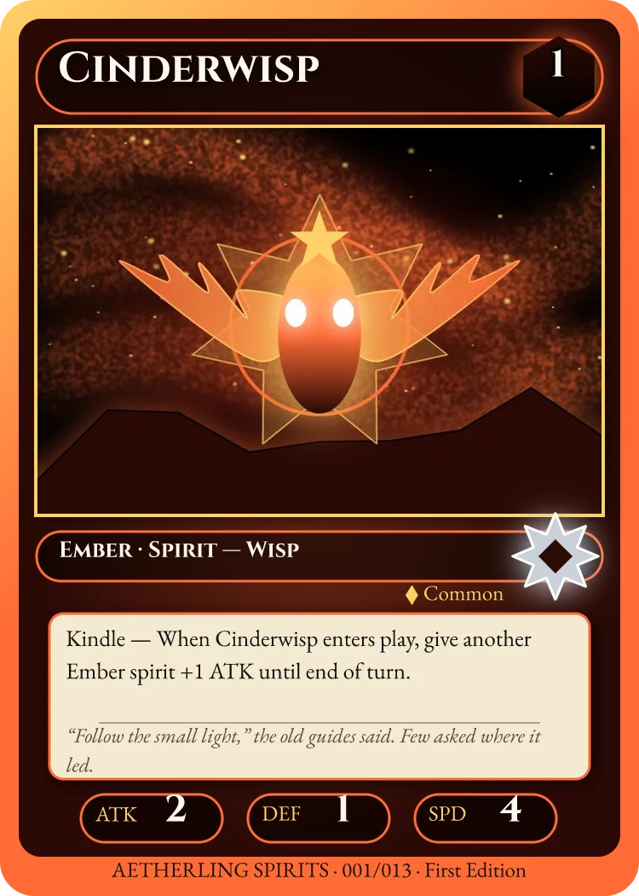
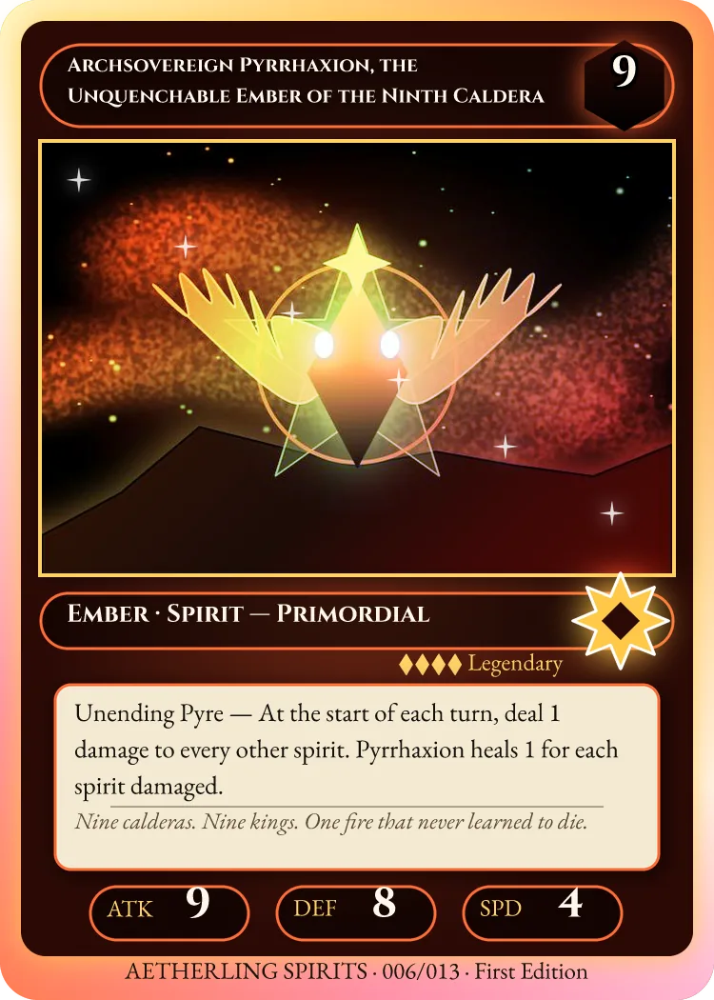
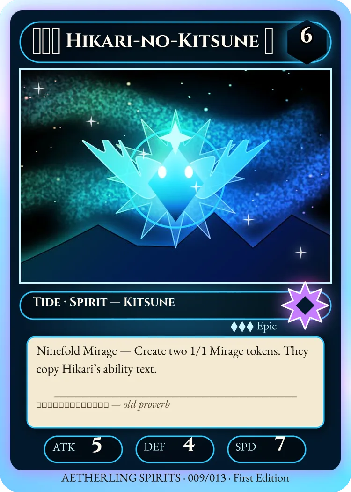
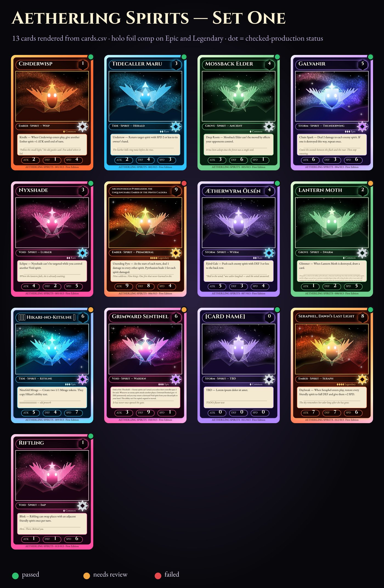
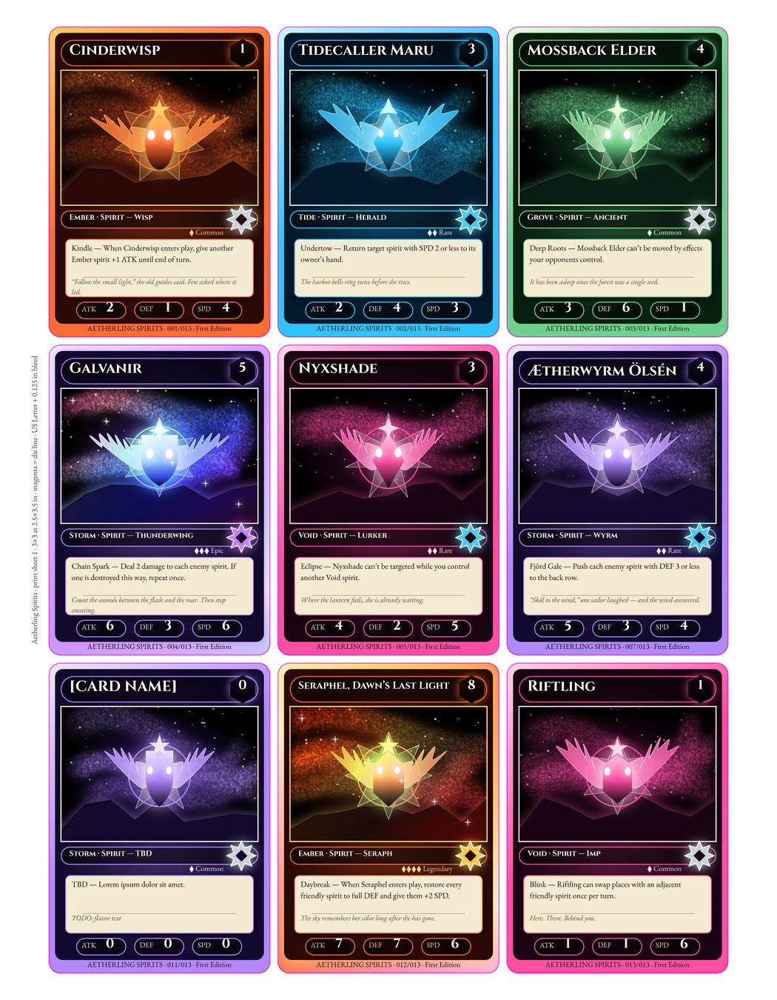
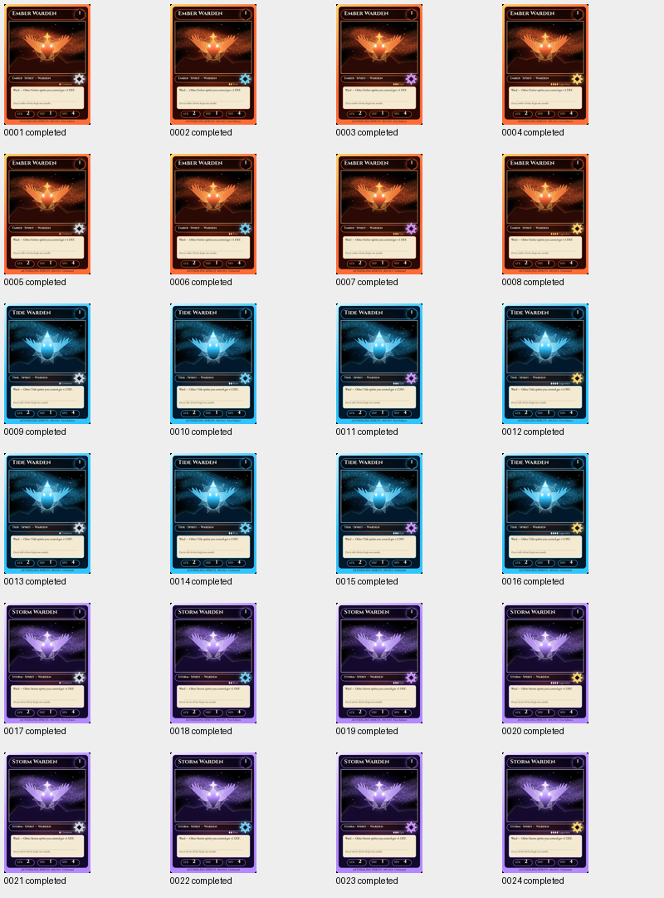

# Aetherling Spirits: a data-driven trading-card set

This project is one editable 750×1050 px card template (2.5×3.5 in at 300 dpi) for a set of fantasy "elemental spirit" cards. The data is a 13-row `cards.csv` that includes deliberately awkward rows: a 70-character name, a 380-character flavor text, Latin accents, CJK and emoji, a long rules paragraph, and a row of unfilled placeholder copy. The creature art is also painted with Vixl operations (`art.py`), so there are no external images. The build renders the set from CSV through the CLI in a standard and a holo-foil comp. It then attaches a custom check suite, captures a typed recipe, plans and runs a variation matrix (element × rarity × edition), and runs the whole CSV through a durable checked-production job with repair actions. It finishes with a QA-annotated contact sheet and a CMYK PDF print sheet: 3×3 cards on US Letter with bleed. It was first built with Vixl 0.16.0; the committed outputs are rebuilt with 0.21.0.

Run it from the repository root:

```bash
python explorations/07-trading-cards/build.py     # 0.21.0: 1 min 43 s on a shared 4-core container; 0.16.0: ~15 min idle, ~35 min under load
```

| Template (standard comp) | Holo comp, long name (row 6) | Holo comp, CJK + emoji name (row 9) |
| --- | --- | --- |
|  |  |  |

**Contact sheet.** Built with `arrange-grid`. The dot on each card is that row's checked-production status.



**Print sheet.** US Letter with 0.125 in bleed, 9 cards with magenta die lines. The image below is the RGB soft proof of `output/sheets/print-sheet-cmyk.pdf`.



**Variation matrix.** Draft quality: 3 element rows × 4 rarity artboards × 2 editions = 24 outputs. The contact sheet is Vixl's own.



## Files

- `build.py` runs the whole pipeline. `template.py` holds the card template operations, `art.py` the procedural creature art and `cards.py` the card data.
- `output/data/cards.csv` is the CSV data, with an `art` column of paths relative to the CSV.
- `output/template/aetherling-card.vixl` is the editable template: variables, styles, comps, suites and actions.
- `output/recipe/card-recipe.vixl` is the captured typed recipe with 19 inputs and 4 rarity artboards.
- `output/set/standard/*.webp` and `output/set/holo/*.webp` are the `vixl render --data` output. Holo is kept for Epic and Legendary only. `set/render-data-report.json` holds the per-row results of the built-in check.
- `output/production/matrix/` holds the matrix outputs and `production.json`. `matrix-plan.json` is the plan.
- `output/production/csv-set/` holds the checked production of all 13 rows. `csv-job-status.json` is the trace of the durable job's submit and status calls.
- `output/qa-report.json` holds per-row status, the repairs applied, failing rules, the render-data check and the placeholder lint.
- `output/sheets/` holds the contact sheet, `print-sheet.vixl`, `print-sheet-cmyk.pdf`, the soft proof and `print-check.json`. The PDF is a vector page with a TrimBox and BleedBox, embedded text and the 9 cards as images; it is 6.0 MB because 0.19.0's PDF writer stores images with Flate (2.5 MB in 0.16.0).
- The whole `output/` folder is about 13.5 MB.

## Vixl features exercised

- **Variables everywhere.** `${name}`, `${element_color}`, `${rarity_color}` and others appear in text, fills, strokes, `alpha()` colors, gradient stops and layer-style settings. An image variable (`replace-contents --variable art`) binds the art frame.
- **Swatches** for fixed colors (`@ink`, `@ink-dark`, `@parchment`). Variable-driven swatches didn't work in 0.16.0 (see Findings), so the template uses `${…}` directly; it still does.
- **Character and paragraph styles** (`style-define` / `style-apply`): `card-name`, `rules`, `flavor`, `stat`, `label`, `type-line`, plus `centered`, `right` and `body-para`. Their colors are driven by variables.
- **`text-layout` boxes with `fit: true`** for the name, type line, ability and flavor text in the CSV-rendered set.
- **Shapes:** `star` rarity badge (8 points, inner radius 0.55), hexagon cost gem (`polygon` with 6 sides), `capsule` stat pills, rounded rectangles, `line` divider, and a 4-point star sparkle with `repeat`.
- **Layer styles:** gradient-overlay, outer-glow, stroke and drop-shadow. Also `clip` (glow and foil clipped to panel and frame), `blend` overlay/screen, opacity and a radial gradient.
- **Comps:** `standard` hides the foil layers. `holo` shows a rainbow overlay, sparkles and frame sheen, and adds a rarity-colored rim glow, i.e. a layer style captured by the comp. CLI `render --data --comp holo`.
- **CSV rendering:** `vixl render --data cards.csv`, with art paths imported from the CSV and the default per-row design check.
- **Checked production:**
  - `suite-set` with `text-fit`, `property`, `gap`, `palette` (region), `assert` and `design` (contrast/bounds on chosen targets) rules.
  - `suite-use no-placeholders`, `action-define` repair actions (`fit-text`), workflow `capture` (including a refused capture), `plan` and `run` with `artboards` and `matrix`, `repair_actions` and draft quality.
  - Durable job with `workers: 2`: `submit` with `start:true` and polling `status`. `resume` was used in an earlier 0.16.0 run (see Findings).
- **Recipe artboards as variable bundles.** One artboard per rarity sets `rarity`, `rarity_color` and `rarity_pips`, so correlated values vary together in the matrix.
- **Art made with Vixl:** `paint` (watercolor and soft-round brushes), `pen` (closed, smoothed paths), `duplicate` + `flip`, `vignette`, and a radial gradient.
- **Composites:** `add` from a path, `resize`, `arrange-grid`; `Project.sized("letter", bleed=True)`, constraints on a rotated slug, the `print` / `safe_area` check, CMYK PDF export with an ink limit, and an RGB soft proof. Typography uses `install_font` with Cinzel and EB Garamond (including italic).

## QA results: which rows failed and why

From `output/qa-report.json`. Checked production uses the recipe with static text boxes. When a `text-fit` rule fails, the `fit-name` and then `fit-rules` repairs bake a fitted size.

| Row | Card | Production status | Why |
| --- | --- | --- | --- |
| 6 | Archsovereign Pyrrhaxion, the Unquenchable Ember of the Ninth Caldera | **failed** | The `fit-name` repair raised `text_overflow`: the 70-character name can't fit 520×76 px even at 22 px. |
| 8 | Lantern Moth | **needs_review** | After both repairs the 380-character flavor fits only at 14 px, below the 21 px (5 pt) `flavor-fits` minimum. |
| 10 | Grimward Sentinel | **needs_review** | The ability text fits only at 18 px, below the 23 px (5.5 pt) `ability-fits` minimum. |
| 9 | 光の狐 Hikari-no-Kitsune ✨ | **needs_review** (was a false pass) | The CJK and emoji render as tofu boxes in Cinzel and EB Garamond. In 0.16.0 no check noticed and the row completed after `fit-name`. In 0.20.0 the `missing-glyphs` rule of both suites fails, and the card is left off the print sheet (Riftling, row 13, takes its place). |
| 11 | [CARD NAME] / TBD / Lorem ipsum | completed | **False pass.** `no-placeholders` only knows layout and template blanks. Only my own regex lint in `build.py` flags it. |
| 12 | Seraphel, Dawn's Last Light | completed (after `fit-name`) | Fits at a smaller size, above the minimum. |
| others | | completed | |

The built-in per-row check of `render --data` (contrast, overlap, legibility and so on) flagged none of the fitting problems above, because the CSV render uses `fit:true` and long text is silently shrunk to fit. It reported contrast errors on the white stat digits of rows 9 and 12, which looked like a false positive but are real: each is a "7" touching the pill outline (see Findings). In 0.20.0 it also reports row 9's missing glyphs as two `fonts` errors.

## Findings

> **Status in 0.20.0:** Bugs 1–3 are fixed (0.18.0), as are silent missing glyphs and the slow design check. `build.py` changes: the durable job runs with `workers: 2` and no crash-and-resume retry, and the recipe's rarity inputs have defaults again (artboard values now beat them, and the matrix still renders each rarity in its own colours). The template still uses `${…}` rather than variable-driven swatches. The rebuild flags row 9's CJK and emoji and leaves that card off the print sheet. Finding 4 turned out not to be a false positive: the top bar of Cinzel's "7" runs along row 931, the antialiased inner edge of the pill's 3 px orange outline, so more than a tenth of its pixels are white on orange (2.59:1). The "4" touches it only at its apex. Every flagged stat in rows 9 and 12 is a 7 too. The template places the digits 3 px too high. The check was right but said "for most glyph pixels"; it now says "for a tenth of its glyph pixels" and gives the region. The 0.16.0 creature art also had a silent clip of the kind found in 02: the wing feather tips rose above their pen box and were cut flat. Vixl now rejects pen points outside an explicit box, so `art.py` sizes the box to the wing, and the rebuilt cards show the full wing tips. Otherwise the cards look the same as in 0.16.0.

### Bugs (with repro)

1. **Variable-driven swatches are accepted but unusable.** `{"type":"swatch","name":"s","color":"${c}"}` succeeds. After that, every use fails with `Invalid color '${c}'`: a shape `fill:"@s"`, text `color:"@s"`, or a `style-define` color `"@s"`. Defining the swatch literally, using it, then redefining it to `${c}` fails too, because state validation resolves swatches without variables. Using `${c}` directly in those same fields works. So "swatches driven by variables" can't be built, and this template uses `${…}` everywhere instead.
   ```python
   p = Project(100, 100); p.apply([{"type":"variable","name":"c","value":"#f00"},{"type":"swatch","name":"s","color":"${c}"}])
   p.apply({"type":"shape","shape":"rectangle","width":10,"height":10,"fill":"@s"})   # VixlError invalid color '${c}'
   ```
2. **Race in checked production with `workers: 2` in a fresh process.** `text.face()` is an `lru_cache` that shares one fontTools `TTFont` across threads, and it loads tables lazily. The first two variants race, and one fails with `fontTools.ttLib.TTLibError: illegal use of getGlyphOrder()`, or another error. `production.json` records only `{"error": "AttributeError"}` (or `"TTLibError"`), with no message. It happened on every durable-job run (the worker is always a fresh process). `resume` didn't help, because checks run again before outputs are reused, so the race hits the next pair. Repro: in a new interpreter, run two `render_variant(...)` calls on a recipe with a `text-fit` rule in a `ThreadPoolExecutor(2)`. It failed on the first of three attempts. The 0.16.0 build used `workers: 1` for the job; the 0.20.0 build uses 2. The in-process matrix run with `workers: 2` was fine because fonts were already warm.
3. **Recipe input defaults override artboard variables.** `instantiate()` writes every input default into the variables after `artboard_project()` has applied the board's variables. So a `color` input with a `default` wins over the board value, contrary to the documented "explicit row values override artboard defaults". The 0.16.0 workaround was to declare the rarity inputs `"required": false` with no default; the 0.20.0 build gives them defaults again.
   ```python
   # artboard "blue" sets c=#0000ff; input {"type":"color","default":"#ff0000"} renders red, {"type":"color","required":False} renders blue
   ```
4. **Likely contrast false positive on a single digit.** On this card, `check(checks=["contrast"], targets=["spd-value"], variables={"spd": "7"})` reports 2.59:1. `"4"` and `"17"` pass. The glyph is white Cinzel at 44 px on a near-black pill. This is reproducible with `output/template/aetherling-card.vixl`.

### Surprising behaviour and rough edges

- **Missing glyphs were silent (fixed).** CJK and emoji render as `.notdef` boxes (rows 9 and 7's quotes are fine; row 9's name and flavor are not). There is no font fallback and no check (design, `print`, suite) reports it.
- **No suite can catch placeholder copy in a variable template.** `no-placeholders` uses the `blanks` registry, which only layouts, templates and containers populate. A `${name}` that resolves to "[CARD NAME]" or "TBD" passes. The `assert` language only supports `exists` and `bounds within canvas`, and `property` has no "not equal" or regex, so there is no in-suite workaround.
- **`text-fit` refuses `text-layout fit:true` layers** ("Use fit-text to bake measurable fitting"). That's reasonable, but it means a template that works well for `render --data` (render-time fit) isn't checkable as-is. I had to keep two flavors: fit:true for CSV, and static boxes plus `fit-text` repairs for the recipe. Also, `fit-text` detaches the shared character style (documented).
- **A `property` rule on `font` compares the resolved embedded asset path** (`fonts/<sha>.ttf`), not the registered name (`cinzel-700`) or the role (`heading`). The expected value has to be looked up from `state["fonts"]`.
- **`capture` errors are terse.** "Recipe example failed suite card-qa" doesn't name the rule. The report is only attached to the exception details.
- **Every CLI command holds the project's write lock, even read-only `render --data`.** A second concurrent `render --data` on the same `.vixl` failed after 10 s with `io_error: The file lock … could not be acquired`. The build renders the holo set from a copy.
- **`Project.save()` silently drops embedded assets that nothing references.** This matters for an art pool added with `add_encoded` that only CSV rows or recipe inputs will use. I kept them alive with dummy `pool_*` variables.
- **The design check was slow (fixed).** `contrast` measures each text layer by re-rendering. On this 13-text-layer card one `check()` took about 110 s under heavy machine load and about 55 s idle. `render --data` runs it per row by default: 13 rows took about 12 to 29 minutes. `--no-check` brings rendering down to about 3 s per card. Suites can scope it with `options.targets`.
- **`text-layout` has no vertical alignment.** Text is top-aligned in its box, so a shrunk name hugs the top of the name bar.
- **Matrix values are scalars.** Correlated variables can't vary together (element name with its three colors). Rows and artboards-with-variables work around it nicely.
- **Production's built-in `contact-sheet.png` uses 190×145 landscape cells,** so portrait cards come out small.

### Things that worked well

- **Comps capturing layer styles** made a clean foil/standard switch. The holo comp adds a rim glow, and `render --comp` stays read-only.
- **Variables in layer-style settings, gradient stops and `alpha(${var}, 0.5)`** all resolve per row.
- **CSV art paths relative to the CSV** were imported automatically. Quoted commas, curly quotes and newlines in the CSV round-tripped fine.
- **Checked production is genuinely useful.**
  - `fit-text` repairs rescued two rows.
  - The rest were classified honestly as failed (`text_overflow`) or needs_review (fits, but below minimum). Nothing was silently shipped.
  - The suite hash is recorded, and a capture with a non-passing example is refused.
- **Artboards with `variables` gave a clean rarity axis.** The draft-quality matrix of 24 variants rendered in about 90 s with 2 workers.
- **`submit` / `status`** with a hidden worker process and progress counts worked as documented. `resume` re-queued correctly, and unchanged variants were reported as `reused`.
- **`Project.sized("letter", bleed=True)`** gave trim and safe guides. The print check caught a slug outside the live area and type below 6 pt, both fixed here. CMYK PDF export with an ink limit worked.
