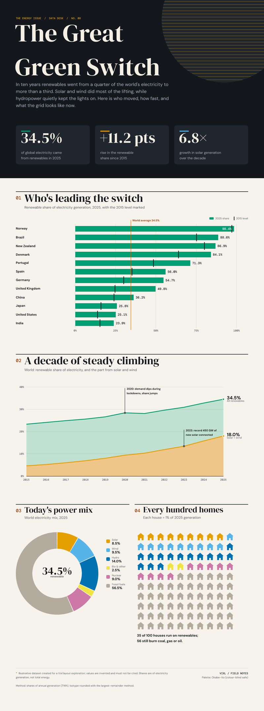
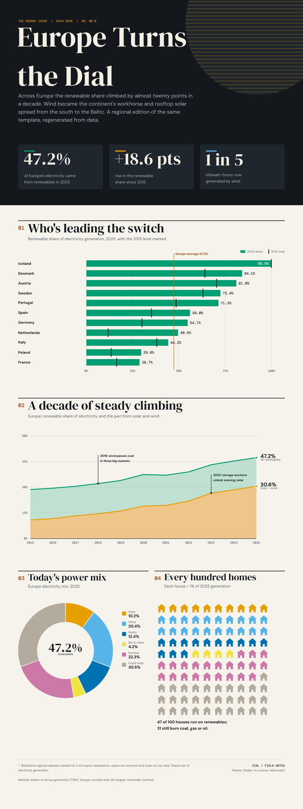
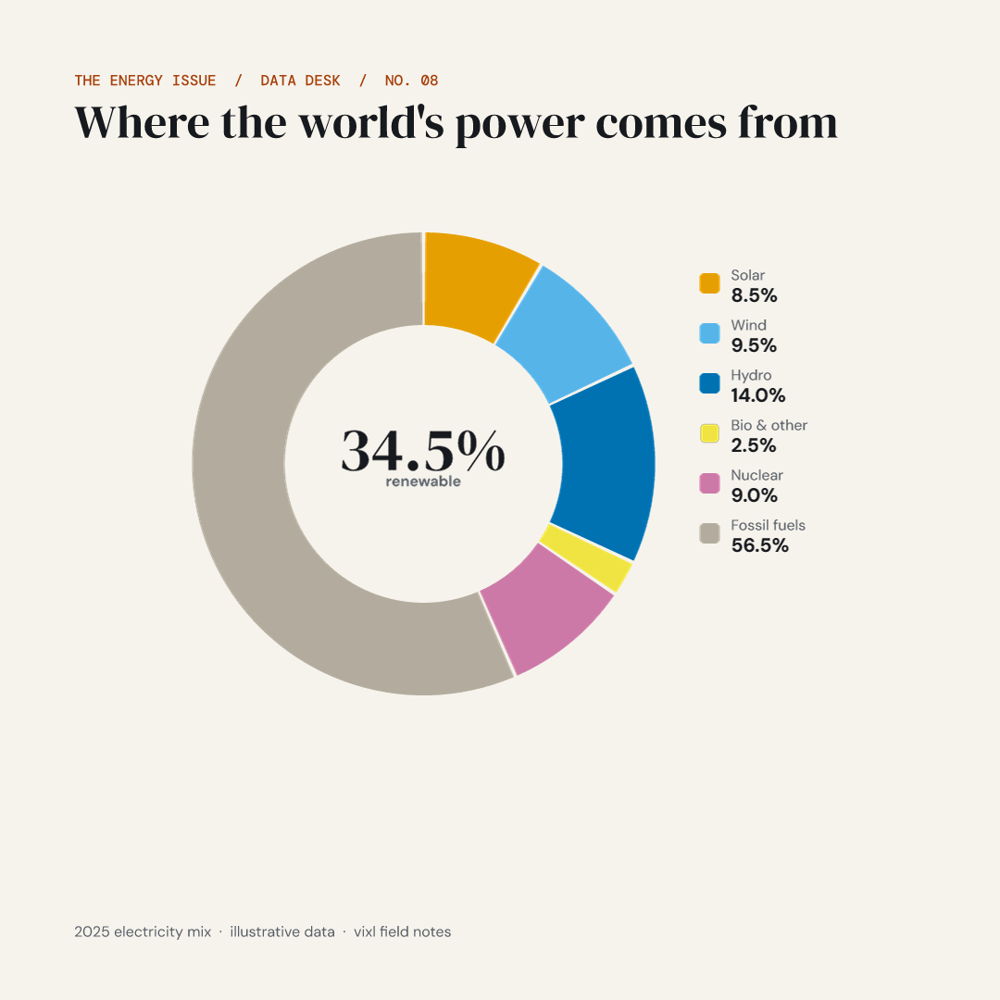
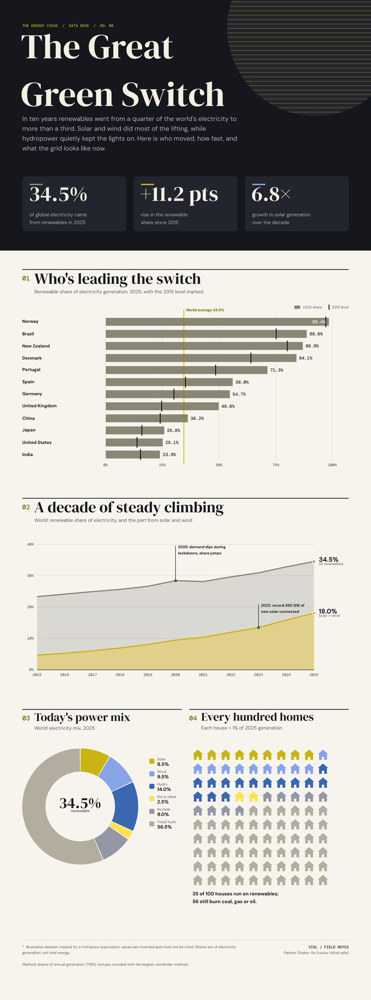

# 08 · Data-driven infographic: "The Great Green Switch"

A tall (1600 × ~4300 px) magazine-style infographic poster that `build.py` generates entirely from
Python data structures: a header with three KPI cards, a horizontal bar chart (2025 share with
2015 markers and a reference line), an area/line chart drawn with `shape: path` and the `pen`,
a donut built from annular-sector paths, a 10 × 10 isotype "hundred homes" chart made of
repeated house paths, annotations with leader lines, a legend, and a footnote. The same code
regenerates a second edition from a different dataset, renders a variables-only title variant,
and exports a 1080 × 1080 social crop of the donut through an artboard + comp. It then runs a
QA pass (spacing assertions, validate rules, `check` including `color_vision`, a deuteranopia
render and a custom chart-colour separation test) and exports PNG, SVG (appearance and strict),
HTML and PDF (RGB and CMYK). It was first built with Vixl 0.16.0; the committed outputs are rebuilt
with 0.20.0.

> **The data is illustrative.** "Renewable share of electricity by country/region, 2015–2025"
> numbers were invented to look plausible for a layout exploration. Do not cite them.

Run from the repository root (needs network once for Google Fonts; 1 min 2 s with 0.20.0 on a
shared 4-core container, now checking contrast on every text layer; ~8 min with 0.16.0, mostly the contrast check
on 12 text layers):

```bash
python explorations/08-infographic/build.py           # everything
python explorations/08-infographic/build.py --draft   # world PNG only, ~25 s, for layout iteration
```

## Output

| World edition | Europe edition (regenerated from a second dataset) |
| --- | --- |
|  |  |

| Social crop (artboard + comp) | Deuteranopia simulation | Variables-only re-render |
| --- | --- | --- |
|  |  |  |

Files in `output/`: `infographic-{world,europe}.vixl` (editable), `infographic-{world,europe}.png`
(full size) plus `-preview.png` (½ scale), `infographic-world-deuteranopia.png`,
`infographic-world-variant-title.png`, `social-donut-1080.png`, `social-donut-europe-1080.png`,
`infographic-world.svg` (appearance policy) and `infographic-world-strict.svg` (strict policy): both
are all vector (1,515 paths, no images) and identical, because repeats stay vectors since 0.17.0. Also
`infographic-world.html`, `infographic-world.pdf` and `infographic-world-cmyk.pdf` (vector pages with
embedded fonts, about 53 KB each, instead of 0.16.0's single-image pages) and `qa-report.json`. The CLI
rules are now passed inline, so `qa-rules.json` is gone.

## Vixl features exercised

- `Project` Python API, atomic batches, `checkpoint`, `save`, `export(...)` with `scale`, `variables`, `artboard`, `comp`, `simulate`, `svg_policy`, `color_space="cmyk"`, `ink_limit`.
- Typography: `pair_fonts("dm-serif-dm-sans")` (heading/body roles), `install_font` for DM Sans 700 and DM Mono 500, `font: "heading"|"body"|registered name`.
- `type-scale` (perfect-fourth from 21 px) + custom `style-define` character/paragraph styles, `style-apply` on every text layer.
- Colour: `palette-define` + `palette-apply roles:false` with the Okabe–Ito palette, role swatches (`@background`, `@ink`, `@muted`, `@accent-text`, `@on-accent` …) and semantic data swatches (`@solar` → `@oi-1` …), colour expressions `alpha()` and `mix()`.
- Layout: 12-column `grid` guides, named `guide`s per section, `constrain` to guides (`guide:g-x1-start.left`, `guide:sec-a.top+170`), to other layers (`title.bottom+40`, `kpi0-card.bottom-30`) and to canvas offsets; `distribute` with `gap` (KPI cards, legend rows); nested `group`s; `resize` with **percentage widths of the parent group** (each bar is `"{share}%"` of the plot group, so the data *is* the geometry); `canvas` resize at the end to trim to content (constraints reflow).
- Shapes: `rectangle`, `rounded-rectangle`, `ellipse`, `shape: path` with `A` arc commands (donut sectors, isotype houses, area fills), `pen` with straight segments (lines, leader lines, reference line), `repeat` (gridlines, decorative rays, isotype runs), `clip` (rays clipped to the sun).
- `text-layout` boxes for the deck and footnotes; `variable`s (`${title}`, `${eyebrow}`) for render-time variants.
- `comp-save`/`comp-apply` + `artboard` with `targets` for the 1080 × 1080 social crop; `unconstrain` to re-anchor.
- QA: `measure_spacing` (expected gaps, equal gaps, artboard+comp), `validate` rules, `check` (bounds, overlap, safe_area, legibility with `thumbnail_width`, contrast on every text layer, `color_vision`, artboard+comp), `simulate="deuteranopia"`, CLI `vixl validate --rules` and `vixl spacing --check`, plus a custom series-separation test using `vixl.colors.simulate_vision`.

## QA results (from `qa-report.json`)

- Spacing: KPI cards 32/32 px, 12 bar gaps all exactly 18 px, legend rows 18 px, social eyebrow→title 18 px — all pass (tolerance 0–1).
- `check` (without contrast): 0 errors; 2 warnings (a 5 px touch between the first 2015 marker and its value label, and the full-bleed header band outside the safe area), plus the sun and rays reported as intentional crops. `color_vision` passes (text only, see findings). The social artboard passes clean.
- Contrast, now on all 94 text layers of each edition, finds one real error: the white "98.6%" value label inside the first (green, `#009E73`) bar is 3.42:1, below 4.5:1. 0.16.0 checked only 12 layers and missed it. The design is unchanged. Eight axis labels (`a-ax2`, `a-ax4`, six `b-x*`) can't be measured in 0.20.0 (`Could not measure 'b-x0': boolean index did not match ...`): they sit on half-pixel positions, which the contrast measurement mishandles (see the explorations README).
- `validate`: all custom rules pass, and both datasets report `valid: true`: the sun and rays are marked as decoration, so their bleed is graded as info. The CLI run of `vixl validate --rules` also passes; the build now reads its `valid` field instead of looking for any `"passed": false`.
- Chart-colour separation (min RGB distance between donut swatches): normal 57.5 (nuclear/fossil), deuteranopia 37.3 (nuclear/fossil), protanopia 51.5, tritanopia 42.2. Nuclear vs fossil is the weakest pair under deuteranopia — visible in the simulation; direct labels and the legend values carry the meaning.

## Findings

> **Status in 0.20.0:** Bugs 1 and 2 and findings 3, 4, 5, 8, 9 and 11 are fixed (0.18.0), and finding 7 since 0.17.0. `build.py` changes: the pen lines no longer get 8 px of padding (without `width`/`height` the box fits the points and stroke), contrast is checked on every text layer, the strict SVG is exported straight from the poster (the repeat-expanded rebuild only runs if strict export fails, and it no longer does), and the CLI rules are passed inline instead of through `qa-rules.json`. The social crop still uses the comp that re-anchors the donut group: artboard `x`/`y` now work, but the comp also shows the social-only title and footer. A pen given an explicit box still clips its stroke at that box. Findings 6, 10 and 12–14 are as recorded below. The rebuilt poster, social crop and variants look the same as the 0.16.0 outputs.

**Bugs**

1. **`artboard` silently drops `x`/`y`.** The schema and docs list `x`, `y` on `artboard`, but `design.py` only stores width/height/background/variables/targets, so a board can't crop a region:
   ```python
   p = Project(400, 400, "white")
   p.apply([{"type":"shape","shape":"rectangle","name":"a","width":100,"height":100,"x":300,"y":300,"fill":"red"},
            {"type":"artboard","name":"crop","width":100,"height":100,"x":300,"y":300}])
   p.state["artboards"]            # {'crop': {'width':100,'height':100,...}}  -- no x/y
   p.render(artboard="crop").getpixel((50, 50))   # white, not red
   ```
   No error or `normalized` note. I worked around it with a comp that re-anchors the donut group to the board centre, which the build still uses.
2. **`text.NAME.font-size` assertions ignore linked character styles.** After `style-apply` of a 150 px style, `layer["size"]` is still 48, so `validate --rules 'text.title.font-size >= 120'` fails even though the title renders at 150 px (`font_size_style_mismatch` in the report). Same for validate's built-in "font size >= 24" warnings.

**Rough edges / surprises**

3. **`check` contrast was very slow on a large poster (fixed):** ~12–15 s per text layer at 1600 × 4300 (each `measure(target=...)` re-renders; a plain `render()` takes ~9 s here). Checking all ~90 text layers would take ~20 min, so the 0.16.0 build checked 12 representative ones via `targets` (141 s). The other checks together took ~6 s. In 0.20.0 all 94 take about 13 s.
4. **`validate` adds a "bounds within canvas" rule for every layer**, with no way to exempt intentional bleed. The decorative sun/rays make `validate` (and CLI `vixl validate`, exit 1) fail, though `check` correctly treats the same thing as a warning.
5. **`vixl validate --rules` wants a JSON file path**, but `--help` shows only `--rules RULES`; passing an assertion string gives `ERROR: [Errno 2] No such file or directory: 'layer.kpis.bounds within canvas'`.
6. **`color_vision` only checks text against its background.** It can't see that two chart fills collapse together (nuclear vs fossil under deuteranopia), so I measured that myself.
7. **`repeat` always rasterized in SVG (fixed in 0.17.0).** The default SVG embeds 16 PNG fallbacks (gridlines, rays, every isotype run); `svg_policy="strict"` fails with `svg_raster_required` and lists them clearly (good). Expanding repeats into plain shapes (198 → 330 layers) made strict export pass. Since 0.17.0 repeats of vector shapes stay vectors and strict export passes directly.
8. **"Constraints must reference sibling layers" doesn't name the layers.** Grouping a layer that other top-level text is constrained to fails the whole batch with only that message, so you have to bisect.
9. **`constrain` merges into existing constraints**, so moving a group from `left` to `center-x` fails with "Use one constraint per axis" until you `unconstrain`. Reasonable, but the error doesn't name the conflicting key.
10. **Line `spacing` can't be negative** (minimum 0), so display headlines can't get tighter-than-default leading; the two-line DM Serif title looks a bit loose.
11. **`pen` strokes are clipped at the layer box.** A stroke through a point on the box edge loses half its width (seen in a prototype), so the build pads every pen layer by the stroke width.
12. Text with no `color` renders **white**, and the type-scale styles carry no colour, so text that isn't explicitly coloured disappears on a light background.
13. Legibility defaults to a 320 px thumbnail, which gives 85 warnings on a tall poster. Passing `thumbnail_width=1080` makes it meaningful.
14. `resize` with only `width` keeps the aspect ratio, so percentage-width bars must also pass `height`.

**Worked well**

- **Percentage sizes inside groups** are a natural fit for charts: an invisible plot frame defines 100 % and every bar is `resize width:"71.3%"`. Spacing measurement then confirmed exact 18 px rhythm.
- **SVG path arcs** (`A` with large-arc flags) made exact donut sectors. Paths, pen lines and outlined text all exported as vectors.
- **Grid guides + named guides + constraints** kept the build readable and let the second dataset reflow (different row counts, different y-axis max, different canvas height) without touching layout code.
- **Comp + artboard** reused the live donut group for the social crop with no duplicated layers, and `check`/`measure_spacing` accept `artboard` + `comp` too.
- Font pairing and installs were quick and cached. Okabe–Ito through `palette-define` plus role and semantic swatches made recolouring a one-line change. Atomic batches meant failed experiments never left half-built documents.
