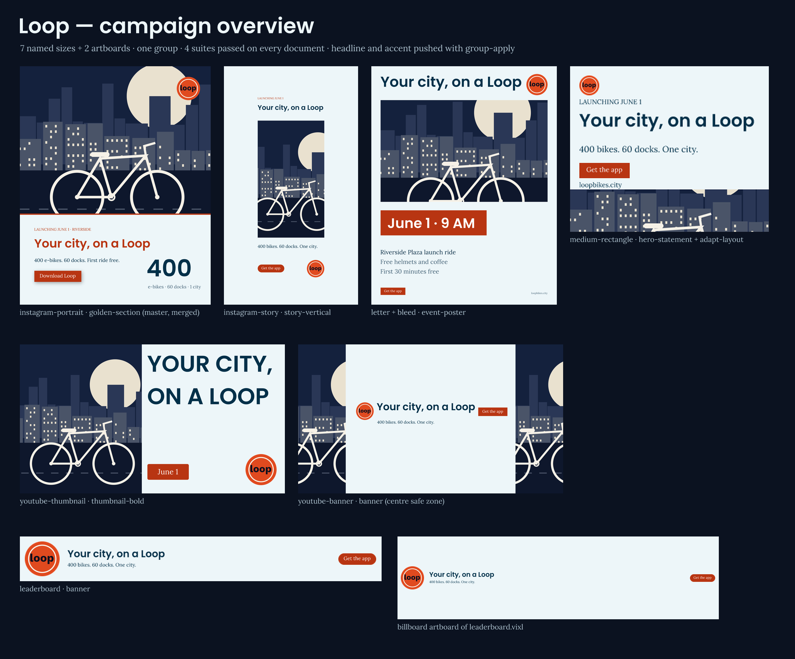
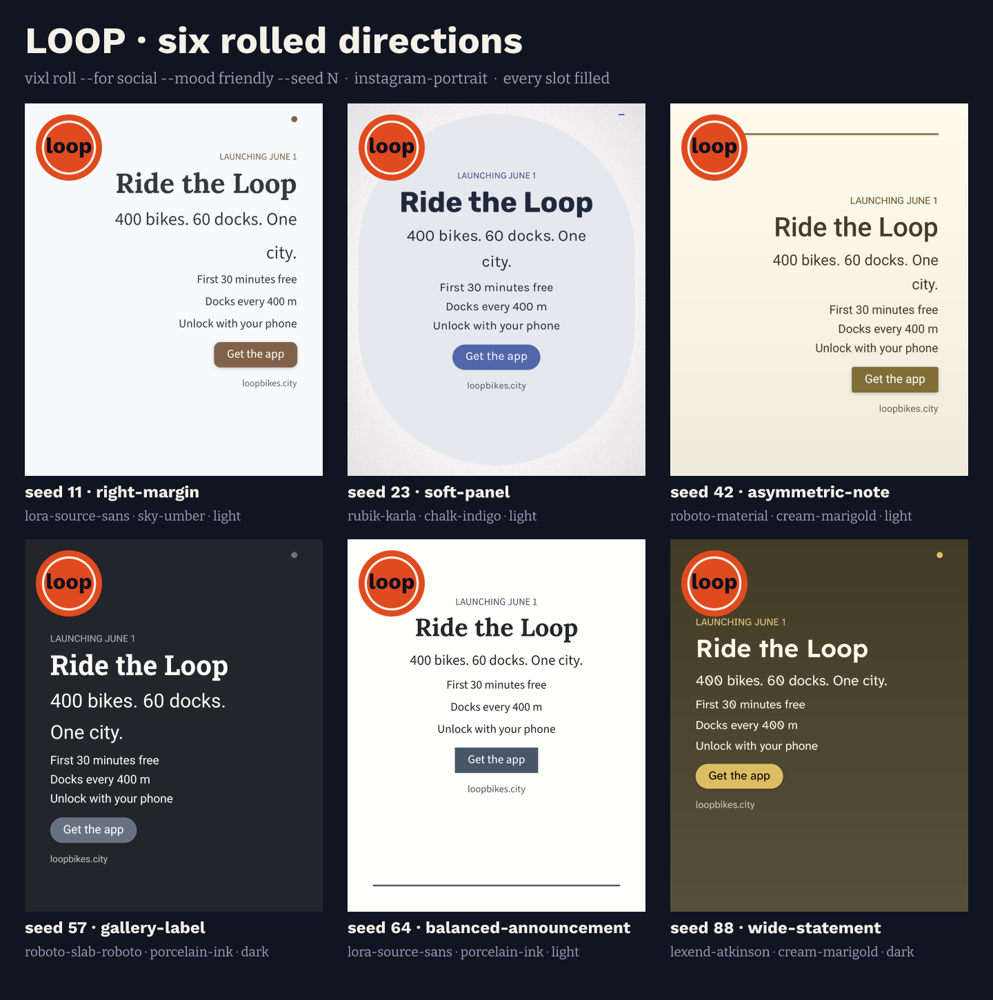
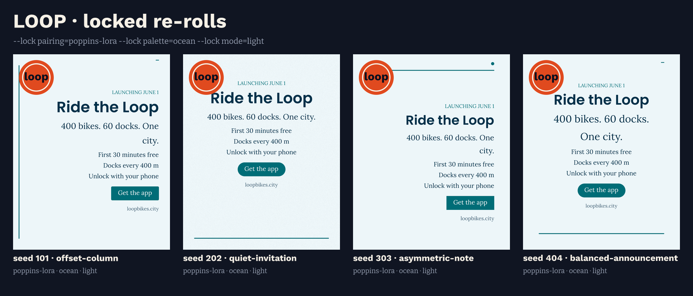
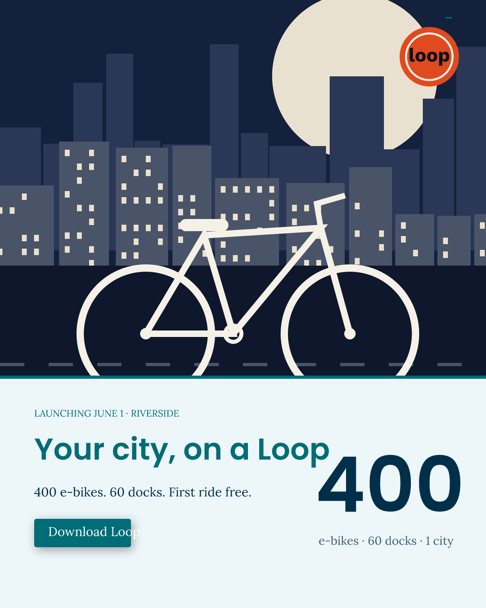
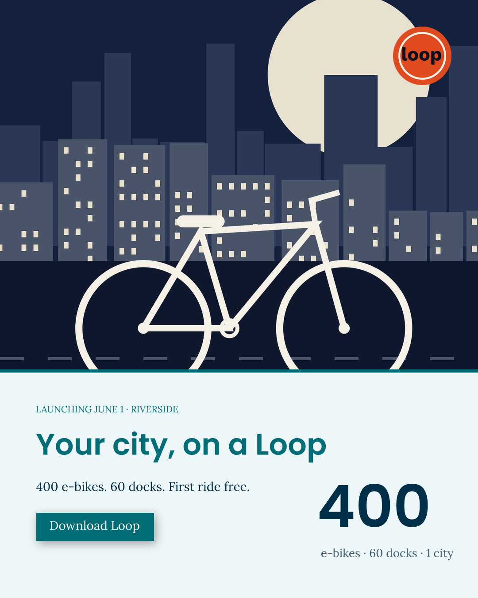
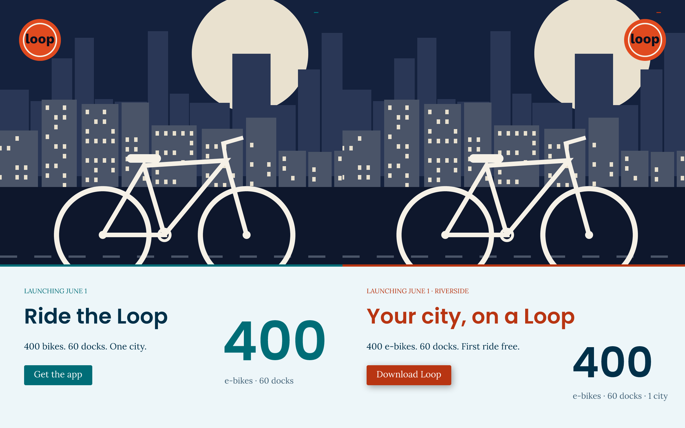
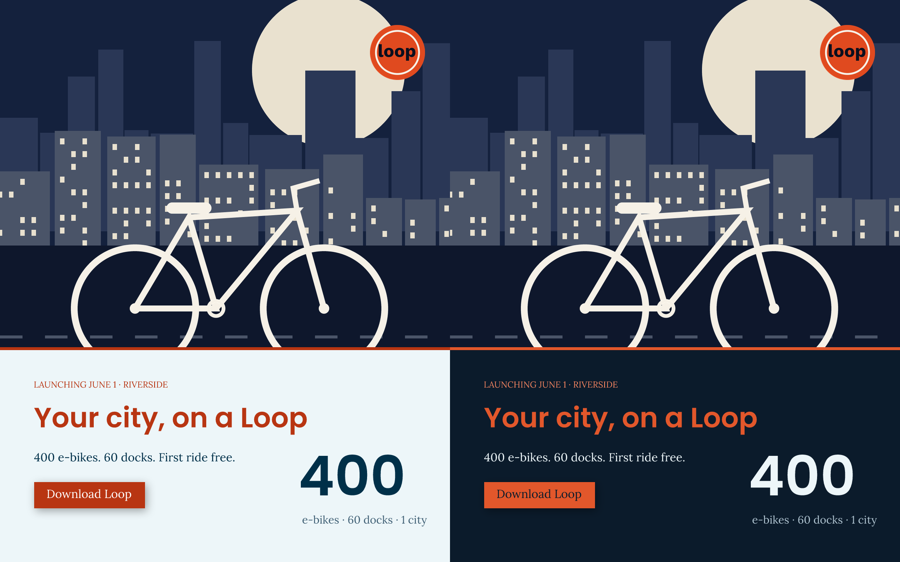

# 09 — Loop: a multi-format campaign built by collaborating agents

A simulated studio team launches **Loop**, a city bike-share ("400 e-bikes, 60 docks, June 1").
An *illustration agent* draws the hero art and logo badge with Vixl shapes and pen paths. An *art
director* writes a workspace `brand.json`, uses `vixl roll` to roll six directions onto a
contact sheet, picks one, and re-rolls compositions with `--lock`. The resulting palette and
pairing become brand v1. A *layout agent* then applies principled layouts to seven named sizes,
filling every slot: Instagram portrait and story, YouTube thumbnail and banner, a leaderboard ad,
a medium rectangle, and a US-letter flyer with bleed. It also refines them, adds two artboards and
uses `adapt-layout`. A *copy agent* and a *design agent* each work on their own fork of the master
and make deliberately conflicting edits. The art director previews each merge, resolves the
conflicts with explicit `resolutions`, and merges with `expected_head`; one attempt is rejected
as stale on purpose. Review notes drive a repair. A *producer* attaches four custom suites to
every document, defines the campaign as a project group, and pushes a shared headline and accent
swatch with `group-apply`. The suites gate that publication: three attempts are blocked before one
publishes. The run finishes with checkpoints, undo/redo, an in-document "night edition" branch,
revision compares, the final exports and an overview sheet.

```bash
python explorations/09-collab-campaign/build.py   # from the repo root, ~3 min when built (~1.5 min with the changelog fixes), rewrites output/
```

## Results



**Art direction.** Here are six rolls (`vixl roll --for social --mood friendly --seed N`, every slot filled).
After that come four re-rolls with `--lock pairing=poppins-lora --lock palette=ocean --lock mode=light`.
The team chose seed 101 (golden-section).




**Collaboration.** This is the master straight after both branch merges. The merges were clean,
but the result is visually wrong: the longer headline runs into the `400` stat and "Download Loop"
spills out of its button. Review notes and a repair pass fixed both.

| merged (before review) | repaired |
| --- | --- |
|  |  |

**History.** `vixl compare layout-approved group-published` (left) and
`vixl compare group-published night-v1` (the night-edition branch):




The final per-size exports are in `output/final/`. The flyer is exported at half scale; the
`.vixl` source is a full 2626×3376 at 300 dpi with a 38 px bleed. The editable documents, forks,
branch bases, group definition and review notes are in `output/workspace/`. Every JSON result
the agents acted on is in `output/reports/`.

## The conflicts and how they were resolved

Here **ours = the master** and **theirs = the agent branch**. Layer IDs change from run to run.

**copy-agent.** The copy agent rewrote the kicker. In the meantime the art director edited the
same kicker on the master, which produced a three-way conflict:

```json
{"path": "/layers/lyr_…/text", "base": "LAUNCHING JUNE 1",
 "ours": "LAUNCHING SATURDAY JUNE 1", "theirs": "LAUNCHING JUNE 1 · RIVERSIDE",
 "deleted": {"base": false, "ours": false, "theirs": false}}
```

Resolved as `{"/layers/lyr_…/text": "theirs"}` (the copywriter owns words). The preview was run
again, then merged with `dry_run:false, expected_head: <source_head from the preview>`. The other
three copy edits (headline, body, CTA) merged automatically.

**design-agent.** The design agent uppercased the headline, recoloured it, moved the logo, added
a CTA shadow and uppercased the CTA. Previewed after the copy merge, this produced three conflicts:

```json
[{"path": "/layers/lyr_A/text",  "base": "Ride the Loop", "ours": "Your city, on a Loop", "theirs": "RIDE THE LOOP"},
 {"path": "/layers/lyr_B/text",  "base": "Get the app",   "ours": "Download Loop",        "theirs": "GET THE APP"},
 {"path": "/layers/lyr_B/width", "base": 152,             "ours": 204,                    "theirs": 179}]
```

Resolution: words, and the derived width that belongs with them, stay with the master (`ours`).
Everything else from the design agent merged automatically: headline colour `@accent`, stat colour,
logo position and the drop shadow. Between the preview and the merge, the master was edited
again. The merge carrying the stale `expected_head` was rejected with
`{"error": "stale_revision", "message": "Source changed since merge review"}`. The art director
previewed again and merged against the new head. Full records are in
`output/reports/merges.json`.

## Suites gating `group-apply`

The custom suites are workspace resources plus one per-document suite. All of them are attached
to every size:

- `loop-accessible`: contrast at the brand's 4.5 floor, and colour-vision.
- `loop-delivery`: bounds, blanks, fonts and brand checks; `layer.logo.bounds within canvas`; a
  logo/headline overlap check; and `alpha maximum 0`.
- `loop-legible` (per document): legibility at that format's viewing width, `text-fit` on the
  headline and on every boxed text, and, on the YouTube banner, the 1546×423 mobile-safe zone
  expressed as `avoid` rectangles.
- the built-in `no-placeholders`.

`group-apply` ran with `suites` and an `operations: [{"type":"action-apply","name":"fit-headline"}]`
step. Each document defines its own `fit-headline` action.

| attempt | shared values | outcome |
| --- | --- | --- |
| pale accent | headline "Your city, on a Loop", accent `#7FC8D0` | blocked by `flyer.vixl`: contrast 1.90:1 on date/CTA, brand palette, logo/headline overlap |
| long headline | 7-word headline, accent `#B83512` | blocked: `fit-headline` raised `text_overflow` ("Text cannot fit at the minimum size") |
| final (after brand v2) | headline "Your city, on a Loop", accent `#B83512` | blocked by `flyer.vixl`: headline now runs under the logo (overlap rule) |
| final, flyer refit | same values, flyer's action box narrowed to stop before the logo | **published to all 7 documents**; all 4 suites pass on all of them |

No documents were written by any blocked attempt.

## Vixl features exercised

- Workspace `brand.json` (v0 policy only → v1 roles + pairing → v2 accent change), an embedded
  logo, `minimum_contrast`, `required_elements`, and `brand` check warnings
- `vixl roll` (preview and `--apply --set`, `--lock pairing/palette/mode/layout`) with six seeds,
  plus locked re-rolls
- Named sizes: `instagram-portrait`, `instagram-story`, `youtube-thumbnail`, `youtube-banner`,
  `leaderboard`, `medium-rectangle`, `letter --bleed`, and the `billboard` artboard preset
- `layout-apply` (golden-section, story-vertical, thumbnail-bold, banner ×2, hero-statement,
  event-poster) with every slot filled, `unused_slot` handling, and image slots fed from an
  embedded asset
- `frame` + `fit`, `fit-text`, `adapt-layout` (including its refusal), `group`, `constrain` with
  layer anchors, and `artboard` with a `background`
- Workflow `branch-fork` / `branch-merge` (preview, `resolutions`, `expected_head`) / `branch-list`
- Workflow `resource-list` / `resource-save` / `suite-use`, `suite-set`, `check` with suites,
  `action-define` / `action-apply`, `variable`, and `swatch`
- Workflow `group-define` / `group-apply` (with `suites` and `operations`) / `group-show`
- History: `checkpoint`, `undo` / `redo`, an in-document `branch` and `checkout`, `vixl compare`,
  and `Session.history`
- Review notes: `vixl notes add|list|resolve`
- `vixl check` (default, `--artboard`, `--checks print safe_area`), and `vixl render` / `export`
  (`--scale`, `--artboard`)
- Composite contact sheets and the overview sheet built as Vixl documents (`frame`, `font pair`)

## Findings

> **Status:** Bug 1 (`text-fit` always failing on auto-sized text) is fixed. Bugs 2 and 3 are still open. See the Unreleased section of the [changelog](../../CHANGELOG.md).

### Bugs

1. **`text-fit` always fails on auto-sized text.** Any plain `text` layer without a `text_layout`
   box reports `fits: false`, even when it obviously fits. Repro:
   ```python
   p = Project(400, 200, "white")
   p.apply([{"type":"text","name":"t","text":"Hello","size":40,"color":"black"},
            {"type":"suite-set","name":"s","suite":{"rules":[{"id":"f","kind":"text-fit","target":"t","minimum":10}]}}])
   p.check_suite("s")["results"]  # -> status "failed", fits: False
   ```
   In this project it failed every CTA label that layouts create (they are auto-sized). The build
   therefore only applies `text-fit` to boxed text (`assurance.py` measures the stored
   `width/height` rather than the auto-size bounds).
2. **`vixl -p DOC roll` without `--apply` ignores the document canvas.** With the same seed, it
   can pick a different layout from `roll --apply`. `cli.py` routes non-apply rolls to the
   standalone path, while `--apply` passes the document size into `roll()` and so filters the
   layout pool differently. Repro on an `instagram-portrait` doc:
   `roll --for social --mood friendly --seed 42` predicts `big-number`, but the same command with
   `--apply` applies `centered-axis`. Workaround: always pass `--size` to the preview.
3. **`text-set size` on boxed layout text clips glyphs, and nothing in `check` notices.** Layout
   text has a fixed `text_layout` box. On the medium rectangle, raising the 7 px kicker to 10 px
   left the box 6 px tall, so the top of the caps and the caption's descenders were cut off. The
   default `check` passed; only a `text-fit` suite rule caught it. `fit-text` is the right tool.

### Surprising behaviour and rough edges

- **The brand logo is placed at a fixed 240 px at (40, 40) on every canvas.** It fell partly off
  the 728×90 leaderboard and covered most of the 300×250 rectangle. On several rolls it also sat
  on the headline. The docs do say to place it after layout, but a size-relative default would
  avoid broken first renders.
- **Some catalogue slots aren't used on every canvas.** On `instagram-portrait`, `event-poster`
  rejects `body` and `big-number` rejects `body`, even though `vixl layouts` lists both. The
  structured `unused_slot` error, with `suggestions` listing the used slots, made a retry loop
  easy. Still, `layout show` cannot tell you per canvas.
- **The service boundary rejects every `font` field, including registered embedded fonts like
  `poppins-600`.** `Session.apply` and MCP therefore cannot add new text in the document's own
  typeface (they fall back to the proofing font). We used `vixl apply ops.json` for those batches.
- **Merges report derived geometry as separate conflicts.** The auto-sized CTA's stored `width`
  conflicts alongside its `text`. If you resolve them to different sides, the stored width
  disagrees with the words. Render bounds are recomputed, so it is harmless, but noisy.
- **A clean merge isn't a good design.** Merged copy plus design edits produced a headline/stat
  collision and an overflowing CTA. `check` caught the CTA through a contrast error (white text
  spilling onto the light ground), but it did **not** flag the headline touching the stat.
- **Artboards don't resize the layout's background `solid`.** The billboard board rendered
  transparent outside 728×90 until the artboard was given `background: "@background"`.
- **`youtube-banner` has `safe: 0`.** Its description says "keep logos/text in center 1546×423",
  yet the `banner` layout put the headline at x=104, outside the mobile crop. We encoded the zone
  as `avoid` rectangles in a suite.
- **Thumbnail legibility defaults to judging at 320 px wide.** Every leaderboard or banner text
  therefore produces warnings, which count as `needs_review` in suites. We set `thumbnail_width`
  per format.
- **`group-apply` errors are uneven.** When a member's suites fail, the error names the document
  (`details.document`) and includes every check report, which is great. When an *operation* fails
  in a member (`text_overflow` from `action-apply`), the error does not say which document.
  Members are also evaluated in sorted path order, so `flyer.vixl` always blocked first and hid
  the state of the others.
- **`adapt-layout` only moves its targets.** Non-target layers (logo, accent rule) were overlapped
  until we included them in the stack. It also left-aligns boxes whose text is centre-aligned,
  which looked ragged until we set `align: left`. Its refusal (`layout_overflow`: "Targets cannot
  fit within canvas") is clear.
- **Merge commits are labelled with the branch author**, e.g. "Merge design-agent by
  design-agent", not the person who merged. Other history nodes have `label: null` unless they
  are transactions or merges.
- **`vixl new -o X` silently writes `.vixl-session.json`** with an absolute path, making X the
  directory default. The docs only mention `vixl open` doing this. The build deletes the file.
- **Pen polylines with `smooth:false` get miter spikes at sharp joins** (visible at the
  handlebar/stem). There is no line-join option.
- **Layer names must be unique and unnamed shapes all default to `shape`.** The second unnamed
  shape in a batch fails with "Layer name already exists: shape".

### Things that worked well

- Branch merging is properly three-way and per field. Independent edits from both agents merged
  silently, real conflicts arrived as clean JSON-pointer records with base/ours/theirs,
  `resolutions` behaved exactly as documented, and `expected_head` reliably rejected a stale merge.
- `group-apply` with `suites` is a genuinely useful gate: blocked attempts wrote nothing. Pairing
  it with per-document `action-define`/`action-apply` gives size-specific adaptation under one
  shared change.
- Brand policy flowed through everything. Rolls automatically locked the brand pairing and
  palette, and the `brand` check flagged the accent change until brand v2 accepted it.
- Undo/redo, checkpoints, the in-document branch, `checkout main` and `vixl compare` were all
  predictable.
- The flyer passed `--checks print safe_area` with one useful warning: the hero frame prints at
  about 152 ppi.
