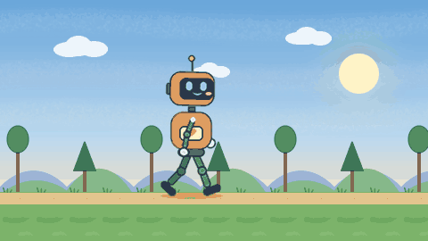
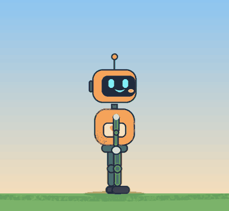
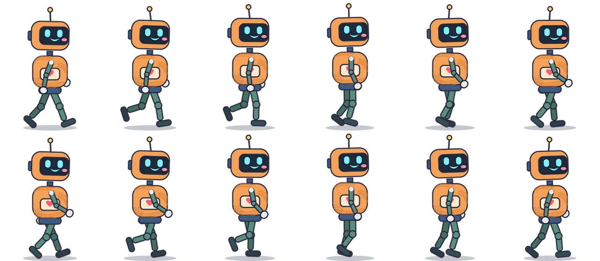
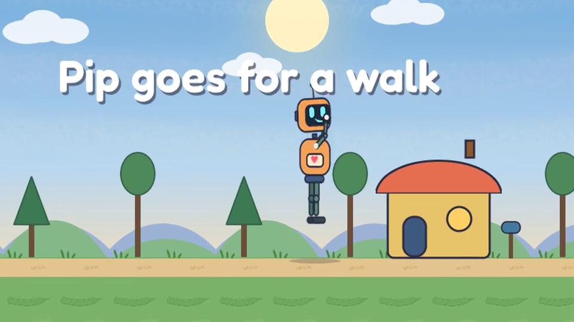
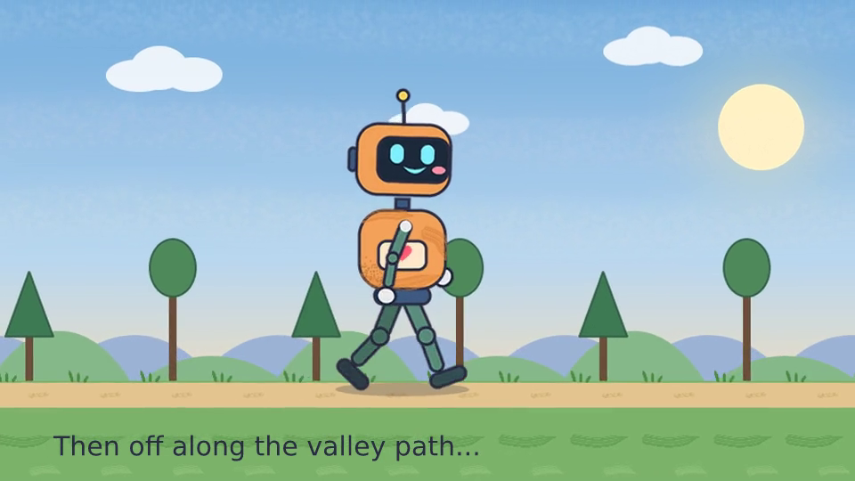
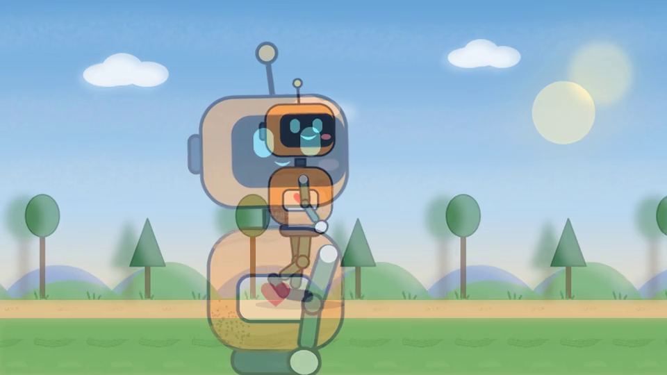

# Pip goes for a walk: a rigged vector robot and a three-shot film

Pip is a small cut-out robot built only from Vixl shapes and paths: rounded rectangles, ellipses, a
heart, a Bézier smile and a speech bubble. He has a real joint hierarchy
(`robot > arm > forearm > hand`, `robot > leg > shin`, `robot > head > antenna`), and his pivots sit
at the shoulders, elbows, wrists, hips, knees, neck and antenna base. `build.py` keyframes three pieces
of motion on that rig. The first is a looping walk cycle with eased leg and arm swings, knee bends,
body bob, a head nod and antenna follow-through. The second is a wave with forearm and wrist flicks,
blinks, a pulsing heart and a speech bubble that pops in. The third is a jump with anticipation,
squash and stretch, a knee tuck and a shrinking shadow. The walk plays in front of a three-plane
parallax valley (ground 1×, trees and hills ½×, far hills ¼×) that loops seamlessly. The scene has
brush work: watercolor sky washes, dry-brush and ink grass tufts, chalk pebbles, and dry-brush/spray
grime clipped to Pip's torso. The script exports the walk as a GIF and a sprite sheet. It then uses
the production `film-plan` / `film-export` workflow to cut an establishing shot, the walk and a
soft-focus wave close-up into an MP4. The film has camera moves, crossfades, captions and a
synthesized sine-wave score with footstep ticks.

Run from the repo root (took about 9–12 minutes, mostly the film render; about 2 minutes with the fixes in the [changelog](../../CHANGELOG.md)):

```bash
python explorations/10-character-film/build.py            # everything
python explorations/10-character-film/build.py --sheets   # documents + contact sheets only
```

## Results

The film is [`output/pip-film.mp4`](output/pip-film.mp4): 960×540, 24 fps, 10.8 s, with AAC audio.

| Walk cycle (parallax loop, 4 strides) | Jump with squash and stretch | Sprite GIF |
| --- | --- | --- |
|  |  |  |

Sprite sheet (one 1 s stride at 12 fps, transparent background, with `walk-sprite-sheet.json`):



Film stills: the establishing shot during the camera push-in, the walk, the crossfade into the
close-up, and the wave close-up.






Contact sheets used to check that joints stay attached:
[walk](output/walk-contact.png), [jump](output/jump-contact.png),
[wave](output/wave-contact.png), [establishing](output/establish-contact.png).
The editable shot documents and the score are in `output/work/` (`walk.vixl`, `establish.vixl`,
`wave.vixl`, `jump.vixl`, `walk-sprite.vixl`, `score.wav`). The film spec as resolved by
`film-plan` is in `output/film-plan.json`.

## Vixl features exercised

- Shapes: `rounded-rectangle`, `ellipse`, `rectangle`, `triangle`, `heart`, `speech-bubble`, and
  `path` (a Bézier smile, a domed roof, and periodic hill silhouettes generated in Python). The
  shapes use outline strokes.
- Nested groups up to four levels deep (`robot > arm-f > forearm-f > hand-f`), built by grouping
  bottom-up.
- `pivot` in every form: `[0.5, 0.5]` fractions, anchor names (`center`, `bottom`), and
  `units: "px"` for the wrists and for the neck and feet pivots. The neck and feet pivots are
  computed from the final group boxes.
- Timeline: `timeline-set`, about 600 `keyframe` ops (including multi-target `targets` for blinks),
  `animate`, and `animate-preset` (`slide-in-up`, `fade-out`, `pulse`, `pop-in`). Animated
  properties include `rotation`, `translate-x/y`, `scale`, `scale-x/y` (squash and stretch about a
  px pivot at the feet), `opacity` and `fill` (antenna bulb and window glow). The easings used are
  sine, quad, cubic, `ease-in-out-back` and `ease-out-back`. There are also `marker`s.
- Brushes: `paint-layer` and `paint` with `watercolor`, `dry-brush`, `ink`, `chalk`, `spray`,
  `soft-round` and `crayon`. Some strokes use `space: "layer"`. One paint tile is repeated with the
  `repeat` op. Grime is held to the torso with `clip`.
- Effects and styles: `blur` on a backdrop group (for depth of field), `outer-glow` on the sun, and
  a `drop-shadow` on the title.
- Fonts: `install_font` with Fredoka from Google Fonts, embedded in the shot documents.
- Exports: `export_timeline` to GIF (`scale`, `colors`) and to a sprite `sheet` (`columns`), plus
  `contact_sheet` with explicit `times`.
- Production workflow over the CLI: `vixl workflow film-plan` and `film-export` with `.vixl`
  timeline shots, `camera` from/to poses, `transition` crossfades, `captions` and an `audio` track.
- The persistent render cache (`vixl.render_cache.enable`).

## Findings

> **Status:** Bugs 1 (nested rigs cropping moving limbs), 2 (effects clipped to the layer box) and 3 (timeline export repainting strokes every frame) are fixed. The transparent "reach" squares and the oversized blur backdrop in `build.py` are no longer needed. See the Unreleased section of the [changelog](../../CHANGELOG.md).

**Bugs and rough edges (reproduced)**

1. **Nested group rigs crop moving limbs.** A group's bounds are fixed to its members' union when
   the group is created, and that is documented in `docs/design-tools.md`. The consequence is that
   the rig recipe in `brushes-and-animation.md` and `SKILL.md` ("group the parts", "pivot at the
   joint") breaks as soon as a child limb rotates. Repro: put a forearm and hand in group
   `forearm`, put `upper` and `forearm` in group `arm`, pivot both at their joints, then animate
   `forearm` rotation to 90°. The forearm and hand are clipped by `arm`'s original 34×184 box and
   vanish within a few frames. Workaround used here: every limb group carries a fully transparent
   "reach" square centred on its joint. The square makes the group's box cover the limb's whole
   range of motion, and it also puts the joint at the group's centre, so the pivot is just
   `[0.5, 0.5]`. Transparent shapes count toward bounds and groups may overhang the canvas, so this
   works well. The rig docs should mention it, or groups should grow to fit animated children.
2. **Effects are clipped to the layer's own box.** A `blur` (amount 6) on a 60×60 ellipse renders
   as a soft square with hard edges. A blur on a group of trees cuts the crowns flat at the group's
   top edge. Workaround: blur a single backdrop group whose oversized sky overhangs the canvas.
3. **Timeline export re-rasterizes paint strokes on every frame.** `export_timeline` and
   `contact_sheet` (Python), and as far as I can tell the CLI `export-timeline`, only use the
   persistent render cache when the caller enables it. Only production, workflow preview and film
   enable it. With about 120 strokes, each frame of the walk took about 14.5 s at 960×540,
   including at `scale=0.5`. After `vixl.render_cache.enable(project, dir)` the first frame took
   12.8 s and later frames took 0.6–0.9 s. The in-memory `_cache` did not help between frames.
   Turning 110 tiled grass strokes into one 75 px tile plus the `repeat` op also cut the first
   frame cost a lot.
4. **Film rendering is slow.** The 260 frames at 960×540 took 7–9.5 minutes across runs (about 1.7–2.2 s per
   frame) even with the cache warm from the GIF export.

**Surprising behaviour and documentation gaps**

- **Camera moves upsample instead of re-rendering.** Film camera zoom crops the frame and enlarges
  it with bicubic resampling (`film.py`), so a 1.25–1.35× push-in looks visibly soft. Scaled
  timeline export, by contrast, re-renders vectors crisply. That is why the close-up is a separate
  document drawn at 2.1× rather than a camera zoom.
- **Captions have no font field.** Captions accept only `text/start/end/x/y/size/color` and always
  render in the bundled proofing font, which `check` itself warns about. Text that has to match
  the film (the title, "Hi!") was put in the shot documents in Fredoka.
- **A shot longer than its timeline freezes.** `project_at` holds the last key, so a film shot
  that outlasts its `.vixl` timeline stops moving. There is no loop or repeat option on a shot.
  The walk was therefore written out as four explicit cycles, and the parallax distances were
  chosen so that one 4 s timeline is both the GIF loop and the film shot.
- **Rotation direction is not documented.** Positive `rotation` is clockwise on screen. For a
  right-facing character, swinging a leg forward is negative.
- `scale-x`/`scale-y` on a pivoted group is applied by resizing the group's box, which rescales
  the combined raster. Squash and stretch about a px pivot at the feet worked as intended.

**Things that worked well**

- Pivots are robust. Fraction, anchor and px pivots on groups and leaves all held through nested
  rotation. Across every contact sheet checked, no joint separated: hips, knees, shoulders, elbows,
  wrists, neck and antenna all stayed attached.
- Keyframing a deep hierarchy by layer name just works. Child tracks compose with parent tracks,
  and the walk is about 12 short cyclic curves applied with phase offsets.
- `repeat` on a paint layer gives seamless, cheap tiling brush texture, and `clip` of a paint layer
  to a shape gives easy painted weathering.
- `film-plan` validated the spec and returned exact frame and overlap numbers. `film-export` mixed
  the WAV with `adelay`/`amix` correctly, and the crossfades and captions landed where the plan
  said they would.
- GIF size is reasonable: the 48-frame 480×270 parallax loop is about 400 KB with `colors=96`.
