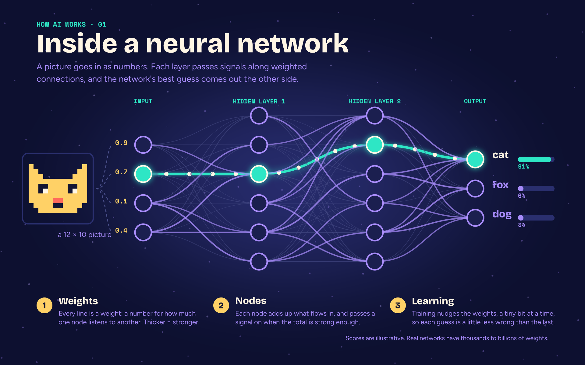

# AI literacy packet (Vixl 0.23.0 field test)

A packet that teaches, explores, demystifies, explains and encourages AI use, built to exercise Vixl 0.23.0's new and
older features. **Start with [REPORT.md](REPORT.md)**: it covers what worked, what was hard to use, what broke, and what
went unused.

| Folder | What | Rebuild (from the repo root) |
| --- | --- | --- |
| [illustrations/](illustrations/) | Neural network, Byte the mascot, token pattern, training loop | `python explorations/11-ai-packet/illustrations/build.py` |
| [creative/](creative/) | Poster, myths carousel, logo + logo package, sticker sheet | `python explorations/11-ai-packet/creative/build.py` (after illustrations) |
| [documents/](documents/) | AI 101 deck (PDF/PPTX/HTML), handout, fillable worksheet, CMYK checklist, certificates | `python explorations/11-ai-packet/documents/build.py` |
| [animations/](animations/) | Network loop, kinetic type, robot helper, next-word explainer, sticker loop | `python explorations/11-ai-packet/animations/build.py` (about 10 min) |
| [workflows/](workflows/) | CSV glossary cards, multi-size adaptation, suite-gated pipeline, proof page, variety study, throughput/REST | see [workflows/README.md](workflows/README.md) |

Each folder has a `NOTES.md` with the detailed field notes (exact commands, errors, repros, timings); the illustrations
notes cover creative/ too. Charted numbers and probabilities are illustrative and labelled as such.
