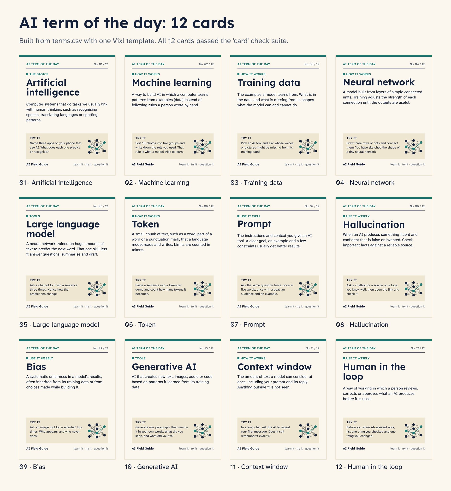

# AI term of the day: glossary cards from a CSV

`terms.csv` holds 12 AI terms with plain-language definitions and a "try it" activity. `build.py` turns it
into 1080×1350 social cards, a contact sheet and a 4-up Letter print PDF.

## How it works
1. `vixl new instagram-portrait` beside `brand.json` (the brand supplies palette and fonts).
2. `vixl apply template.json`: `variable`s (`${term}`, `${definition}`, `${tryit}`, `${category|upper}`,
   `${NUM}`), text boxes, a small neural-network motif, and a `card` check suite (hierarchy, contrast, text
   size, relations, nothing cut off). The template is filled with the longest CSV row so `check` sees the
   worst case.
3. Quick proof: `vixl render --data terms.csv` (one PNG per row, design check per row).
4. Final cards: `vixl workflow run` with `actions: ["reflow"]` and `suites: ["card"]`. The `reflow` action
   re-runs `text-layout` on each row so the definition moves up under a one-line term; a row that fails the
   suite is held for review instead of being written. Named copies go to `output/cards/`.
5. Print: `vixl merge --data terms.csv --size letter --cols 2 --rows 2` writes `print-sheets.pdf`
   (vector text, crop marks).
6. A contact sheet built with Vixl (`frame` + captions) as `contact-sheet.jpg`.

## Reuse it
- **Your own terms:** edit `terms.csv` (keep the header). Definitions up to ~150 characters and activities up
  to ~110 fit; longer rows are reported by `render --data` and held by the production run.
- **Your own look:** edit `../brand/brand.json`. Check that `accent-text` reaches 4.5:1 on *both* background
  and surface; the suite will tell you if not.
- **Another number of cards:** change the `/ 12` in the `number` text.
- Known limits (see NOTES.md): layouts cannot be used for variable templates (they size boxes from the
  `${placeholder}`), name variables used inside layout `label`s in capitals, and draw lines with `pen`, not
  `shape line` + `from`/`to`.

Files: `output/card.vixl` (template), `output/template.json` (its operations), `output/production.json`
(the production request), `output/reports/` (check, suite, merge and timing reports), `output/quick-proof/`
(two `render --data` rows, 0005 "Large language model" and 0009 "Bias": in the quick path the text boxes keep
the template's size, so a one-line term leaves a gap that the production run's reflow removes).
