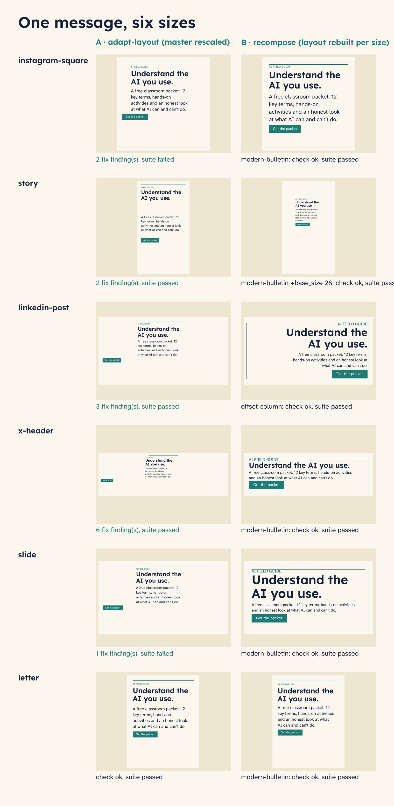

# One message, many sizes

One announcement ("Understand the AI you use.") in the packet brand, made for instagram-square, story,
linkedin-post, x-header, slide and letter, two ways, with `vixl check` and a small suite on every output.

- **A. adapt-layout**: copy the master and run `vixl -p copy.vixl adapt-layout --size NAME` (the CLI
  equivalent of MCP `vixl_adapt_layout`). Fast, keeps any hand edits, but a portrait design stays a portrait
  block on wide canvases.
- **B. recompose**: run the same `vixl compose` request (layout, copy, seed) at each size. The layout is built
  natively for the canvas. If a size fails (`fix` findings or the suite), the script tries the next layout in
  `FALLBACKS`, ending with a smaller `base_size`.

Result here: recompose passed on all six (linkedin-post needed `offset-column`, story needed `base_size 28`);
adapt-layout had `fix` findings on 5 of 6. Use recompose for new campaigns; use adapt-layout when the master
was edited by hand after the layout.

## Reuse it
Change `COPY`, `LAYOUT` (layout name, seed) and `SIZES` at the top of `build.py`; the brand comes from
`../brand/brand.json`. The suite targets `headline` (layouts name the title slot's layer `headline`).
`output/report.json` lists every attempt per size. Review the story size by eye: it passes the checks but the
layout uses a narrow column (NOTES.md).
