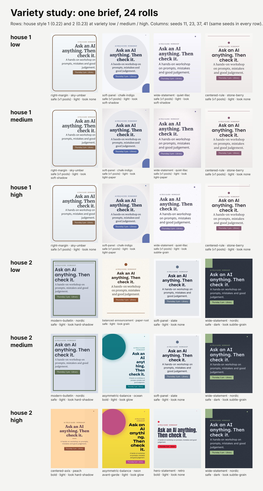

# Variety study: house style 1 vs 2

The same brief ("Ask an AI anything. Then check it." workshop post) rolled with
`vixl roll --apply --for social --seed S --variety V --house-style H` for seeds 11, 23, 37, 41, variety low /
medium / high, house style 1 (0.22) and 2 (0.23): 24 documents, each checked. `study.json` has every choice
(tier, layout, palette, pairing, mode, look, background, headline) and `summary.json` per cell.

**Verdict.** House style 2 is the better default: rolls differ more, dark mode and sharp corners appear,
type has more contrast, and the variety level now changes something (v1 gave the same layout, palette and
pairing at every level for a seed). Its weakness is the bold tier: `asymmetric-balance` with a large headline
broke "anything" mid-word in 2 of 12 v2 rolls and `check` passed both. For unattended batches use
`--variety low` (or `--lock tier=safe`); use medium/high when a person picks from the sheet.

## Reuse it
Change `SLOTS`, `SEEDS`, `LEVELS` and the `--for` purpose in `build.py`. There is no brand.json here on
purpose: a brand overrides palette and fonts, which would hide the variety.
