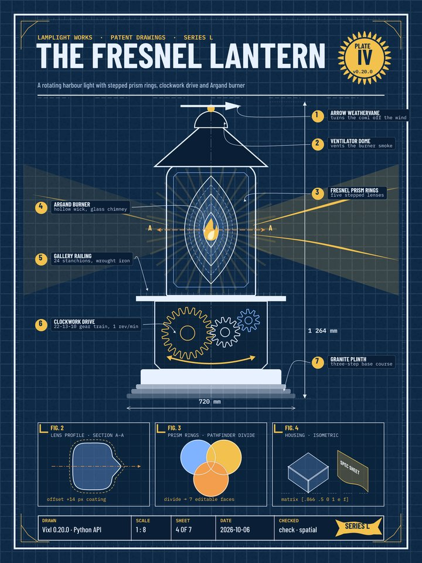

# 11 · THE FRESNEL LANTERN patent plate

An 18 × 24 in (1800 × 2400 px) blueprint poster of a rotating harbour lantern, built entirely from
Vixl 0.20.0 vector layers: about 165 layers and no imported artwork.



```bash
python explorations/11-lantern-blueprint/build.py   # about 35 s
```

| Output | What it is |
| --- | --- |
| [`fresnel-lantern.png`](output/fresnel-lantern.png) | Full-size render |
| [`fresnel-lantern.svg`](output/fresnel-lantern.svg) | Vector export: strokes, dashes, markers and distortions as real geometry |
| [`fresnel-lantern.pdf`](output/fresnel-lantern.pdf) | Vector PDF (needed two engine fixes, below) |
| [`fresnel-lantern.check.json`](output/fresnel-lantern.check.json) | `vixl check` at a 900 px reading width: passes with no findings |
| [`fresnel-lantern.spatial.json`](output/fresnel-lantern.spatial.json) | Spatial-API measurements: callout and panel alignment, title ink box, free space |
| `fresnel-lantern.vixl` | Editable master (gitignored, like the other explorations; rebuild to get it) |

## 0.20.0 features it uses

- **Parametric shape catalog:** gear (three meshing gears with 22, 13 and 10 teeth), seal, ring,
  lens/vesica (the five Fresnel rings), flame, teardrop, sunburst, notched rectangle, isosceles
  triangle with chamfered corners, half circle, concave-headed arrow, a quadratic arrow drawn from
  explicit `from`/`control`/`to` points, ruler tick strips, corner ornaments, corner brackets,
  banner, cube, document and dashed line.
- **Per-corner radii and corner styles:** the housing (`[60, 60, 6, 6]`), the chamfered pedestal and steps.
- **Stroke controls:** inside plus outside strokes from one border shape (`strokes`), dash-dot
  centrelines, round caps, `open`, `triangle`, `round` and `concave` markers on dimension and
  section lines, and width profiles on the light rays.
- **Path editing:** a squircle converted with `shape-to-path`, simplified from 192 sampled nodes,
  then edited with node move, exact Bézier insert and corner; `path-smooth`; a duplicate pushed out
  with `offset-path` for the coating outline.
- **Pathfinder `divide`:** three overlapping discs become seven editable faces (FIG. 3).
- **Non-destructive distortion:** corner-pinned light beams and a flag-waved banner.
- **Precise transforms:** a six-coefficient affine `matrix` on the isometric spec sheet and its
  label, `skew`, rulers rotated and then placed by canvas corner (`move space: canvas`), and steps
  widened with signed `resize` (`"+40"`) from a centre anchor.
- **Hug stacks:** each callout label is a vertical stack that sizes itself to its two lines plus padding.
- **Spatial API:** the leader lines start at each callout's measured edge, and the report records
  alignments, gaps, the title's ink bounds and free space in the callout column.
- **Materials:** a built-in `grid` pattern fill for the drafting grid, plus `stipple` paper tooth.

## Findings

Four engine bugs turned up while building this poster. All four are fixed in this branch, with
regression tests:

1. **`transform` with a matrix made documents unsaveable.** The QR decomposition stored a numpy
   `bool_` in `flip_y`, so `save()` raised `TypeError: Object of type bool is not JSON serializable`.
   The values are now plain Python floats and bools (`src/vixl/transforms.py`).
2. **Vector PDF export failed on long generated strokes.** A dotted page border (about 900
   round-capped dashes) outlines to a path of about 300 kB, and a smoothed path's flattened stroke
   comes to 18,000 commands. The PDF writer pushed these through `parse_path`, whose 262,144-character
   and 8,192-command caps exist to guard user input. PNG and SVG exported fine. Engine-generated
   primitives now parse with `bounded=False` (`geometry.py`, `pdf_export.py`).
3. **Hug stack backgrounds painted over their own members.** `stack` with `targets` inserted the
   generated `…/background` just before the group in the flat layer list, which put it after the
   members it had just grouped, so the pill covered its text. The docs' button example hit the
   same bug. It is now inserted before the first member (`stacks.py`).
4. **The contrast check misjudged text inside hug stacks.** To render a text layer's backdrop, the
   check hid the layer. Hiding a stack member reflows the stack, so the background shrank out from
   under the text and the check measured it against whatever lay behind the pill (here, a gold
   light ray). It reported 2.7:1 for text that renders at 12:1. The check now zeroes opacity instead
   of hiding (`measure.py`).

Rough edges, not fixed:

- `fill: "none"` is rejected; use `"transparent"`. The error is raised at state validation, so it
  carries no operation index.
- On a `line` shape, `from`/`to` are accepted but ignored. The line always runs corner to corner
  across its box, so use a `pen` for a horizontal dimension line.
- The `curve` catalog shape is a filled section divider, so its stroke also runs along the closing
  edges. Use a smoothed `pen` for an open swoosh.
- Pathfinder `divide` refuses translucent or stroked operands. The refusal message is clear: draw
  outlines as their own layers.
- Group distortion refuses groups that contain text, so only the banner shape is warped, not its lettering.
- `rotate` keeps the bounding box's top-left corner fixed, not the centre. Re-place the layer with a
  canvas-space `move` afterwards.
- `seal` ignores `inner_radius` (with a warning); its edge depth is `depth`.
- The default `check` judges legibility at a 320 px thumbnail, which flags almost every label on an
  18 × 24 in poster. The build passes `thumbnail_width=900` instead.
