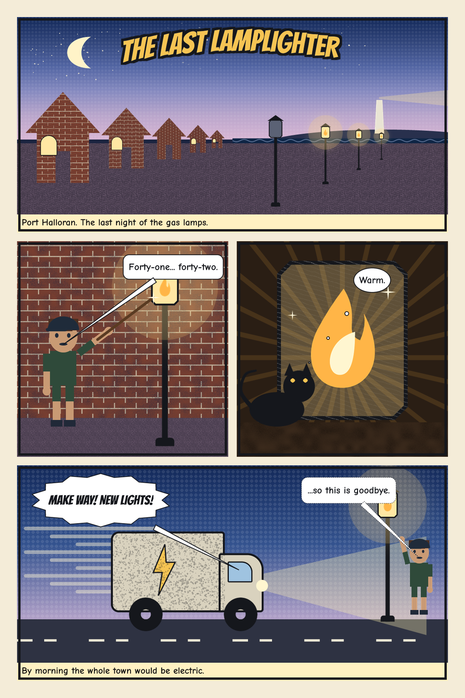
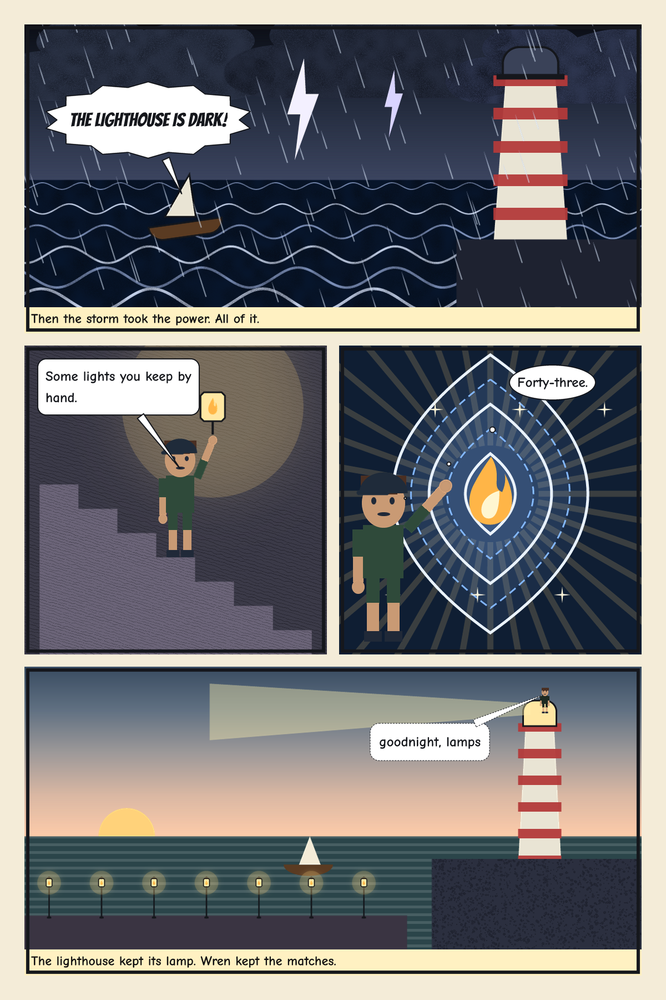

# 12 · THE LAST LAMPLIGHTER, a two-page comic

Two lettered comic pages (1200 × 1800 px each). Vixl draws every panel's artwork as its own scene
document, renders it at the exact size of that panel's art slot, and lays it out with
`comic-layout`.

| Page 1 | Page 2 |
| --- | --- |
|  |  |

```bash
python explorations/12-lamplighter-comic/build.py   # about 15 s
```

Outputs: both pages as PNG, a two-page [PDF](output/last-lamplighter.pdf), a contact
[spread](output/last-lamplighter-spread.png), every panel's artwork and scene master in
[`output/panels/`](output/panels/), the panel boxes in [`panels.json`](output/panels.json), and
checks (both pages pass) in [`last-lamplighter.check.json`](output/last-lamplighter.check.json).

## 0.20.0 features it uses

- **`comic-layout`** on two `page`s: two columns, spanning panels, gutters, borders, captions and
  image slots. A first probe layout without artwork measures each art slot, so the scenes are
  rendered at the size they will be shown.
- **Speech, thought, shout and whisper bubbles.** An invisible anchor layer sits at each speaker's
  head (from `spatial` canvas bounds of the character's `head` part), so every tail points at the
  person talking.
- **Natural palettes:** the dusk/night/dawn skies and the night/dawn sea and stone come from
  `natural_palette`.
- **Perspective helper:** the houses and lamps in panel 1 take their sizes from a two-point
  `perspective_guides` result. Their ground lines rise toward the horizon in proportion.
- **Clone stamp:** about 36 painted stars are rasterized and cloned across each sky.
- **Custom pattern:** a 40 × 20 running-bond brick tile captured with `pattern-define` (seamless)
  covers every house and wall.
- **Built-in patterns:** halftone skies, stone cobbles and stripes on the towers.
- **Drawn textures:** pencil, charcoal, crayon, ink-wash, stipple and hatch, each used somewhere.
- **Characters and IK:** Wren is a generated standard-parts character. The rig's shoulder limits
  are widened with `character-rig`, and `character-ik` raises an arm to the lamp, the lantern or the lens.
- **Spatial hit tests:** in the stair panel, Wren is stood on a step by hit-testing down (or up)
  from the feet to the first rendered stair pixel.
- **Catalog shapes:** house, crescent, cloud, lightning, sunburst, sparkle, flame, teardrop, lens,
  notched rectangle, speed lines, stairs, ring wheels and a dashed road line. There are also
  corner-pinned tapered towers and beams, a tapered pen for the cat's tail, and rain as tapered pen streaks.

## Findings

- **Comic dialogue can't be aimed or restyled.** Dialogue given inside `comic-layout` always anchors
  its tail to the panel's whole art layer, so tails point at the panel centre, and the bubble uses
  the default font and a fixed padding. `speech-bubble` has no `target` for restyling an existing
  bubble. The pages therefore use `comic-layout` for panels and captions, and standalone
  `speech-bubble`s with anchors.
- **Shout bubbles clip their text at the default padding.** The 14-point star is sized to the text box,
  so its valleys cut into the words. Padding 48 fixes it.
- **Captions are measured with DejaVu Sans.** The caption box height comes from DejaVu at
  `caption_size`. Restyling to Comic Neue afterwards works because the metrics are close.
- **Pattern fills are clipped to their source's alpha.** A pattern over an almost-transparent sheet
  is invisible, so you can't make rain that way.
- **Integer-only fields.** `text.size` and `character.height`/`x`/`y` must be integers, even
  though 0.20 vector geometry is otherwise fractional.
- **Drop-shadow settings.** The fields are `dx`, `dy`, `blur`, `opacity` and `color`; `angle` and `distance` are refused.
- **Spatial hit tests and empty corners (docs fixed).** The default `bounds: "box"` hit test
  reports the layout box, so a stepped shape also hits in its empty corner. Pass `bounds: "ink"`
  to test rendered pixels. The spatial docs said hits always verified alpha; they now say which
  mode does.
- **Image slots and the workspace.** Image-slot paths must be inside the workspace. Embedded assets
  (`add_image`) work anywhere.
