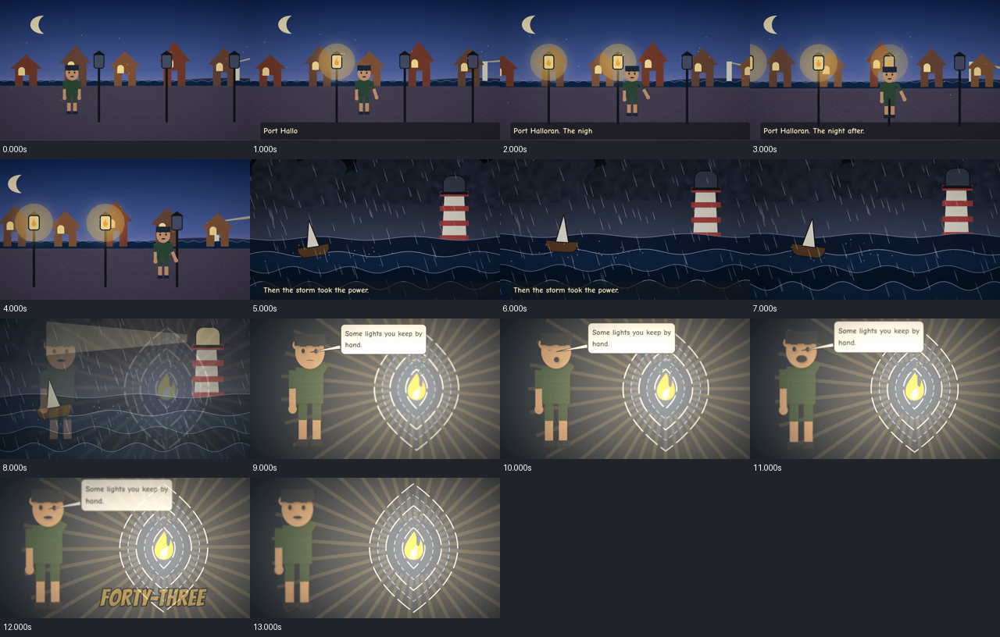

# 13 · FORTY-THREE, a 13-second animated short

The sequel to the comic: three shots, crossfades, captions and a synthesized score, rendered to
a 960 × 540, 24 fps [MP4 with sound](output/forty-three.mp4). The cast, the shots, the music and
the review are all Vixl.



```bash
python explorations/13-forty-three-film/build.py           # about 6 minutes
python explorations/13-forty-three-film/build.py --draft   # draft quality, about 3 minutes
```

| Output | What it is |
| --- | --- |
| [`forty-three.mp4`](output/forty-three.mp4) | The film: 313 frames with the mixed score |
| [`forty-three-score.wav`](output/forty-three-score.wav) | The score alone (`export_audio`) |
| [`film.json`](output/film.json) | The film spec: shots, crossfades, captions, eight synth tracks |
| [`shots/`](output/shots/) | Contact sheets for each shot (the `.vixl` masters are gitignored) |
| [`review/frame-*.png`](output/review/) | `film-preview` frames rendered before the full export: shot middles, both crossfade midpoints, a lightning flash, the line and the title |
| [`review/loop-shot-c.gif`](output/review/loop-shot-c.gif) | A looping preview of shot C alone |
| [`review/film-contact.png`](output/review/film-contact.png) | `video_sample` of the exported MP4, one labelled frame per second |
| [`review/audio.json`](output/review/audio.json), [`spectrogram.png`](output/review/spectrogram.png) | `audio_analyze` of the MP4: levels, silence, onsets and sync against six events |
| [`review/checks.json`](output/review/checks.json) | `motion`, `character` and `captions` checks per shot |

## 0.20.0 features it uses

**Reusable character.** Wren is authored once in `cast.vixl`, with a widened shoulder rig, and
saved with `character-save`. Each shot loads it with `character-load source=…` at a different scale.

**Shot A, the quay (4.8 s).**
- Four parallax planes with `layer-depth`: the sky and lighthouse at 6, houses at 2.2, the quay at 1.
- A `camera` pan and push-in.
- A `walk` cycle while compact `keyframes` carry Wren along the quay.
- Each lamp lights as Wren reaches it: opacity keyframe arrays, a `glow` look and a burst of
  `sparks` particles.
- A pivoted, corner-pinned lighthouse beam sweeps on a three-key rotation, under drifting `dust`
  particles, a vignette and a typewriter caption.

**Shot B, the storm (4 s).**
- Four sea bands bent by `distort` `wave`, with `distort:phase` animated as an ordinary track.
- The boat rocks on a keyframe array and bobs with the `hover` recipe.
- Rain: 160 tapered pens in a group that falls 64 px every 220 ms, written as one compact keyframe array.
- Two lightning flashes, each a single keyframe array shared by a full-frame sheet and the bolt.
- Camera shake and spray particles; the lantern and beam relight at 3.2 s.

**Shot C, the lens room (5.2 s).**
- `character-lipsync` on "Some lights you keep by hand." and a `speech-bubble` whose tail follows
  Wren's head as they breathe (`breathing` recipe). Both eyes `blink`.
- Crawling dashed lens rings (`dash_offset` keyframes) and a pivoted flame that `wiggle`s.
- `cut-paper` grain, rough edges and a paper shadow on Wren, held at a 12 fps cadence.
- A warm point light at the flame, a vignette, and a camera rack focus from Wren (depth 1) to the
  lens (depth 1.6).

**Film.**
- A film spec with 500 ms crossfades.
- Captions: a typewriter caption, a fade caption, and a stroked, tracked title in Bangers.
- Eight synth tracks: a piano theme, bells timed to each lamp, wind (`whoosh`), rain (`noise`),
  thunder (`kick`) after each flash, a relight bell and a closing chime.

**Review loop.**
- `film-preview` frames and a GIF loop before the full render.
- `video_sample` of the MP4.
- `audio_analyze` with the lamp and flash times as sync events. The bells land 12–24 ms before
  each lamp's light-up keyframe, and the peak is −5.5 dBFS with no clipped samples.

## Findings

- **Film captions couldn't use any font except the fallback (fixed).** A film caption accepted
  `font`, but the overlay it is drawn on is a fresh project with no registered fonts, so any font
  name failed with "Font not found". Captions now resolve fonts registered in the film's `.vixl`
  shots (`film.py`, with a test).
- **Film-level captions are not checked.** The title first ran off the right edge of the frame,
  and nothing flagged it: the `captions` check covers captions inside shot documents, not
  film-spec captions. The contact sheet caught it.
- **Motion warnings are intentional here.** The constant-speed walk and dash crawl are two-key
  linear tracks, and the rain loop jumps back 64 px every 220 ms. The `motion` check flags both,
  correctly, as heuristics.
- **Caption style keys** are `stroke_color`/`stroke_width`, not a nested `stroke` object.
- **A stray cache file.** Rendering a film writes `.vixl-cache.usage.json` next to the
  `.vixl-cache/` directory in the workspace root. It is now in `.gitignore`.
- **Score gaps.** `audio_analyze` reported short silences between the piano phrases. The closing
  chord was added to cover the longest one.
