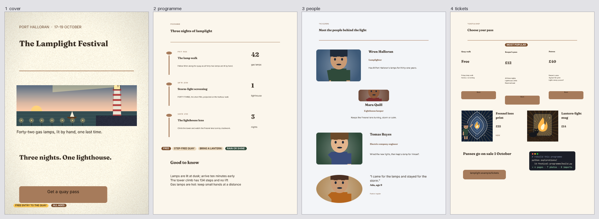

# 14 · THE LAMPLIGHT FESTIVAL programme and social set

A four-page A4 programme (1240 × 1754 px, 150 dpi) and a social set for the festival where the
comic and the film take place. It is built from 0.20.0 containers, use-case templates, hug stacks
and seeded variety. The photos in the image slots are Vixl renders: the cover, product and social
photos come from the comic's own scene functions, and the four portraits are generated characters.



```bash
python explorations/14-festival-programme/build.py   # about 40 s
```

| Output | What it is |
| --- | --- |
| [`lamplight-programme.pdf`](output/lamplight-programme.pdf) | The four-page programme |
| `programme-{cover,programme,people,tickets}.png` | Each page |
| [`lamplight-programme.check.json`](output/lamplight-programme.check.json) | Bounds, contrast, blanks, fonts and overlap checks: all four pages pass |
| [`social/event-promo-*.png`](output/social/) | The `social-event-promo` template in its three recommended combinations |
| [`social/link-card-roll-*.png`](output/social/) | Three seeded rolls (3, 14, 27) of a link card |
| [`social/social.json`](output/social/social.json) | Each template's recorded choices and checks, and each roll's seed and full direction |

## 0.20.0 features it uses

- **Use-case templates:** `print-flyer` for the cover (warm-editorial: `coffee`, `paper`, light) and
  `social-event-promo` in minimal-light, bold-dark and warm-editorial. Each slot is filled, and
  the template result records its seed and choices.
- **Containers:** section header, timeline step, stat, list block, profile, testimonial, pricing
  tier, product card and CTA.
- **Image slots:** cover-cropped around a focal point. The four portraits come from
  generated characters on radial-lit backdrops, and the product photos are the comic's lens and
  flame scenes rendered at 600 × 600.
- **`container-variant`:** every profile is placed in the `left` arrangement. Two are then switched
  to `centered` and `split`, keeping their photo, copy and group identity.
- **Resize and `container-reflow`:** the featured pricing tier is made taller with a top-anchored
  resize, and its content reflows rather than stretching.
- **Hug stacks:** the badge pills (`FREE`, `RAIN OR SHINE`…), the `MOST POPULAR` flag, and a code
  window built from a horizontal stack of window dots inside a vertical stack of mono lines with a
  dark rounded background.
- **Safe variety:** `roll_document(seed=…)` picks the palette, font pairing, layout, density,
  accent, corner and finish from the curated pools. All three rolls pass their checks, and
  re-running with the same seed reproduces each card.

## Findings

- **Palette roles are document-wide.** Swatches like `@ink` are global, so in a multi-page document
  a dark template on the cover made `@ink` cream on every page, and later per-page
  `palette-apply` calls did not reset it. The first build failed 54 contrast checks with text at
  about 1.02:1. One combination now carries the whole booklet; per-page palettes would need
  per-page swatch scopes.
- **The coffee palette's buttons fail its own contrast check.** `on-accent` text on the `accent`
  button measures 4.2:1. That's fine for large text, but the CTA and pricing button labels are
  small enough to need 4.5:1. The booklet overrides the button ink.
- **Container type doesn't scale with the container.** `fit_text` only shrinks text, so a section
  header placed 1100 px wide keeps its 24 px default title. That's why the containers read small on A4.
- **Container text ignores the document font roles.** Containers and templates set DejaVu Sans
  directly instead of the `heading`/`body` roles. The build restyles each container's text layers
  afterwards.
- **Button labels sit at the top of their buttons.** The CTA and pricing-tier label frames have no
  vertical centring, so a taller button leaves the label near its top edge.
- **The round photo mask follows the slot.** In the testimonial's split arrangement, the photo
  slot isn't square, so the round mask becomes an ellipse.
