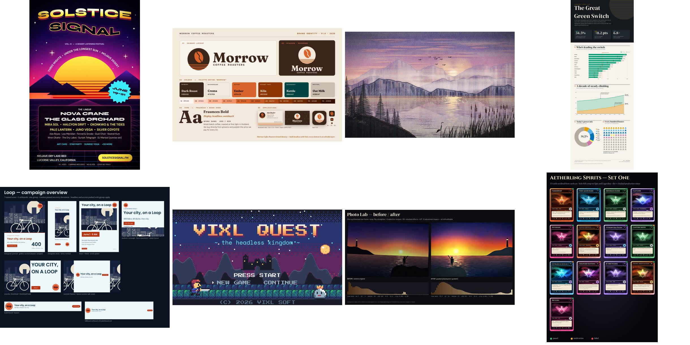

# Vixl explorations

Ten complex projects, each designed to stretch a different part of the engine. They were first built with Vixl 0.16.0 to find its limits; the committed outputs are now rebuilt with Vixl 0.20.0. Every project has a reproducible `build.py`, which you run from the repo root with `python explorations/NN-name/build.py`. Each also has its outputs and a README with the features it used and its findings. `python explorations/build_gallery.py` recomposes `gallery.jpg` from the outputs.

| # | Project | What it pushes on |
| --- | --- | --- |
| 01 | [SOLSTICE SIGNAL print poster](01-print-concert-poster/) | Tabloid with bleed and safe guides, gradients, repeat-blend, clip, warped and path text, print/color-vision checks, SWOP soft proof, CMYK PDF/JPEG, SVG |
| 02 | [Morrow Coffee brand identity](02-brand-identity/) | Pen Béziers, pathfinder, palette-generate/define, symbols, artboards, business card, strict SVG, ICO and icon sets, HTML, palette suites |
| 03 | [HALO kinetic launch film](03-kinetic-launch/) | Timeline keys and easings, presets, markers, staggers, animated effects, motion-define/apply, GIF/WebP/APNG/MP4/sheet |
| 04 | [Vixl Quest pixel RPG pack](04-pixel-rpg/) | pixel-art/pixel-draw, frames, palette swaps, tileset, tile map via repeat, comps, nearest-sampled exports |
| 05 | [Generative mountain-lake painting](05-generative-painting/) | 3,700+ seeded strokes, all 17 brushes and custom brushes, masks, blends, adjustment grading, artistic-filter variants, timelapse |
| 06 | [Non-destructive photo lab](06-photo-lab/) | Every selection kind, masks, tonal stack, LUT, adjustment layers, presets, history branches and compare, all 19 filters and 5 effect workflows |
| 07 | [Aetherling Spirits trading cards](07-trading-cards/) | Variables, CSV `render --data`, comps, suites, recipe capture, plan/run matrix, durable jobs, CMYK print sheet |
| 08 | [The Great Green Switch infographic](08-infographic/) | Charts from data with shapes/paths/repeat, grids and constraints, spacing/validate QA, color-vision checks, SVG/HTML/PDF |
| 09 | [Loop collaborative campaign](09-collab-campaign/) | brand.json, rolls, layouts across 7 sizes, adapt-layout, branch fork/merge with conflict resolution, group-apply gated by suites |
| 10 | [Pip the robot film](10-character-film/) | Nested rig with pivots, walk/wave/jump, parallax, painted texture, film-plan with camera, crossfades, captions and audio to MP4 |

## Caveats on the outputs

- **The poster is at 150 dpi.** 01 builds at 150 dpi to keep the committed files small. For press resolution, set `DPI = 300` at the top of its `build.py`; every coordinate scales with the canvas.
- **The infographic's data is invented.** 08's renewable-share figures were made up to exercise the layout, and its README says so. Don't cite them.
- **The infographic's validate run passes; its contrast check does not.** The decorative sun and rays that bleed off the top edge are marked as decoration, so `validate` reports both datasets valid. Checking every text layer (it used to check 12 to save time) found one real error: the white "98.6%" label inside the first green bar is 3.42:1, below 4.5:1. The design is left as it was.
- **Build times.** Each build was run on a shared 4-core container, two at a time, with downloaded fonts and the ICC profile cached: 01 1 min 17 s, 02 14 s, 03 1 min 35 s, 04 25 s, 05 2 min 41 s, 06 26 s, 07 1 min 43 s, 08 38 s, 09 1 min 23 s, 10 1 min 57 s. With 0.16.0 the longest builds took 8 to 14 minutes, mostly in the design check.
- **What changed in the 0.21 rebuild.** Most designs are pixel-identical or nearly so. The visible differences come from 0.21's rendering changes: effects now run before rotation, resampling is clamped (no ringing on rotated or scaled rasters), open stroked paths are unfilled, the contrast check measures glyphs where the compositor draws them, and the animated GIFs default to ordered dither on a shared palette (stable between frames, but 03's GIF is 1.7 MB instead of 0.9 MB). The checks are stricter and now cover more (below). `roll` in 09 rolls the same curated catalogue as in 0.20.0.
- **New findings from the stricter checks.** Several reports that used to pass now carry errors that are real properties of the designs, which are left as they were:
  - 01 and 09: the canvas safe area is checked by default, so the SIGNAL title (01), the print live area (01), `s-word` (02) and `stat` (09 master after the merge) are reported as outside it.
  - 03: the motion check and legibility at frame 0 flag that the poster frame is empty and that the letters, tagline and chips are hidden at the poster time (the intro builds up from nothing); the overlap check also counts the stacked word and letter layers. 03's design does not change.
  - 08: the one genuine contrast error is still the "98.6%" label in the first bar.
- **Bug found by the rebuild (fixed).** Single-pass contrast coverage was cut with a fractional crop, so text whose ink box sat on a half pixel was measured one row off and reported false errors (18 to 22 per infographic edition). Fixed in the same release; the 0.20.0 workarounds are gone (01 asks for a PDF without `--pdf-content raster`, 09 no longer nudges centred labels by half a pixel).

## Cross-project findings

Each project README has repro details. These are the issues the explorations found in Vixl 0.16.0 that showed up most often or matter most. Items marked **Fixed** shipped in 0.18.0 ("Fixes from the explorations" in the [changelog](../CHANGELOG.md)) unless another release is named. The 0.20.0 rebuild, with most of the workarounds removed, exercises most of them.

### Bugs
- **Fixed: group bounds are frozen.** A group kept the bounds it had when created, so resized or rotated children got clipped (04, 10). Groups no longer clip their members, and `inspect` reports `drawn_bounds` for anything drawn past the box. Group `scale` no longer smooths pixel art (04).
- **Fixed: effects are clipped to the layer box.** A blurred shape rendered as a soft rectangle (03, 10). Blur now spreads past the box.
- **Fixed: stroke wider than its box crashes rendering.** A stroke wider than a small shape's box raised a raw PIL `ValueError` at render time, even though apply succeeded (03).
- **Fixed: swatch references break in some paths.**
  - `repeat`/`repeat-blend` rejected an `@swatch` fill (01).
  - A swatch whose value is `${var}` made every later `@swatch` use fail (07).
- **Text fitting is unreliable.**
  - **Fixed:** `fit:true` broke a word mid-word ("SOLSTI / CE") instead of shrinking it (01).
  - **Fixed:** `text-fit` rules always failed on auto-sized text (09).
  - **Fixed:** warped text was clipped at the top of its box (01).
- **Fixed: artboard `x`/`y` are accepted but ignored** (08). An artboard with `x`/`y` is now a viewport onto that region of the canvas.
- **Fixed: assertions read the wrong value.** `text.*.font-size` assertions ignored linked styles (08).
- **Fixed: `roll` previews and applies different directions.** Without `--size`, the preview and `--apply` picked different layouts (09).
- **Fixed: production with `workers:2` races** on the shared font cache (07).
- **Fixed: `--ink-limit` is silently ignored** when an ICC profile is given (01).
- **Fixed: outlined text fails the contrast check.** The 01 SIGNAL headline (dark fill, yellow `stroke` style) was flagged at 1.13:1; outlined text now passes when its outline contrasts with the backdrop.
- **Fixed: missing glyphs pass every check.** Tofu boxes went unreported (06, 07). They are now an error in every `check`, every suite and `validate`.
- **Fixed: boxed text clipped silently.** Raising the size of layout text cut it off at its `text-layout` box and `check` said nothing (09). The `bounds` check now reports it with the size the text needs.
- **Fixed: `oil-paint` adds false colours** to thin dark strokes on light ground (05). It now only uses colours already in the image.
- **Fixed: pen layers ignore their nodes' extent.** Without `width`/`height` a pen was canvas-sized, and a box smaller than the nodes clipped them silently (02, 08). The box now fits the nodes and stroke, and a too-small box is rejected.
- **Fixed: `scale` 0 leaves a 1-pixel sliver** (03).
- **Fixed: recipe input defaults override artboard variables** (07).
- **Not a bug: the 07 single-digit contrast "false positive".** The "7" really touches the stat pill's outline. The contrast message now gives the share of pixels and where they are.

### Performance
- **Fixed: the contrast check is the bottleneck.** It re-rendered the whole document per text layer, at 12–137 s per layer on large posters (01, 02, 07, 08). Top-level text is now measured from one shared render, with identical results, and nested renders, text measurement, styles and the layer cache are much cheaper. The full `check` on the 01 poster takes about 17 s instead of more than 10 minutes.
- **Fixed: painting slows quadratically** as strokes are added to a layer (05). A batch now costs time in proportion to its strokes (400 strokes: 9.8 s to 1.6 s), adding one stroke to a 3,000-stroke layer takes about 0.3 s instead of 10.7 s, and renders are pixel-identical.
- **Fixed: timeline export skips the persistent render cache.** Brush-heavy frames took about 14 s each without the cache and under 1 s with it (05, 10). Layers that only move are no longer redrawn per frame, and timeline exports of saved documents use the persistent cache.

### Rough edges
- **Fixed: vague errors.** Ragged pixel rows (04), constraint conflicts (08), the batch limit (05), far `px` pivots (03) and undefined swatches (02) now name the row, layers, anchors, numbers or operation involved. `validate --rules` takes inline assertions (08), and unnamed layers are numbered instead of colliding (09).
- **Fixed in 0.21: no effect reorder operation, and `lookup` was not a real effect** (06). `effect-move` reorders any effect, and `lookup` is an ordinary stack effect that can be disabled, reordered and limited to a selection. 06 does not use `effect-move`, so this rebuild does not exercise it.
- **Fixed in 0.19.0: CMYK PDFs are single raster pages** with no TrimBox or BleedBox (01, 02). The 02 business cards are now vector DeviceCMYK pages with embedded fonts, and the print PDFs of 01, 02 and 07 have a TrimBox and BleedBox. The 01 poster is still one image, because its blend modes need the backdrop.
- **Blend modes force raster fallbacks in SVG** (01): the full 01 poster is still one embedded image. Repeats of vector shapes did too in 0.16.0 (01, 08), but export as vectors since 0.17.0, so the 01 `vector` comp and the 08 poster now export strict SVG with no images.
- **Partly fixed in 0.21: `color_vision` checks only text,** not chart fills (08). It now compares chart series colours (bar, area, line, pie); other adjacent fills are still not compared.
- **Fixed in 0.19.0: `animation-set` can't export a subset of frames** (04). Named animations replace the clone-and-delete workaround in 04.
- **Film captions have no font field,** and film camera zoom softens the image (10). 0.20.0 adds a caption font and style; 10 does not use it, so this rebuild does not confirm it. Camera zoom still crops and enlarges with bicubic resampling.

### Worked well
Atomic batches with precise, structured errors. Pivots on deep rigs. Markers used as times. Three-way branch merges with explicit resolutions and `expected_head`. Suite-gated group publishing. Symbols and artboards. Font pairing and embedding. The print, contrast, bleed and spacing checks caught real problems.
