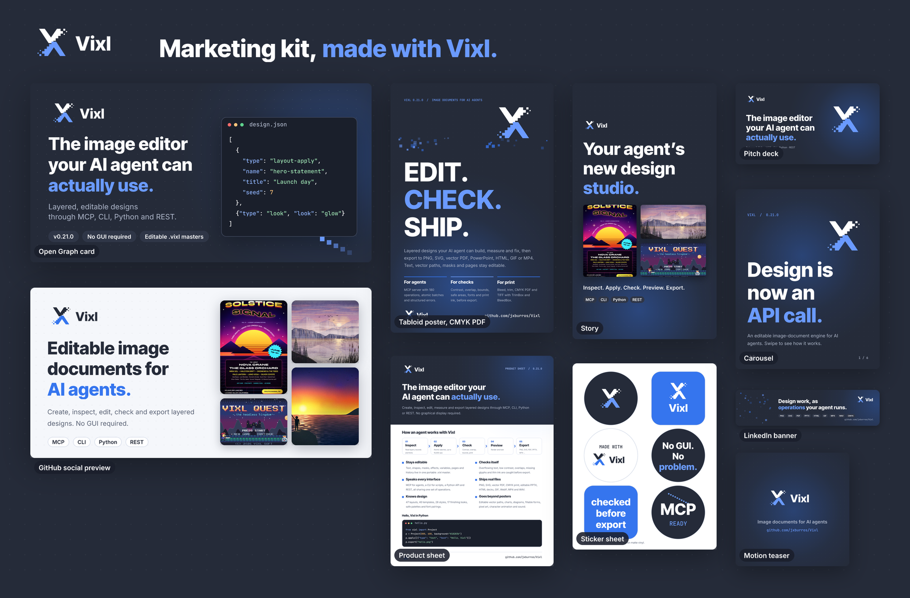

# Vixl marketing kit

Marketing material for Vixl, made with Vixl 0.21.0. One script, [`build.py`](build.py), builds every
piece through the Python API: layouts, rich text, linked logo masters, framed images, pages,
keyframes, checks and exports. Nothing was drawn by hand or in another app.



## What's in it

| Piece | Files | Notes |
| --- | --- | --- |
| Open Graph / link card | [`social/og-card-1200x630.png`](output/social/og-card-1200x630.png) | Link previews on X, Slack, Discord and so on |
| GitHub social preview | [`social/github-preview-1280x640.png`](output/social/github-preview-1280x640.png) | Upload under the repository's Settings → Social preview |
| LinkedIn banner | [`social/linkedin-banner-1584x396.png`](output/social/linkedin-banner-1584x396.png) | Left fifth kept quiet for the profile picture |
| Story | [`social/story-1080x1920.png`](output/social/story-1080x1920.png) | Top and bottom 250 px kept clear of platform UI |
| Carousel, 6 slides | [`carousel/`](output/carousel/): PDF, one PNG per slide, contact sheet | 1080 × 1350 for Instagram or LinkedIn document posts |
| Pitch deck, 9 slides | [`deck/`](output/deck/): PDF, editable PPTX, self-contained HTML presenter | Speaker notes on every slide; open the HTML in a browser to present |
| Tabloid poster | [`print/poster-tabloid.pdf`](output/print/poster-tabloid.pdf) (CMYK, bleed, TrimBox/BleedBox) and PNG preview | 11 × 17 in at 150 dpi |
| Product sheet | [`print/one-pager-letter.pdf`](output/print/one-pager-letter.pdf) (vector) and PNG | US Letter handout |
| Sticker sheet | [`print/sticker-sheet-letter.pdf`](output/print/sticker-sheet-letter.pdf) and PNG | Six event stickers on US Letter |
| Motion teaser | [`motion/teaser.mp4`](output/motion/teaser.mp4), [`teaser.gif`](output/motion/teaser.gif), contact sheet | 6.6 s, 1080 × 1080: logo, the five-step loop, end card |

Every piece also has its editable `.vixl` master next to the exports, and a `.check.json` with
the `vixl check` findings it was released with (see below).

## Rebuild

From the repository root, with Vixl installed (`python -m pip install -e '.[pdf]'`):

```bash
python marketing/build.py                 # everything (about a minute with 0.21.0)
python marketing/build.py og deck teaser  # just some pieces
```

Fonts (Inter Tight 800, Inter 400/600, JetBrains Mono 500) download from Google Fonts on the first
run and are embedded in each master. The MP4 needs `ffmpeg`. The script changes into the repo root
so the logo links resolve.

## How it's built

- **Brand.** Colours and type come from the [Digital Shift kit](../assets/brand/digital-shift/START-HERE.md):
  charcoal `#252B39`, blue `#3575EE`, `#6A9AFF` on dark, Inter Tight 800. The logo is a live `link`
  layer to the masters in `assets/brand/digital-shift/Editable-Vixl/`, so a logo change flows into
  every piece on the next build. The scattered and stepped squares pick up the mark's detached pixels.
- **Showcase images** (the gallery tiles in the GitHub card, story, carousel and deck) are real
  outputs from [`explorations/`](../explorations/) and [`docs/assets/generated/`](../docs/assets/generated/),
  all made with Vixl, placed with `frame` and clipped to rounded `shape`s.
- **Copy facts** were counted from the 0.21.0 source by taking the length of each registry:
  180 operation types (`vixl.operations.OPERATION_TYPES`), 150 named sizes (`vixl.sizes.SIZES`),
  47 layouts (`vixl.layouts.LAYOUTS`), 40 templates and 19 containers (`vixl.resources.TEMPLATES`
  and `CONTAINERS`), 28 styles (`vixl.style_catalog.STYLES`), 17 looks (`vixl.looks.LOOKS`) and
  17 brushes (`vixl.brushes.BRUSHES`). The 10,000-operation batch limit is `vixl.model.Limits().max_operations`.
  The same rule applied to the 0.19.0 source reproduces the numbers the 0.19.0 kit quoted
  (138 operations, 150 sizes, 32 layouts, 28 styles, 14 looks, 17 brushes; it also gives
  14 templates, 6 containers and a 1,000-operation batch limit).
  To recount after a release:

  ```bash
  python -c "from vixl.operations import OPERATION_TYPES; from vixl.sizes import SIZES; \
  from vixl.layouts import LAYOUTS; from vixl.resources import TEMPLATES, CONTAINERS; \
  from vixl.style_catalog import STYLES; from vixl.looks import LOOKS; from vixl.brushes import BRUSHES; \
  print(*map(len, (OPERATION_TYPES, SIZES, LAYOUTS, TEMPLATES, CONTAINERS, STYLES, LOOKS, BRUSHES)))"
  ```

  The "Seconds, not minutes" deck slide quotes the before/after timings in
  [explorations/README.md](../explorations/README.md#performance).
  If those numbers change, edit `FACTS` and the slide in `build.py`.
- **No licence claim.** The repository has no licence file, so nothing says "open source". Add it
  to the chips in `build_og` once a licence is chosen.

## Checks

Each piece runs `vixl check` before export and has no remaining `fix` findings. The carousel is
checked with the `phone` deck profile and the pitch deck with the `screen` profile (it is read on a
laptop or shared as a PDF, not projected). The dot grids are marked `layer-intent role=decoration`
and the strikethrough bars over the "before" timings may overlap their numbers. What's left in the
`.check.json` files is deliberate:

- Informational notes: glow gradients cropped by the canvas edge, and dot grids built from
  `repeat`, which the checks measure by their first instance.
- The deck title slide's headline sits lower than the other slide titles.
- The "MCP" sticker's pixel stair runs into the word, by design.

## Engine issue found while building this (fixed in 0.20.0)

With 0.19.0, `vixl.deck.contact_sheet` (and MCP `vixl_render_preview(page="all")`) failed with
`Dimensions must be 1–16384` when the sheet scaled a page by less than about 1/3 and the page had
a `repeat` of a very small shape (the 3 px dots of the background grid rounded to 0 px), so the
deck sheet had to be rendered at 640 px per slide. 0.20.0 prevents those zero-size allocations;
the deck sheet now renders at 480 px per slide (1/4 scale).
