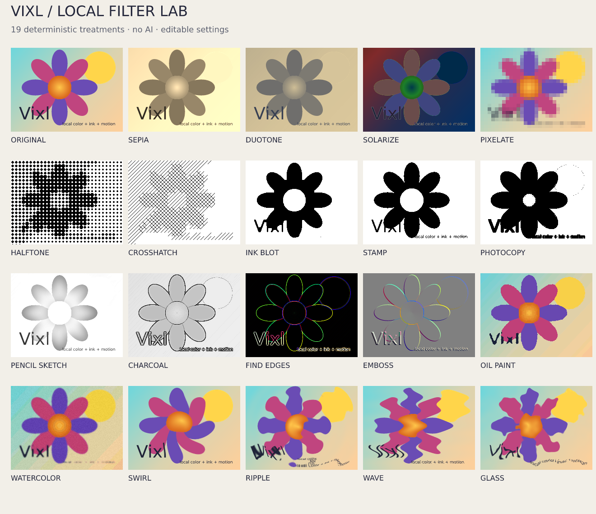

# Local artistic filters and SVG export

Vixl has 19 built-in artistic filters (since 0.12). They use local Pillow/NumPy algorithms, require no AI provider, and never download models or contact a service. Filters remain editable in the effect stack; undo/redo, presets, selections, adjustment layers, REST and MCP use the same implementations.



## Quick start

```text
vixl sepia photo 70
vixl ink-blot photo 140 --radius 2
vixl pencil-sketch photo 100 --radius 12
vixl halftone photo 10
vixl swirl photo 120 --radius 0.8
vixl glass photo 6 --radius 12 --seed 42
vixl effect set photo 1 --amount 85
vixl effect disable photo 1
vixl effect enable photo 1
```

Layer and amount are optional for these shortcuts. With no layer, Vixl uses the active layer; with no amount, it uses the defaults below. `vixl filter sepia --target photo --amount 70` is the equivalent generic syntax. JSON uses `{"type":"ink-blot","target":"photo","amount":140,"radius":2}` or `{"type":"effect","name":"ink-blot",...}`. `vixl commands --json` and `vixl schema` discover the built-ins and operation fields.

## Treatments

Amount has filter-specific units. Values outside these ranges are rejected atomically.

| Filter | Appearance | Amount: default (range) | Other settings |
| --- | --- | --- | --- |
| sepia | Warm photographic sepia | 100 (0–100% mix) | — |
| duotone | Map brightness between two colors | 100 (0–100% mix) | `shadow_color` default `#172544`; `highlight_color` default `#ffe6ac`; both opaque |
| solarize | Invert values above a cutoff | 128 (0–255 cutoff) | — |
| pixelate | Average into coarse square blocks | 8 (1–256 integer block size) | Transforms alpha along with color |
| halftone | Black printing dots on white | 8 (2–128 integer cell size) | — |
| crosshatch | Increasing layers of hatch lines | 8 (2–128 integer cell size) | — |
| ink-blot | Softened threshold with joined ink regions | 128 (0–255 cutoff) | `radius` 2 (0–20 pixels, rounded) |
| stamp | Crisp black-and-white threshold | 128 (0–255 cutoff) | — |
| photocopy | Contrast-heavy black-and-white edges | 160 (0–255 cutoff) | — |
| pencil-sketch | Grayscale dodge-style edge lines plus hatching that follows the tone; transparent pixels count as white paper, so a flat shape keeps an outline and its value | 100 (0–100% mix) | `radius` 12 (0–20 pixels) |
| charcoal | Dark edges and shaded paper | 100 (0–100% mix) | `radius` 2 (0–20 pixels) |
| find-edges | Colored edge detection on black | 100 (0–100% mix) | — |
| emboss | Raised relief appearance | 100 (0–100% mix) | — |
| oil-paint | Local mode smoothing and reduced colors | 3 (1–6 integer neighborhood radius) | — |
| watercolor | Smoothed, reduced and lightened colors with blotchy density, a darker rim inside every edge and paper variation | 100 (0–100% mix) | `seed` 0 |
| swirl | Twist around the image center | 90 (−720–720 degrees) | `radius` 0.8 (0.01–1 fraction of the shorter dimension) |
| ripple | Concentric displacement waves | 8 (0–64 pixels) | `radius` 32 (1–256 pixel wavelength) |
| wave | Horizontal sinusoidal displacement | 8 (0–64 pixels) | `radius` 32 (1–256 pixel wavelength) |
| glass | Smooth seeded refractive distortion | 6 (0–64 pixels) | `radius` 12 (1–256 pixel texture size); `seed` 0 |

Duotone CLI colors use `--shadow-color` and `--highlight-color`; JSON uses underscores. `effect set` accepts amount, radius, seed and the duotone colors. Settings and seeds are saved in `.vixl` projects. Glass/watercolor reproduce the same output for a fixed seed and imaging-library environment. These are Vixl treatments, not replicas of proprietary Photoshop algorithms.

Color treatments preserve source alpha. Pixelate and distortions transform alpha with the artwork; their sampling uses premultiplied color to avoid transparent-pixel fringes. Distortions clamp sampling at image edges. Filters run in stack order on the layer at its box size, after resizing and before it is flipped, rotated or skewed (so patterns such as halftone, wave and pixelate turn with the layer, while emboss keeps its light at the canvas's top left and selections stay in canvas space), and before layer styles. Render at final dimensions before choosing pixel-based filter sizes.

## Shaped text and scalable SVG effects

PNG and SVG now share HarfBuzz shaping, bidirectional/script runs, line wrapping/fitting, glyph placement and font outlines. Ligatures, combining marks, supported Unicode scripts, multiline text, text on polylines and arc/flag/bulge warps export as paths. Use a font containing the needed glyphs. Exported outlines require no font installation; editable text remains in the Vixl project. Shared outline rendering can slightly change text metrics/antialiasing from earlier Pillow-only versions; inspect older designs after updating.

SVG preserves blur, brightness/contrast/saturation, grayscale, invert, sepia, duotone, solarize, posterize, threshold, exposure/gamma, temperature/tint/white-balance, shadows/highlights, levels and curves as SVG filters. Drop shadows, outer glow, stroke and color overlays also retain geometry. Full-strength opaque gradient overlays, vector clipping masks and supported full-opacity adjustment layers remain native. SVG filters may look slightly different across viewers and are rendered into image buffers at display time.

```text
vixl export artwork.svg --svg-policy strict
```

Python: `project.export("artwork.svg", svg_policy="strict")`. REST: `POST /export` with `{"format":"SVG","svg_policy":"strict"}`. MCP: `vixl_export_file(path="artwork.svg", svg_policy="strict")`.

The default `appearance` policy preserves unsupported appearances with raster fallbacks and records layer/effect details in SVG metadata. Fallbacks affect individual layers when compositing permits it. `strict` rejects **any embedded raster content** with `svg_raster_required` and `fallbacks` details, before writing the output file. SVG filters are allowed in strict mode; it does not mean paths-only output.

Photographs, bitmap/color fonts, unsupported Unicode isolate controls, artistic spatial/texture filters, pixel masks/selections, LUTs, repeats and HSV hue may need fallbacks. Partial/translucent gradient overlays also retain a fallback. Unsupported backdrop-dependent blends and adjustment stacks can require document rasterization; their metadata identifies the responsible layers. Strict export exposes these limitations rather than silently dropping an effect.
